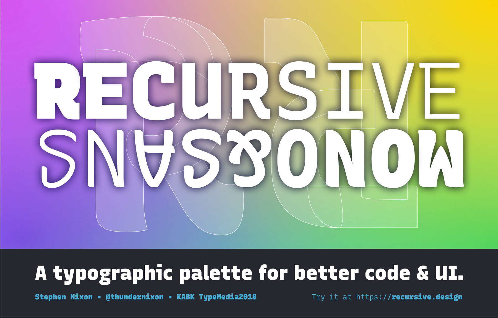

# Recursive Mono & Sans




## Build

To build, set up the virtual environment

```
virtualenv -p python3 venv
```

Then activate it:

```
source venv/bin/activate
```

Then install requirements:

```
pip install -U -r requirements.txt
```

(...to be continued)