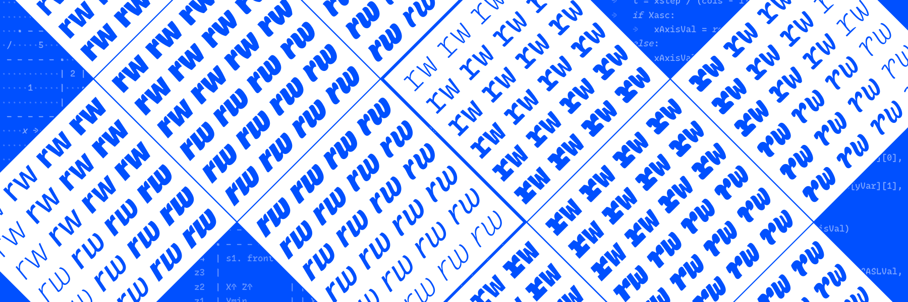
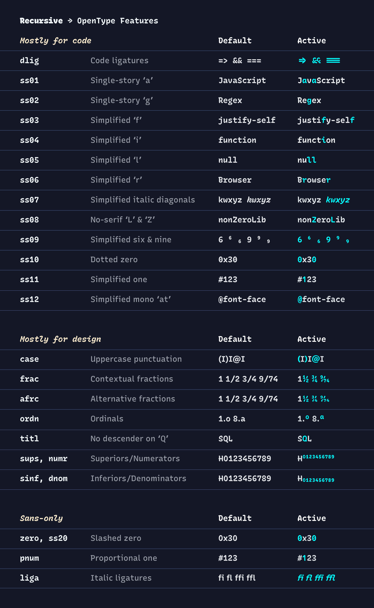

<p align="center">
<strong>Want (infrequent) updates on new fonts from ArrowType?</strong>
 </p>
<p align="center">
💌 <strong>Sign up for the <a href="https://arrowtype.com/" target="_blank">ArrowType newsletter!</a></strong> 💌
</p>
<p align="center">
📝 <strong>Follow <a href="https://instagram.com/arrowtype" target="_blank">@ArrowType</a> on Instagram!</strong> 📝
</p>

---

# Recursive Sans & Mono

Learn more on the [Recursive web specimen →](https://recursive.design)



Recursive Sans & Mono is a variable type family built for better code & UI. It is inspired by casual script signpainting, but designed primarily to meet the needs of programming environments and application interfaces.

In programming, “recursion” is when a function calls itself, using its own output as an input to yield powerful results. Recursive Mono was used as a tool to help build itself: it was used to write Python scripts to automate type production work and to generate specimen images, and it was used in HTML, CSS, and JS to create web-based proofs & prototypes. Through this active usage, Recursive Mono was crafted to be both fun to look at as well as deeply useful for all-day work.

Recursive Sans borrows glyphs from its parent mono but adjusts the widths of many key glyphs for comfortable readability. Its metrics are *superplexed* – every style takes up the exact same horizontal space, across all styles. In this 3-axis variable font, this allows for fluid transitions between weight, slant, and “expression” (casual to strict letterforms), all without text shifts or layout reflow. Not only does this allow for new interactive possibilities in UI, but it also makes for a uniquely fun typesetting experience.

### Language Support

Recursive is designed with a modified Google Fonts Latin Expert character set, including numerous useful symbols for currencies & math (see the [Character Set notes](https://github.com/arrowtype/recursive/tree/main/docs/00--character_set_for_google_fonts) for more details), plus support for the following languages:

```
Abenaki, Afaan Oromo, Afar, Afrikaans, Albanian, Alsatian, Amis, Anuta, Aragonese, Aranese, Aromanian, Arrernte, Arvanitic (Latin), Asturian, Atayal, Aymara, Azerbaijani, Bashkir (Latin), Basque, Belarusian (Latin), Bemba, Bikol, Bislama, Bosnian, Breton, Cape Verdean Creole, Catalan, Cebuano, Chamorro, Chavacano, Chichewa, Chickasaw, Cimbrian, Cofán, Cornish, Corsican, Creek, Crimean Tatar (Latin), Croatian, Czech, Danish, Dawan, Delaware, Dholuo, Drehu, Dutch, English, Esperanto, Estonian, Faroese, Fijian, Filipino, Finnish, Folkspraak, French, Frisian, Friulian, Gagauz (Latin), Galician, Ganda, Genoese, German, Gikuyu, Gooniyandi, Greenlandic (Kalaallisut), Guadeloupean Creole, Gwich’in, Haitian Creole, Hän, Hawaiian, Hiligaynon, Hopi, Hotcąk (Latin), Hungarian, Icelandic, Ido, Igbo, Ilocano, Indonesian, Interglossa, Interlingua, Irish, Istro-Romanian, Italian, Jamaican, Javanese (Latin), Jèrriais, Kaingang, Kala Lagaw Ya, Kapampangan (Latin), Kaqchikel, Karakalpak (Latin), Karelian (Latin), Kashubian, Kikongo, Kinyarwanda, Kiribati, Kirundi, Klingon, Kurdish (Latin), Ladin, Latin, Latino sine Flexione, Latvian, Lithuanian, Lojban, Lombard, Low Saxon, Luxembourgish, Maasai, Makhuwa, Malay, Maltese, Manx, Māori, Marquesan, Megleno-Romanian, Meriam Mir, Mirandese, Mohawk, Moldovan, Montagnais, Montenegrin, Murrinh-Patha, Nagamese Creole, Nahuatl, Ndebele, Neapolitan, Ngiyambaa, Niuean, Noongar, Norwegian, Novial, Occidental, Occitan, Old Icelandic, Old Norse, Onĕipŏt, Oshiwambo, Ossetian (Latin), Palauan, Papiamento, Piedmontese, Polish, Portuguese, Potawatomi, Q’eqchi’, Quechua, Rarotongan, Romanian, Romansh, Rotokas, Sami (Inari Sami), Sami (Lule Sami), Sami (Northern Sami), Sami (Southern Sami), Samoan, Sango, Saramaccan, Sardinian, Scottish Gaelic, Serbian (Latin), Seri, Seychellois Creole, Shawnee, Shona, Sicilian, Silesian, Slovak, Slovenian, Slovio (Latin), Somali, Sorbian (Lower Sorbian), Sorbian (Upper Sorbian), Sotho (Northern), Sotho (Southern), Spanish, Sranan, Sundanese (Latin), Swahili, Swazi, Swedish, Tagalog, Tahitian, Tetum, Tok Pisin, Tokelauan, Tongan, Tshiluba, Tsonga, Tswana, Tumbuka, Turkish, Turkmen (Latin), Tuvaluan, Tzotzil, Uzbek (Latin), Venetian, Vepsian, Vietnamese, Volapük, Võro, Wallisian, Walloon, Waray-Waray, Warlpiri, Wayuu, Welsh, Wik-Mungkan, Wiradjuri, Wolof, Xavante, Xhosa, Yapese, Yindjibarndi, Zapotec, Zarma, Zazaki, Zulu, Zuni
```

## License

When you are considering using a font, the font license is one of the first things you should look for and read. It outlines how you agree to use the fonts, and font licensing is different between different type projects & type foundries.

The Recursive project is licensed under the [SIL Open Font License v1.1](OFL.txt). This is a free software license that permits you to use the font software under a set of conditions. Please refer to the full text of the license for details about the permissions, conditions, and disclaimers.

---

## Using the fonts

1. Download the latest fonts from the [Releases](https://github.com/arrowtype/recursive/releases) (Look under the "Assets" of the latest release, download the zip, and then open that zip)
2. Install the fonts on your system

### Installing fonts on your system

#### Mac

The easy way: open font files in Font Book, and click "Install Font".

The nice way: 
- In Finder, navigate to the folder `<yourusername>/Library/Fonts`
- Drag this to the Finder sidebar, or while the folder is highlighted, use **File > Add to Sidebar** to do so
- Now, you can manage new font files just like normal files! Drag in fonts. Enclose them in folders to more easily organize families. To deactivate fonts, you can either remove them from this folder or (if you might want them later) right click and "Compress" them into zip files.

#### Windows

Double-click the TTF file, then select "Install."

To install many static font files (these may work better in apps such as Microsoft Word and PowerPoint):
- Go into the `static_fonts` folder, then into the mono or sans `static_otf` folder. 
- Open Font Settings, then drag-and-drop these font files into the Font Settings window.

### On the web

This is a big topic, but a couple of good guides are [from MDN](https://developer.mozilla.org/en-US/docs/Web/CSS/CSS_Fonts/Variable_Fonts_Guide) and [from CSS-Tricks](https://css-tricks.com/one-file-many-options-using-variable-fonts-web/).

In general, you should link in the font with `@font-face`, being sure to use `font-weight: 300 1000;` to specify the font's weight range:

```
@font-face {
 font-family: 'Recursive';
 src: url('path/to/font/<UPDATE_SPECIFIC_FONT_PATH>.woff2') format('woff2-variations');
 font-weight: 300 1000;
}
```

Then, you can use the font with both `font-weight` and `font-variation-settings`! 

Notes: 

- `MONO` and `CASL` are "unregistered" axes (not currently in Microsoft's official listing of variation axes and specs), so these tags must be used in all-caps and controlled via `font-variation-settings`.
- You will eventually be able to also use the property `font-style` to control `slnt` and `CRSV` axes, but these have some browser support issues (as of Oct 2019, but tools are rapidly evolving to better support variable fonts, so this will improve over time!) For now, these work best in `font-variation-settings`.
- One weird trick: you can use CSS custom properties to more easily control `font-variation-settings` – read more about this technique in [Pixel Ambacht's fantastic tutorial on it](https://pixelambacht.nl/2019/fixing-variable-font-inheritance/).

## Font usage in Code Editors

There are two primary ways to use Recursive in code editors:

#### 1: Rec Mono for Code

Install the `Rec Mono` fonts (found in the “Recursive_Code” folder of release downloads). These have code ligatures & several stylistic sets pre-applied so they will work by default in most code environments & apps. These are also named & configured in a way that enables their use in code themes that utilize italic & bold styles. If you wish to configure specific features in `Rec Mono` fonts (such as a dotted `0` or single-story `g`), see [Recursive Code Config](https://github.com/arrowtype/recursive-code-config).

#### 2: Standard Recursive Mono desktop fonts

These fonts are built in a more traditional way than the "Code" fonts above, so they may render slightly better in some contexts. There are pros and cons, though: Code ligatures work better in the "Code" fonts, in many monospace-only apps. On Mac before macOS 11, these do not work in themes with Italic styles – see above for “Code” fonts that do. And, the "Code" fonts allow you a bit more customization, if you want it!

To use the standard decktop fonts, install the desktop `Recursive Mono` fonts (found in the “Recursive_Desktop” folder of release downloads). Then, activate them & set OpenType features if your code editor allows this. Instructions for three editors follow. 

In summary, open the editor settings and set the font family. These family names are shortened because long font names can cause errors in some environments. The main abbreviations are as follows:
- Metrics:
  - `Mn` means _Mono_ (monospace/fixed-width)
  - `Sn` means _Sans_ (proportional/natural-width)
- Styling:
  - `Csl` means _Casual_
  - `Lnr` means _Linear_ 
- `St` means _Static_ (as opposed to _variable,_ like the full Recursive variable font)

So, you will pretty much be setting your editor to use either `Recursive Mn Csl St` or `Recursive Mn Lnr St`.


#### Settings for specific code editors, to use Recursive Mono desktop fonts:

<details>
<summary><b><!-------->⚙️ VS Code<!--------></b> (Click to expand)</summary>
 
In Settings, search `Font Family`, then specify the family you wish to use. 

For Recursive Mono Casual Regular:

```
"Recursive Mn Csl St", Menlo, "Apple Color Emoji",  monospace
```

For Recursive Mono Linear Regular:

```
"Recursive Mn Lnr St", Menlo, "Apple Color Emoji",  monospace
```

Then, if you want, you can activate OpenType features by searching in the settings for `fontLigatures`, then editing this in settings.json like this:

```json
    "editor.fontLigatures": "'ss01','ss05','dlig'"
```

(The above would give you a simplied `6` & `9`, a single-story `a`, and activate code ligatures.)

</details>

<details>
<summary><b><!-------->⚙️ Atom<!--------></b> (Click to expand)</summary>

In the menu bar, go to `Atom` -> `Stylesheet` and add in the following:

```css
atom-text-editor {
  font-family: 'Recursive Mn Csl St';            /* This sets the font family*/
  font-feature-settings: "ss01", "ss05", "dlig"; /* This sets OpenType features, if you want to set them. */
}
```
 
Use `font-family: 'Recursive Mn Lnr St';` to get the Linear family.

</details>

<details>
<summary><b><!-------->⚙️ Sublime Text<!--------></b> (Click to expand)</summary>

Go to `Sublime Text` -> `Preferences` -> `Settings` and set `font_face` to the specific PostScript name of the style you wish to use.

For Recursive Mono Casual Regular:

```json 
"font_face": "Recursive Mn Csl St",
```

For Recursive Mono Linear Regular:

```json
"font_face": "Recursive Mn Lnr St",
```

To control code ligatures or other OpenType features, set the `font_options` open, like so:

```json
"font_options": ["ss01", "ss05", "dlig"],
```
 
So, the full settings might look something like this:
 
```json
{
	"font_face": "Recursive Mn Lnr St",
	"font_size": 24,
	"theme": "Adaptive.sublime-theme"
}
```

</details>

---

## Variable Axes

Recursive has the following axes:

| Axis       | Tag    | Range        | Default | Description                                                     |
| ---------- | ------ | ------------ | ------- | --------------------------------------------------------------- |
| Monospace  | `MONO` | 0 to 1       | 0       | Sans (natural-width) to Mono (fixed-width)                      |
| Casual     | `CASL` | 0 to 1       | 0       | Linear to Casual                                                |
| Weight     | `wght` | 300 to 1000  | 300     | Light to ExtraBlack. Can be defined with usual font-weight property. |
| Slant      | `slnt` | 0 to -15     | 0       | Upright (0°) to Slanted (about 15°)                             |
| Cursive    | `CRSV` | 0, 0.5, or 1 | 0.5     | Always roman (0), auto (0.5), or always cursive (1)             |

### Axis Definitions

Axis Definitions, Recursive

- **Monospace** `MONO` - 0 to 1. Adjusts the glyph widths from proportional or “Sans” (0) to fixed-width or “Mono” (1).

  *Recommended use:* In general, the proportional design is more readable in text and UI, while the monospace design is more appropriate for code and text in which letter disambiguation is especially critical (e.g. passwords, ID numbers, tabular data, etc).

- **Casual** `CASL` - 0 to 1. Adjusts the expressive style or “genre” of the glyphs. In Recursive, this goes from from Linear (0) to Casual (1). 

  *Recommended use:* The Linear style shares a similar structure to fonts classified as *lineal*, merging aspects of humanist sans with rationalized, compact, flat-sided letterforms. This regular, familiar structure makes it appropriate for long-form text requiring focus (e.g. paragraphs, full code documents, and punchy headlines). The Casual style is inspired by single-stroke casual signpainting, but drawn for small sizes. It is most useful in shorter-form text where a warm and inviting tone is desired (e.g. blog post headlines, store signage, and computer terminals).

- **Weight** `wght` - 300 to 1000. The overall thickness of letters and the darkness of text composed with them. Notably, in Recursive, the weight axis does not affect glyph width. A bold weight takes the same amount of space as a light weight, even at in proportional styles of the `MONO` axis.

  *Recommended use:* Differences in weight can provide emphasis in text, show user interaction, or adjust the tone of communication. For light text on dark backgrounds, 400 (“Regular”) tends to be appropriate for text and code. For dark text on a light background, it can be beneficial to adjust the weight upwards to 500 (“Medium”).
  
  *Why isn’t it a Grade axis?* See [Issue #365](https://github.com/arrowtype/recursive/issues/365)

- **Slant** `slnt` – 0 to -15. The "forward lean" of letters. Note: `-15` (negative 15) corresponds to a 15° clockwise slant, due to type design's roots in geometry. If the Italic axis is at its default value, going past a slant of `-13.99` will activate "cursive" letters, converting them to more-handwritten forms such as the simplified, "single story" `a` and `g`.

  *Recommended use:* Use Slant as a secondary way to emphasize text or vary typographic tone. In text, it can be useful to use a partial slant of around -9, while at display sizes, you can expect the most precise outlines at either 0 or -15. You can also animate from `0` to `-13` without letterforms or glyph widths changing, which is great for things like hovered links or buttons.

- **Cursive** `CRSV` – 0, 0.5, or 1. Controls the substitution of cursive forms along the Slant axis. "Off" (0) maintains Roman letterforms such as a "double story" `a` and `g`, "Auto" (0.5) allows for Cursive substitution, and "On" (1) asserts cursive forms even in upright text with a Slant of 0.

  *Recommended use:* Use Cursive as a tertiary way to emphasize text, or as a way to have more control over animated text (e.g. a hyperlink that slants upon user interaction can by styled with Cursive 0 or 1 to prevent the abrupt changes of glyph substitution).
  
  
### Advanced design recommendations

In general, Recursive is intended for small-to-medium sized usage, particularly on screen. However, it is useful to understand which stylistic ranges work best in what contexts. A few guidelines worth knowing:

| Style range                  | Recommended size                 | Recommended use case                                |
| ---------------------------- | -------------------------------- | --------------------------------------------------- |
| Casual 0 *(Linear)*, Weight 300–800 *(Light–ExtraBold)*  | 8px to 72px   | General use (especially for longer text)   |
| Casual 1 *(Casual)*, Weight 300–800 *(Light–ExtraBold)*  | 14px to 72px  | General use (more personality)             |
| Weights 801–900 *(Black–ExtraBlack)*      | 32px to 144px | Headlines, display typography              |
| Intermediate values of Casual and Slant  | 10px to 40px  | Good in text, but may not look as good in display sizes |


Things to be aware of:
- If you use weights 300–800 for large text, it may look good to slightly reduce letter-spacing (also called _tracking_).
- The heaviest weights of Recursive are _really heavy_, so they need to be a little larger to remain legible.
- Casual and Slant axes look great with intermediate values at text sizes, but they are mostly intended to be used at either fully "on or off" values, with intermediates available to allow animated stylistic transitions. If you are setting type at large sizes, avoid intermediate `CASL` and `slnt` values. If you stick to named instances in design apps (e.g. `Mono Casual Bold Italic`, etc), this is handled for you automatically.
- The Casual Italic instances are drawn to work well in text but are also the most expressive styles of the family – try them at large sizes to show off their wavy stems and really make a statement! 🏄‍♂️🏄‍♀️


## OpenType Features

Recursive is built with a number of OpenType features that make it simple to control a few handy typographic features.




--- 

## Building the fonts

### Set up the environment

To build, set up the virtual environment

```
virtualenv -p python3 venv
```

Then activate it:

```
source venv/bin/activate
```

Then install requirements:

```
pip install -U -r requirements.txt
```

Also:

```
pip install git+https://github.com/LettError/DesignspaceProblems
```

### Build the fonts

The fonts are built with the `mastering/build.py` script. This script can build everything (`python build.py --all`), or a subset of the fonts. To view all the options, type `python build.py -h` to see all options. The recommended build process is detailed below. 

*Note:*
There are sub-scripts for just prepping the source files (`mastering/prep_fonts.py`), building the source files (`mastering/build_files.py`), generating the variable font (`mastering/build_variable.py`), and generating the static fonts (`build_static.py`). These scripts can be handy if you just want to do one thing to the build files. Each takes a set of command line arguments, all documented (type `python <script_name> -h`) to view the documentation.

**First, prep fonts**

Before beginning, change your working directory to `mastering`.

```
cd mastering
```

`python build.py --files` is the first step. This will generate all the files needed for building the variable and static fonts. You will likely want to give the font a version number with this command (`python build.py --version 1.086 --files`). To prep only files for the variable font, use `python build.py --varfiles`, or to prep only files for the static fonts, use `python build.py --statfiles`.

After the files have been generated (do note that the static instances take a bit of time to generate), you will want to look at the `mastering/build/static/CFF/checkoutlines.txt` file. This is the report (edited to remove issues that do not need attention) from [checkoutlinesUFO](https://adobe-type-tools.github.io/afdko/AFDKO-Overview.html#checkoutlinesufo). Issues found in this report should be cleaned up in the static UFOs. Many issues are due to overlap removal. Nothing is perfect, overlap removal algorithms included.

**To build the variable font**
   
To build the variable font, run:

```bash
# activate venv, install dependencies, cd mastering
version=1.086 # (replace version number)
python build.py --varfiles --version $version
python build.py --variable --version $version
```

**To build the static fonts**

To build all the static fonts, run:

```bash
# activate venv, install dependencies, cd mastering 
version=1.086 # (replace version number)
python build.py --statfiles --version $version
python build.py --static --version $version
```

**To build all the fonts**

If you want to build all of the sources, fonts, and WOFF2 versions of all of the fonts run:

```bash
# activate venv, install dependencies, cd mastering
python build.py --all --version 1.086 # (replace version number)
```

**Get notifications (Mac only)**

Add option `--pync` (`-p` for short) to the script call to get Mac notifications, which may be helpful if you are working on other tasks while a build runs.

```bash
# activate venv, install dependencies, cd mastering
python build.py --all --pync --version 1.086 # (replace version number)
```

### Making a GitHub release

First, build fonts with the mastering flow above. Then:

```bash
# navigate to the root directory of the project, then...

# update to latest font build directory
fontDir="fonts_1.086"
src/build-scripts/make-release/00-prep-release.sh $fontDir
```

Then, copy the latest variable font into your local [Recursive Code Config](https://github.com/arrowtype/recursive-code-config) repo to build updated Code fonts. Copy these into the newly-made directory `fonts/ArrowType-Recursive-1.XXX/Recursive_Code`.

Finally, go to the repo’s Releases page to make a new one.

## Using the resources in this project for type design

This project has included a large amount of research (contained in `docs/`), and contains many small tools (contained in `src/00-recursive-scripts-for-robofont` that may help you if you are designing variable fonts with UFOs in RoboFont.

### Using the project scripts in RoboFont

1. Navigate to your robofont scripts folder in a terminal. 
    1. In RoboFont's menu, go to *Scripts > Reveal Scripts Folder*
    2. Open a terminal window.
    3. Type `cd `, then copy-paste or drag-n-drop the scripts folder to get its full filepath. Hit return/enter.
   
2. Make a symbolic link or "symlink" to the Recursive project scripts folder, `src/00-recursive-scripts-for-robofont`
    1. Still in the same terminal, type `ln -s `
    2. Copy-paste or drag-n-drop the `src/00-recursive-scripts-for-robofont` from Finder to get its full path. Hit return/enter.
    3. Check that it's there by running `ls` to list files. You should see `src/00-recursive-scripts-for-robofont` as one of the items listed.

So, this will look something like:

```
ln -s ~/FOLDER_PATH/robofont-scripts ~/FOLDER_PATH/recursive/src/00-recursive-scripts-for-robofont
```

3. Update your Scripts menu in RoboFont with *Scripts > Update Menu*
    - If the Recursive scripts don't appear, you may need to restart RoboFont

Now, you can run the Recursive project scripts directly from the Scripts menu, or by opening them in the Scripting Window. 

## Contributing

See [CONTRIBUTING.md](CONTRIBUTING.md) for policies around contributing to the project.

## Contributors 

- Design by Stephen Nixon, with
  - Lisa Huang
  - Katja Schimmel
  - Rafał Buchner
- Font Mastering with Ben Kiel

+ Many other advisors and reviewers
