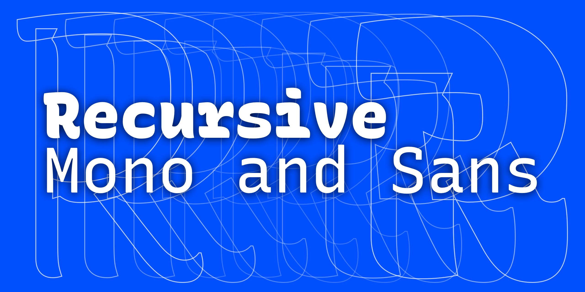

# Recursive Mono & Sans



Recursive Mono & Sans is a variable type family built for better code & UI. It is inspired by casual script signpainting, but designed primarily to meet the needs of programming environments and application interfaces.

In programming, “recursion” is when a function calls itself, using its own output as an input to yield powerful results. Recursive Mono was used as a tool to help build itself: it was used to write Python scripts to automate type production work and to generate specimen images, and it was used in HTML, CSS, and JS to create web-based proofs & prototypes. Through this active usage, Recursive Mono was crafted to be both fun to look at as well as deeply useful for all-day work.

Recursive Sans borrows glyphs from its parent mono but adjusts the widths of many key glyphs for comfortable readability. Its metrics are *superplexed* – every style takes up the exact same horizontal space, across all styles. In this 3-axis variable font, this allows for fluid transitions between weight, slant, and “expression” (casual to strict letterforms), all without text shifts or layout reflow. Not only does this allow for new interactive possibilities in UI, but it also makes for a uniquely fun typesetting experience.

## Variable Axes

Recursive has the following axes:

| Axis       | Tag    | Range        | Default | Description                                                     |
| ---------- | ------ | ------------ | ------- | --------------------------------------------------------------- |
| Monospace  | `MONO` | 0 to 1       | 0       | Sans (natural-width) to Mono (fixed-width)                      |
| Expression | `XPRN` | 0 to 1       | 0       | Linear to Casual                                                |
| Weight     | `wght` | 300 to 900   | 300     | Light to Heavy. Can be defined with usual font-weight property. |
| Slant      | `slnt` | 0 to -15     | 0       | Upright (0°) to Slanted (about 15°)                             |
| Italic     | `ital` | 0, 0.5, or 1 | 0.5     | Always roman (0), auto (0.5), or always italic (1)              |


## Using the fonts

1. Download the latest fonts from the [Releases](https://github.com/arrowtype/recursive/releases)
2. Install the fonts on your system

### On the web

This is a big topic, but a couple of good guides are [from MDN](https://developer.mozilla.org/en-US/docs/Web/CSS/CSS_Fonts/Variable_Fonts_Guide) and [from CSS-Tricks](https://css-tricks.com/one-file-many-options-using-variable-fonts-web/).

In general, you should link in the font with `@font-face`, being sure to use `font-weight: 300 900;` to specify the font's weight range:

```
@font-face {
 font-family: 'Recursive';
 src: 'path/to/font/file/rec-mono_xprn_wght_slnt_ital--2019_09_30.woff2' format('woff2-variations');
 font-weight: 300 900;
}
```

Then, you can use the font with both `font-weight` and `font-variation-settings`! 

Notes: 

- `MONO` and `XPRN` are "unregistered" axes (not currently in Microsoft's official listing of variation axes and specs), so these tags must be used in all-caps and controlled via `font-variation-settings`.
- You will eventually be able to also use the property `font-style` to control `slnt` and `ital` axes, but these have some browser support issues (as of Oct 2019, but tools are rapidly evolving to better support variable fonts, so this will improve over time!) For now, these work best in `font-variation-settings`.
- One weird trick: you can use CSS custom properties to more easily control `font-variation-settings` – see this [CodePen](https://codepen.io/thundernixon/pen/MPdwZL?css-preprocessor=none) for an example of this.


### Design recommendations

In general, Recursive is intended for small-to-medium sized usage, particularly on screen. However, it is useful to understand which stylistic ranges work best in what contexts. A few guidelines worth knowing:

| Style range                  | Recommended size                 | Recommended use case                                |
| ---------------------------- | -------------------------------- | --------------------------------------------------- |
| Expression 0 (Linear), Weight 300–800 (Light–ExtraBold)  | 8px to 72px   | General use (especially for longer text)   |
| Expression 1 (Casual), Weight 300–800 (Light–ExtraBold)  | 14px to 72px  | General use (more personality)             |
| Weights 801–900 (UltraBold–Black)      | 32px to 144px | Headlines, display typography              |
| Intermediate values of Expression and Slant  | 10px to 40px  | Good in text, but may not look as good in display sizes |


Things to be aware of:
- If you use weights 300–800 for large text, it may look good to slightly reduce letter-spacing (also called _tracking_).
- The heaviest weights of Recursive are _really heavy_, so they need to be a little larger to remain legible.
- Expression and Slant axes look great with intermediate values at text sizes, but they are mostly intended to be used at either fully "on or off" values, with intermediates available to allow animated stylistic transitions. If you are setting type at large sizes, avoid intermediate `XPRN` and `slnt` values. If you stick to named instances in design apps (e.g. `Mono Casual Bold Italic`, etc), this is handled for you automatically.
- The Casual Italic instances are drawn to work well in text but are also the most expressive styles of the family – try them at large sizes to show off their wavy stems and really make a statement! 🏄‍♂️🏄‍♀️

### In Code Editors

Currently, the static OTF fonts are the best fonts to use for code.

In code editors like VS Code and Atom, you must use a string to set your preferred font. These strings work well with the font names as follows:

| Style           | Font name for VS Code seetings   | Recommended use case                             |
| --------------- | -------------------------------- | ------------------------------------------------ |
| Linear Regular  | `RecursiveMonoB_020-LnrMd`       | General use                                      |
| Linear Medium   | `RecursiveMonoB_020-LnrMd`       | Light themes                                     |
| Casual Regular  | `RecursiveMonoB_020-CslRg`       | General, with more personality (try in terminal) |
| Casual Regular  | `RecursiveMonoB_020-CslRg`       | With more personality, Light themes              |

The `B_020` in these name string represents the current beta release version. It's possible this has shifted (I am releasing often at this point), so check what the release notes say.

## Using the project scripts in RoboFont

1. Navigate to your robofont scripts folder in a terminal. 
    1. In RoboFont's menu, go to *Scripts > Reveal Scripts Folder*
    2. Open a terminal window.
    3. Type `cd `, then copy-paste or drag-n-drop the scripts folder to get its full filepath. Hit return/enter.
   
2. Make a symbolic link or "symlink" to the Recursive project scripts folder, `src/00-recursive-scripts-for-robofont`
    1. Still in the same terminal, type `ln -s `
    2. Copy-paste or drag-n-drop the `src/00-recursive-scripts-for-robofont` from Finder to get its full path. Hit return/enter.
    3. Check that it's there by running `ls` to list files. You should see ``src/00-recursive-scripts-for-robofont` as one of the items listed.

3. Update your Scripts menu in RoboFont with *Scripts > Update Menu*
    - If the Recursive scripts don't appear, you may need to restart RoboFont

Now, you can run the Recursive project scripts directly from the Scripts menu, or by opening them in the Scripting Window. 

**Standard disclaimers:**

Like any Python scripts, read through them and be generally familiar with what they do before running them. Also, use Git and/or backups when you are using scripts to design. 

Feel free to use/remix these scripts in other projects. I give no warrantees or guarantees of their quality, and your mileage may vary.

<!-- 
## Build


To build, set up the virtual environment

```
virtualenv -p python3 venv
```

Then activate it:

```
source venv/bin/activate
```

Then install requirements:

```
pip install -U -r requirements.txt
```

(...to be continued) -->

## Collaborators 

- Stephen Nixon
- Lisa Huang
- Katja Schimmel
- Rafał Buchner

+ Many other advisors and reviewers
