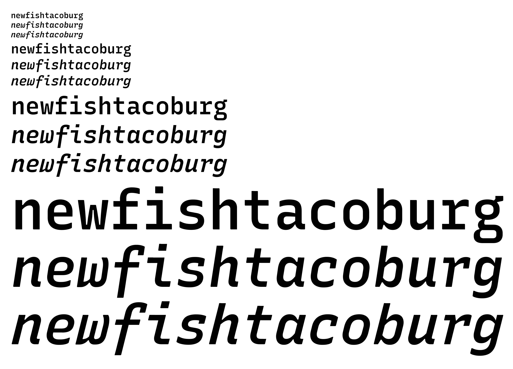
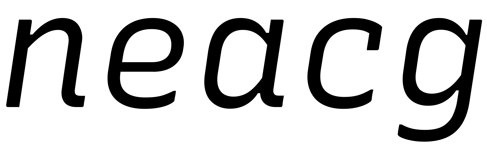
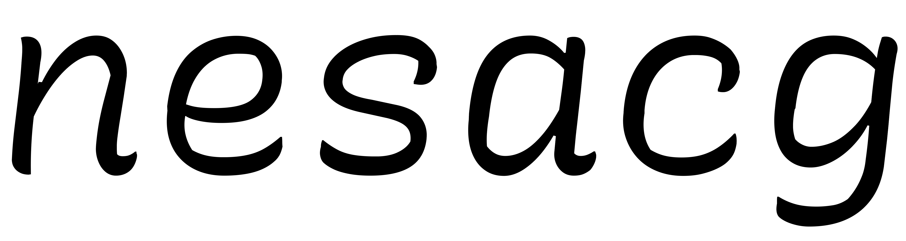
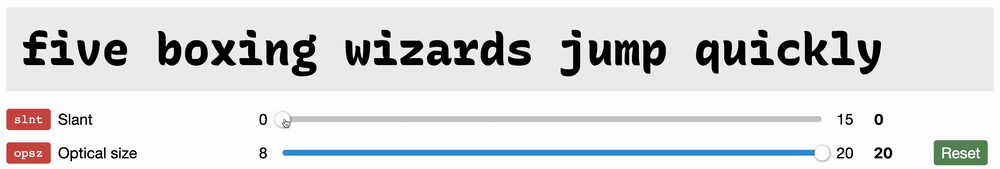
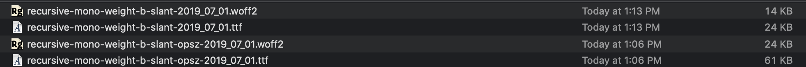

# Experiments with Optical Sizing & "Binary" Variation Axes, June 30

Goal: Make a font which has: 
- A large range of flexibility.
- Safegaurds to prevent poor usage.
- Maintains a compact file size.

I'll be taking a quick look at each of these goals.


## A large range of flexibility

Recursive Mono & Sans has several variation axes:
- Weight: from Light to (very) Heavy
- Slant: from upright to 14.04° of forward slant
- Italic: alternate letterforms which can either be within their own axis or tied to the Slant axis
- Expression: (Casual (curvy) versus Linear (normal) letterforms)
- Proportion: Mono vs Sans (coming soon)

Between these axes, there is a huge amount of room for users to play with typographic styles.

## Safegaurds to prevent poor usage

Not all possible combinations are equally as refined for large usage, where slightly rounding issues can disrupt the quality of interpolated glyph outlines.

A common issue is "kinking." This mostly isn't evident even at relatively large sizes:



...but at large *enough* sizes, it does become quite visible:



The problems are especially bad in the partially-slanted, fully-casual instances:



Some of these issues (for instance, disconnected inktrap bits, and some extent of kinks) will be very addressable in the source drawings. However, careful drawing will only get the font so perfect in intermediate styles. At large-enough font sizes, it would be very useful to restrict portions of the designspace which are likely to show problems.

So, something you wish to make "binary" or "stepped" axes, or perhaps to make axes stepped *only above* a certain optical size.

Initially, I thought that this would be done by making an axis's min–max values go from 0 to 1 – seemingly allowing just two options. However, variable font slider UIs almost always make such axes act as fluid scales, with decimal values allowed between 0 and 1.

Instead, I learned from Petr van Blokland that a binary axis can be made in a slightly unexpected way.

**How to make a binary axis**

At a high level, a “binary” axis can be achieved by making duplicate references to the same sources to cover a range of value with the same drawing, like this:

```
source A
- expression: 0

source A
- expression: 0.4999

source B
- expression: 0.5

source B
- expression: 1
```

The above designspace setup would create an "expression" axis which has just two real settings (0 or 1), with no smooth transition between them.

**How might "safeguards" work?**

This logic should be possible to extend to an optical size. Below a certain size, the slant axis could be fluid. Above that certain size, the slant axis could be binary. That might look something like:

```

# fluid axis at 8pt size
source A
- slant: 0
- opsz: 8

source B
- slant: 15
- opsz: 8

# fluid axis up to 19.99pt size
source A
- slant: 0
- opsz: 19.99

source B
- slant: 15
- opsz: 19.99

# binary axis at 20pt size and above
source A
- slant: 0
- opsz: 20

source A
- slant: 7.49
- opsz: 20

source B
- slant: 7.5
- opsz: 20

source B
- slant: 15
- opsz: 20
```

**Problems**

Works at 8pt:


Works at 20pt:



Confusing between 8pt & 20pt:


I would expect it to be the exact same at opsz 14 as at opsz 8, because I have tried to duplicate source references to make it the same between 8 and 19.99. However, it seems to be influenced by both sides of the opsz divide, resulting in something not useful at all: an axis which is partially smooth, and partially snapping.

I have also tried a setup with *even more* duplicate source references, but this didn't change the behavior.

<details><summary><b>Setup for second trial of opsz control for slant</b> (Click to expand)</summary>

```

# fluid axis at 8pt size
source A
- slant: 0
- opsz: 8

source A
- slant: 0.01
- opsz: 8

source B
- slant: 14.99
- opsz: 8

source B
- slant: 15
- opsz: 8

# fluid axis up to 19.99pt size
source A
- slant: 0
- opsz: 19.99

source A
- slant: 0.01
- opsz: 19.99

source B
- slant: 14.99
- opsz: 19.99

source B
- slant: 15
- opsz: 19.99

# binary axis at 20pt size and above
source A
- slant: 0
- opsz: 20

source A
- slant: 7.49
- opsz: 20

source B
- slant: 7.5
- opsz: 20

source B
- slant: 15
- opsz: 20
```

</details>

## Maintaining a compact file size

A big problem with strategies involving duplicate references to font sources is that they seem to bloat font filesize.

My experiments of making an ExtraBold font with Slant & Optical Size axes resulted in a final filesize of 24KB WOFF2, 61KB TTF (with a limited A–Z, a–z character set).

The same font, but without the Optical Size from duplicate source references, is only 14KB WOFF2, 24KB TTF.

Notably, the Optical Size didn't actually use any additional UFO sources – it merely made more `<source>` references to the in the designspace file.



I don't yet know *why* there is that size difference, however, and I can't predict whether it would be more or less pronounced for a full character set. Is the size change proportional to added characters, or would it stay relatively constant, even with many more characters? That is, if I made a font with 8x more characters, would the size change be 80KB (8 times the 10KB difference), or would it still be around 10KB (the current difference)?

Why the difference in size?

By inspecting the font files with TTX, I can find a main area of difference.

Overall, the slant-only font is 11,341 lines of XML, while the opsz+slnt font is 29,063 lines.

The `glyf` table is
- lines 417 to 5718 in the slant-only font (5301 total)
- lines 396 to 6120 in the opsz+slnt font (5724 total)

The `gvar` table is:
- lines 6090 to 11338 in the slant-only font (5248 total)
- lines 6765 to 29060 in the opsz+slnt font (22295 total)

The `gvar` table alone takes up an extra 17047 lines in the opsz+slnt font – almost the entire difference of 17722 lines. Looking at these files, it is obvious why: the one-axis font has just a single `tuple` of `delta` entries per glyph. Meanwhile, the opsz+slnt font has four sets of deltas per glyph.

The number `4` is significant here, because it corresponds to the number of separate locations I have described on the `slnt` axis in the designspace:
- slnt= `0`, for opsz = `8` and `19` and `20`
- slnt= `7.49`, for opsz `20`
- slnt= `7.5`, for opsz `20`
- slnt= `15`, for opsz = `8` and `19` and `20`

I know that this is connected specifically to slant, because the XML tells me.

```
 <glyphVariations glyph="x.italic">
      <tuple>
        <coord axis="slnt" min="0.0007" value="0.9993" max="1.0"/>
        <delta pt="0" x="-40" y="0"/>
        <delta pt="1" x="-44" y="0"/>
        
        etc...

      </tuple>
      <tuple>
        <coord axis="slnt" min="0.9993" value="1.0" max="1.0"/>
        <delta pt="0" x="-40" y="0"/>
        <delta pt="1" x="-44" y="0"/>

        etc...
```

*SO,* it's not that the opsz axis added weight, per se – but rather, describing additional "deltas" along the `slnt` axis (even if they're duplicates) *does* add weight. 

I had expected WOFF2 compression to somehow work around this, but it seems that (at least for now), it doesn't.

Because three of these four delta tuples describe the same exact points, it seems plausible that at some time, each tuple could refer to multiple `slnt` values, to save space. However, I'm not sure what would be involved in that change to the OpenType format, or to WOFF2 compression.


## Conclusion

For the time being (unless I get different data or find a better hack), I will not include an opsz axis in Recursive.

Instead, I will do something that type designers have always had to rely on: allow typographers to make usage choices with the font, and accept that those choices may be better or worse, depending on the knowledge and judgement of the individual. However, this gives more incentive for the minisite to include a set of "usage" guidelines.