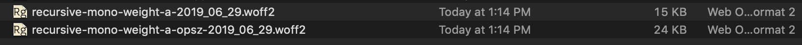

# Experiments with Optical Sizing & "Binary" Variation Axes

Goal: Make a font which has: 
- A large range of flexibility.
- Safegaurds to prevent poor usage.
- Maintains a compact file size.

I'll be taking a quick look at each of these goals.


## A large range of flexibility

Recursive Mono & Sans has several variation axes:
- Weight: from Light to (very) Heavy
- Slant: from upright to 14.04° of forward slant
- Italic: alternate letterforms which can either be within their own axis or tied to the Slant axis
- Expression: (Casual (curvy) versus Linear (normal) letterforms)
- Proportion: Mono vs Sans (coming soon)

Between these axes, there is a huge amount of room for users to play with typographic styles.

## Safegaurds to prevent poor usage

Not all possible combinations are equally as refined for large usage, where slightly rounding issues can disrupt the quality of interpolated glyph outlines.

A common issue is "kinking." This mostly isn't evident even at relatively large sizes:


...but at large *enough* sizes, it does become quite visible:


The problems are especially bad in the partially-slanted, fully-casual instances:


Some of these issues (for instance, disconnected inktrap bits, and some extent of kinks) will be very addressable in the source drawings. However, careful drawing will only get the font so perfect in intermediate styles. At large-enough font sizes, it would be very useful to restrict portions of the designspace which are likely to show problems.

So, something you wish to make "binary" or "stepped" axes, or perhaps to make axes stepped *only above* a certain optical size.

Initially, I thought that this would be done by making an axis's min–max values go from 0 to 1 – seemingly allowing just two options. However, variable font slider UIs almost always make such axes act as fluid scales, with decimal values allowed between 0 and 1.

Instead, I learned from Petr van Blokland that a binary axis can be made in a slightly unexpected way.

**How to make a binary axis**

At a high level, a “binary” axis can be achieved by making duplicate references to the same sources to cover a range of value with the same drawing, like this:

```
source A
- expression: 0

source A
- expression: 0.4999

source B
- expression: 0.5

source B
- expression: 1
```

The above designspace setup would create an "expression" axis which has just two real settings (0 or 1), with no smooth transition between them.

**How might "safeguards" work?**

This logic should be possible to extend to an optical size. Below a certain size, the slant axis could be fluid. Above that certain size, the slant axis could be binary. That might look something like:

```

# fluid axis at 8pt size
source A
- slant: 0
- opsz: 8

source B
- slant: 15
- opsz: 8

# fluid axis up to 19.99pt size
source A
- slant: 0
- opsz: 19.99

source B
- slant: 15
- opsz: 19.99

# binary axis at 20pt size and above
source A
- slant: 0
- opsz: 20

source A
- slant: 7.49
- opsz: 20

source B
- slant: 7.5
- opsz: 20

source B
- slant: 15
- opsz: 20
```

**Problems**

Works at 8pt:


Works at 20pt:


Confusing between 8pt & 20pt:


## Maintaining a compact file size

I've done one experiment with this, making the "Expression" axis binary above 20pt.

