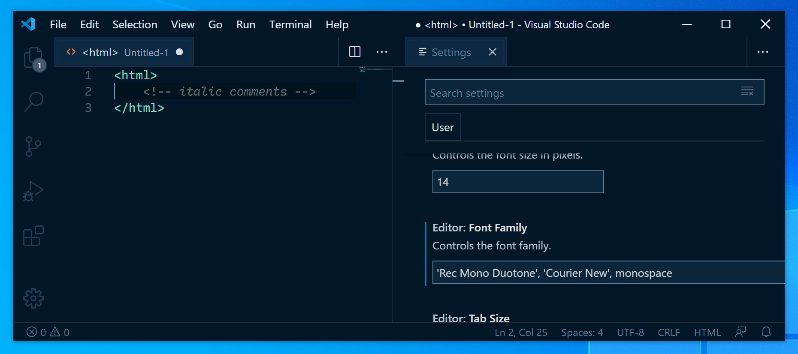

# Improving Code fonts reliability on Windows

There are several issues present in the current "Rec Mono" fonts:


## Naming

- [Code fonts (Rec Mono series) have name/behavior conflicts on Windows, #336](https://github.com/arrowtype/recursive/issues/336)
- [Difficulty in configuring font-family for vscode #342](https://github.com/arrowtype/recursive/issues/342)

**Do both mac & win platforms have expected name IDs?**

I would expect this to be an issue in name IDs 1 & 2, the typical names used in RIBBI style-linking.

```
▶ ttx -t name -o- fonts/Recursive-Beta_1.047/Recursive_Code/Duotone/RecMono-Duotone-1.047.ttf

<!-- mac platform -->
<namerecord nameID="1" platformID="1" platEncID="0" langID="0x0" unicode="True">
	Rec Mono Duotone
</namerecord>
<namerecord nameID="2" platformID="1" platEncID="0" langID="0x0" unicode="True">
	Regular
</namerecord>

<!-- windows platform -->
<namerecord nameID="1" platformID="3" platEncID="1" langID="0x409">
	Rec Mono Duotone
</namerecord>
<namerecord nameID="2" platformID="3" platEncID="1" langID="0x409">
	Regular
</namerecord>

▶ ttx -t name -o- fonts/Recursive-Beta_1.047/Recursive_Code/Duotone/RecMono-DuotoneItalic-1.047.ttf

<!-- mac platform -->
<namerecord nameID="1" platformID="3" platEncID="1" langID="0x409">
	Rec Mono Duotone
</namerecord>
<namerecord nameID="2" platformID="3" platEncID="1" langID="0x409">
	Italic
</namerecord>

<!-- windows platform -->
<namerecord nameID="1" platformID="3" platEncID="1" langID="0x409">
	Rec Mono Duotone
</namerecord>
<namerecord nameID="2" platformID="3" platEncID="1" langID="0x409">
	Italic
</namerecord>

```

These are correct (as far as I know), so the problem must be elsewhere.

If I ttx the entire font and search for "Casual," I find that the `STAT` tables are still present in these fonts, and seem to be the only place making reference to Casual/Linear names. Potentially, Windows is making use of the `STAT` table and being "told" that these are different fonts.

There are two potential solutions:
- The Easy Way: remove the `STAT` table. This may make Windows rely on the `name` table for RIBBI relationships, as usual.
- The Harder Way: make new, accurate `STAT` tables. This may work better, but it’s unclear whether there would be a benefit to this.

First, I’ll replicate the issue, and then I’ll try to fix it.

I replicated the issue, then I tried with fonts in which I had dropped the STAT table. It looks promising!





## Glyph substitutions

- [Rec Mono for Code fonts should freeze in rvrn subsitutions, #335](https://github.com/arrowtype/recursive/issues/335)