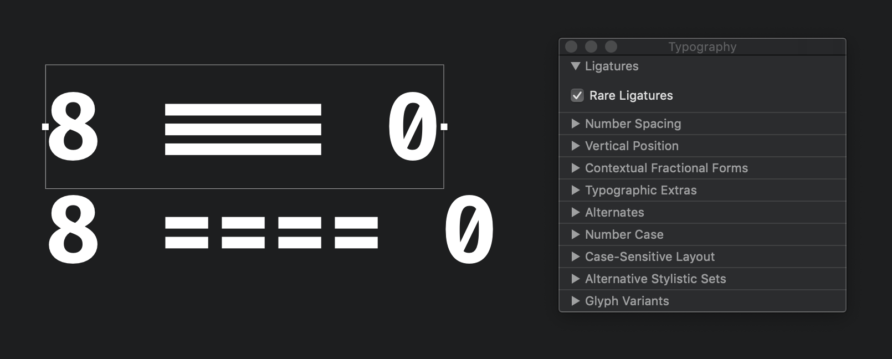
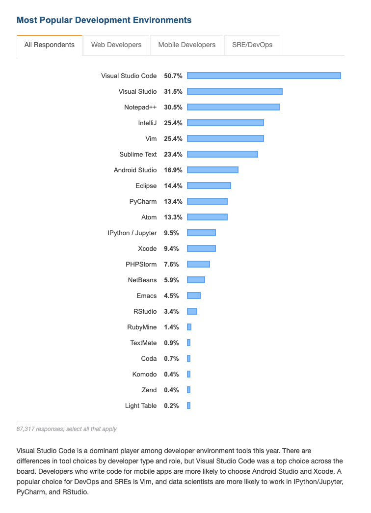
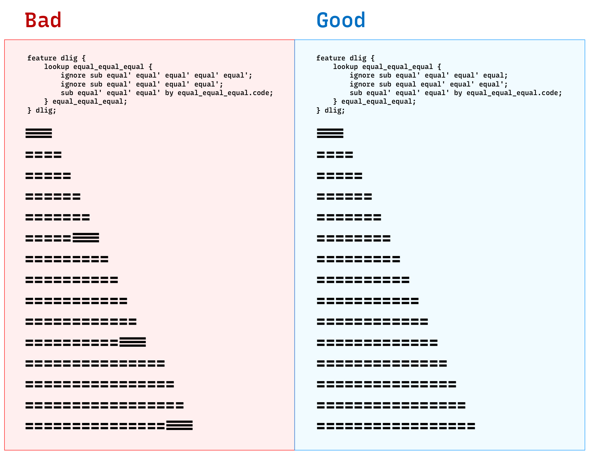
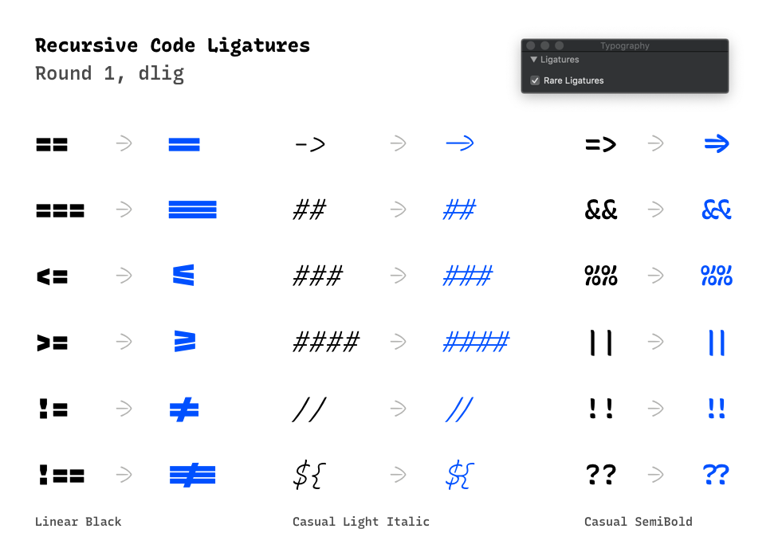

# Implementing Code Ligatures

A summary of this also exists as a [Google Slides deck](https://docs.google.com/presentation/d/11POJKckoGBhDk1kyQu3DC1tNUNJWwqF2FigIV6Tfdwo/edit?usp=sharing).

---

There are three primary possible ways I see to implement code ligatures:

1. Emulate Fira Code: use `calt` to make code ligatures default, and let people disable them if they want to.
2. Use a `CODE` axis with alternates & GSUB set up in the designspace. This could be layered on top of the calt approach – it would have "invisible" composed ligatures by default, but more-connected, "code ligaturey" ligatures available when CODE gets turned up to 1.
3. Use `dlig`, checking that contextual control is still possible (This seems like the best way, per the OpenType spec).

## Fira Code, using DLIG instead of CALT

I asked @tonsky why Fira Code uses `calt`, when `dlig` may be more "by the book" for this type of feature (https://github.com/tonsky/FiraCode/issues/854). His initial reply was:

> I don’t remember exactly but one reason why I put them into calt instead of liga/dlig is because lookups or subs I use didn’t work in liga/dlig. Are they working ok for you?

With a quick test in a forked Fira Code file, these *do* seem to work if the feature code is moved from CALT to DLIG. Here is an image in Sketch:



(This font is stored at `docs/code-ligatures--implementation/assets/FiraCodeDLIG-Bold.otf`, and is made from the `dlig-test` branch of @thundernixon/firacode).


-----------------------------------------------------

## A closer look: how does Fira Code work?

At first look, Fira Code seems to have some pretty complicated OpenType feature code. It's actually relatively simple, though, once you understand a few aspects of it.

It does a pretty good job of a few things:
1. It *just works* in most places.
2. It avoids adding ligatures where they don't make sense. Example: `===` turns into a ligature, but `====` does not get any ligatures inside itself.
3. It allows the user to place their cursor "in the middle" of code ligatures, to edit them relatively easily.

Thign #1 (above): Fira Code *just works* because it uses the "contextual alternates" (`calt`) feature, which most environments turn on by default. If you are trying the OpenType spec closely, this is arguably something of a hack (but it probably makes sense in a single-purpose font like Fira Code).

Thing #2: it works because it uses OpenType "lookups." These go from bottom-to-top to allow a text renderer to make substitutions where needed, but nowhere else. For this, Fira Code uses blocks like this:

```
    lookup equal_equal_equal {                             # sets up a "lookup" for contextual awareness in substitutions
        ignore sub equal equal' equal equal;               # ignores an "equal" symbol in the second place of four
        ignore sub equal' equal equal equal;               # ignores an "equal" symbol in the first place of four
        sub LIG LIG equal' by equal_equal_equal.liga;      # adds ligature
        sub LIG  equal' equal  by LIG;                     # adds ligature
        sub equal'   equal  equal  by LIG;                 # adds ligature
    } equal_equal_equal;
```

Thing #3: it allows the user to easily place their cursor "inside" of ligatures. This is because it keeps the actual *drawing* of code ligatures to one unit of width, but substitutes blank glyphs (called `LIG`) in front of the drawn glyph. That's why there are three lines in the above code block to add in a single ligature.

@tonsky: 
> LIG is just an empty glyph, I invented the name for it myself. Why I need it is explained here https://www.patreon.com/posts/fira-code-inside-28074541.


## Is the LIG hack required to allow users to "step into" ligatures?

On the question of code ligatures and whether to use multi-width glyphs versus a `LIG LIG whatever.liga` approach similar to Fira Code:

> Just tested Sublime Text 3, Intellij Idea, Text Edit, VS Code and Atom on macOS. Everyone except Atom can step inside ligatures, none needs caret instructions to do so. Atom ignores caret and can’t step into ligatures.

source: https://github.com/tonsky/FiraCode/issues/854#issuecomment-539570736

For context, about 13% of developers use Atom. This is either a large number or a small number, depending how you think about it.



https://insights.stackoverflow.com/survey/2019#technology-_-most-popular-development-environments

----------------------------------


## Testing in Recursive

I'm starting in `src/features/features.fea`, which I can include in UFOs with syntax like `include(../../features/features.fea);` ([as per RoboFont docs](https://robofont.com/documentation/workspace/features-editor/#linking-to-external-feature-files)).

### Goal: make `===` turn into a ligature, but ignore strings like `====` with many `=` in a row.

This code does this:

```
feature dlig {
    lookup equal_equal_equal {
        ignore sub equal' equal' equal' equal, equal equal' equal' equal'; # if 'equal' is before or after the sequence, ignore the substitution
        sub equal' equal' equal' by equal_equal_equal.code;
    } equal_equal_equal;
} dlig;
```



Font in test: `docs/code-ligatures--implementation/assets/Recursive Mono-Linear B - DLIG test 100719 4.otf`

## Full (starter) set!



Font in test:
https://github.com/arrowtype/recursive/tree/6082c6a91962b3f6d0690361735b73985c137a60/font_betas/static_fonts/recursive_mono-static_otf

**Questions to answer:**

- How can I write this code in a central location then import it in?
  - You can use `include()` with a feature file path, BUT this seems to stop working if you use FontMake to generate interpolated fonts.


## Trying this with Contextual Alternates (calt)

So, my first thought on how to achieve this was to:

1. Make ligatures that don't look like ligatures – just two components. E.g. /equal_equal_equal.no_lig
2. Make ligatures that do look like ligatures, E.g. /equal_equal_equal.code
3. Use a calt feature (or possibly liga feature) to do looks for applying /equal_equal_equal.no_lig
4. Use designspace rules to swap from /equal_equal_equal.no_lig to /equal_equal_equal.code when a user turns up the CODE axis.

To make this CODE axis work, I have to create a glyph like /equal.precode, and swap to that in my axis rules, and then use /equal.precode in the lookup for calt. So, it adds another extra glyph and an extra layer of logical complexity to the feature. It's not impossible, but definitely not ideal.


## Resources

- http://adobe-type-tools.github.io/afdko/OpenTypeFeatureFileSpecification.html
- http://opentypecookbook.com/rules.html