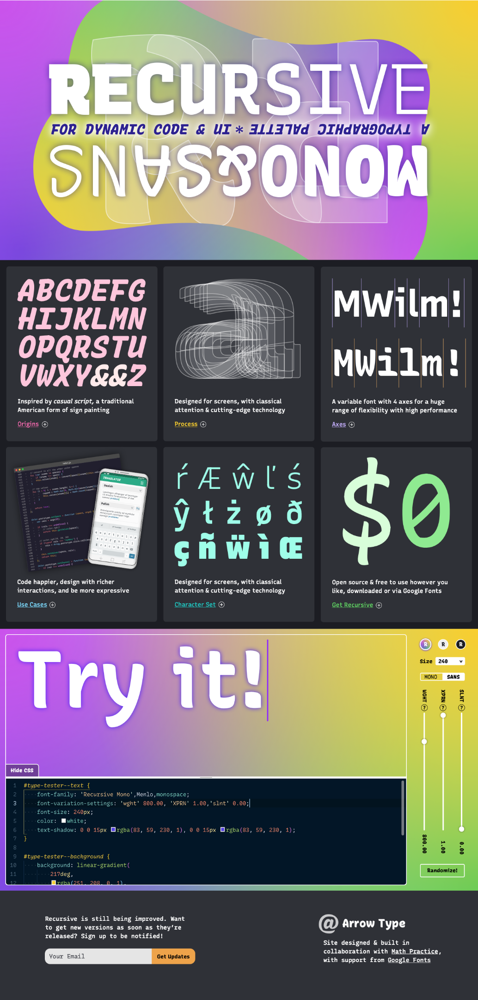
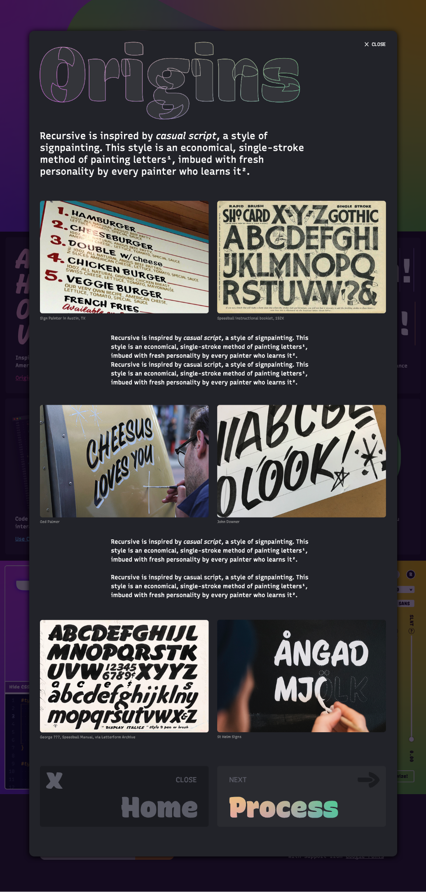
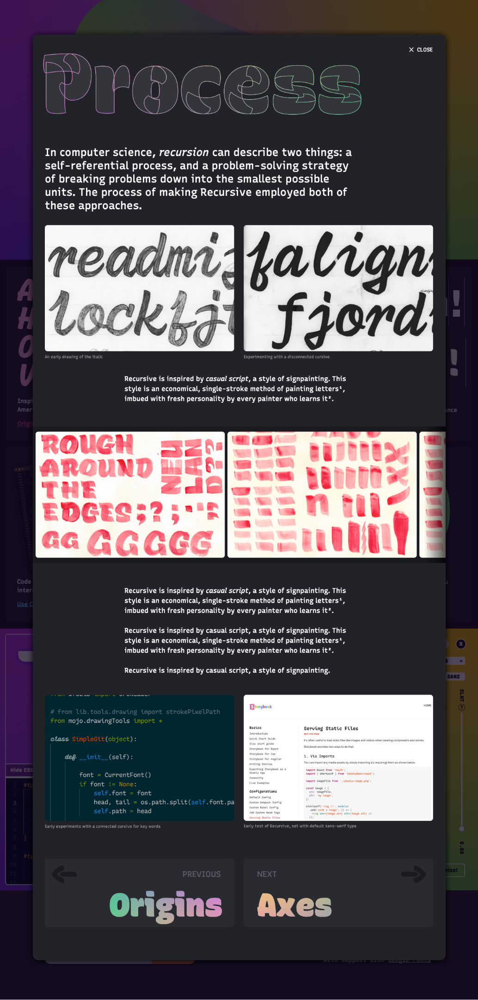

# Recursive Minisite – ideas for improving communication on the website

**Problems with old minisite prototype:**

- verbose and abstract
- started with “color” thing, which people don’t get
- buried type tester
- buried inspiration
- bad for people in a hurry / easily bored by academic stuff

**Ideas for improved site:**

- Instead of a long scrolling page, have each a tile for each section, then pop-up modals with rich information inside (e.g. process description, diagram of axes & features, etc)
- Improve type tester – give a panel to show the CSS, and let people play with settings there
- Play with the color gradient more – it looks pretty cool with a reversed overlap. Maybe it could even be an undulating vector blob mask?

_Note: the design below is definitely subject to change, and is simply a visualization of the ideas outlined above._

