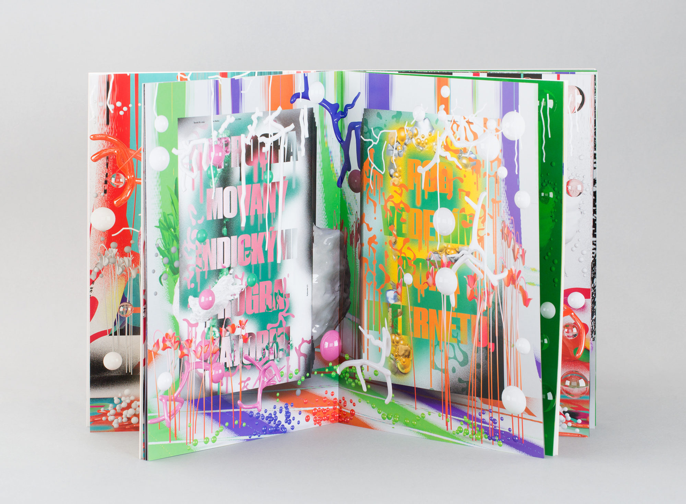
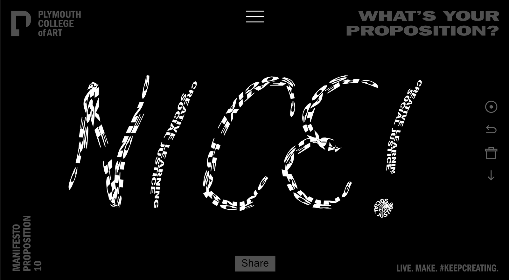
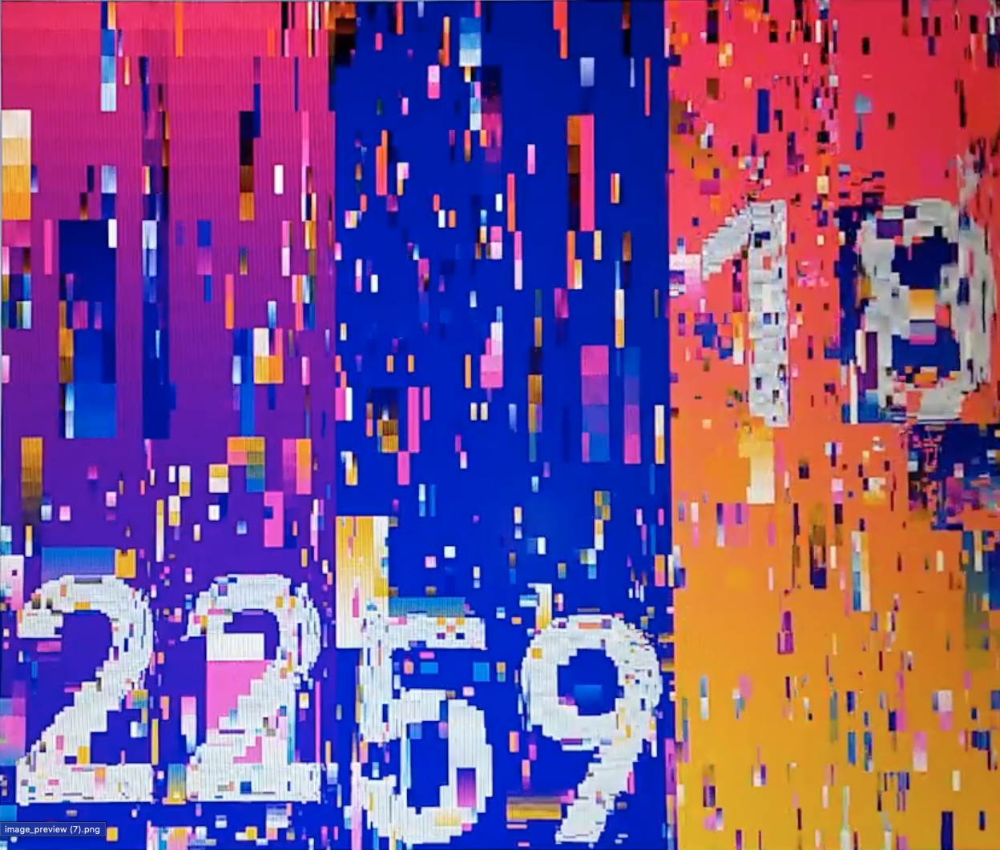
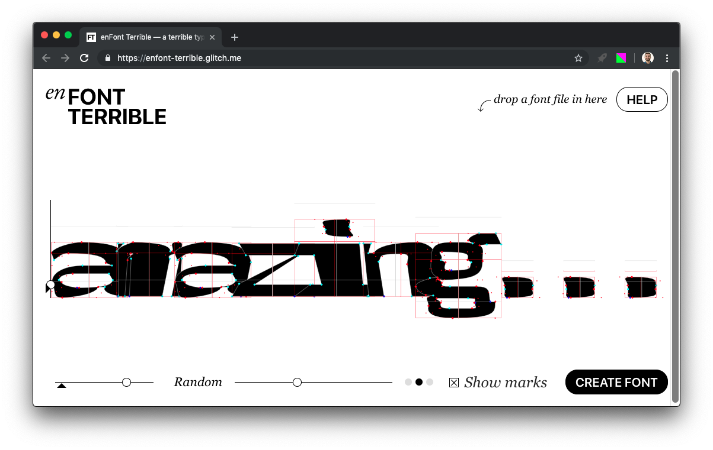
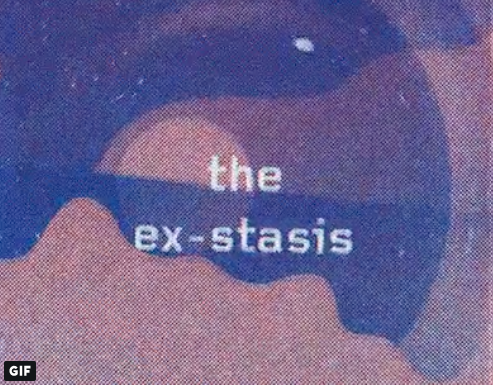
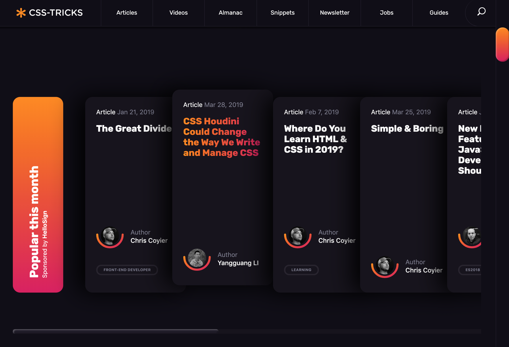

# Recursive Minisite – Info & Links

# Existing materials

## Websites

**Current beta minisite:** [**https://recursive.design**](https://recursive.design/)

**Mockup up improved minisite:** [ideas for improving communication on the website](ideas_for_improving_communication.md)

## Pre-beta fonts

https://github.com/thundernixon/recursive/tree/master/fonts

## Presentations / graduation materials

(Links to graduation materials available upon request – specimen PDF, poster, etc)

# Aesthetic / interactive inspiration for minisite

# Colors

https://twitter.com/arkotypeco/status/1121994178785882113

[https://twitter.com/arkotypeco/status/1121994178785882113](https://twitter.com/arkotypeco/status/1121994178785882113)

**Grainy Colors**

Beautiful [illustrations by Elliot Salazar](https://www.elliotsalazar.com/#/trip-sitting-tips/):

(If this graininess were applied to a glowing/moving gradient, that would be suuuuper cool)

## “Weird” design

https://www.therodina.com

**Nothing in particular, but we could connect glyph contour nodes with lines, to show interpolation**
http://www.hansje.net/

**Fun weird site designs**

https://hoverstat.es/

## Product Websites

**Stripe**
The animated pieces of UI work nicely with explanations. Stripe has a lot of nice CSS touches, overall.

https://stripe.com/en-US/sigma

**iOS 12**
Lots of images of product UI. Attractive pace of explanation with great copywriting – catchy titles with easy-to-read explanations of around 200–500 characters.

https://www.apple.com/ios/ios-12/

**Sketch**
Beautiful sense of drama and fun, with the dark backgrounds and bright pops of color.

https://www.sketch.com/

## Type Specimens

**GT Eesti Design**
Beautiful, up-close look at characters & design features. Good example of video animations to show type variations (probably a better solution than using actual font animations, as those will crash browsers right now). The site is overall a good example of flow: story, design, origins, try/buy.

https://gt-eesti.com/design.html

http://www.underware.nl/fonts/zeitung_mono/features/PDF/

**Halyard**
Really excellent set of SVG illustrations of a wide range of suggested uses. Makes it easy to imagine where the family could be used in other graphic design work.

http://halyard.dardenstudio.com/#welcome

## Type Experiments

**Amazing interactive way to draw with type.**

- http://whatsyourproposition.com/
  

**ASCII Art**
Obviously, ASCII art is a great use case for monospace type. This is a nice example of that:

- [https://twitter.com/rob_arista/status/1115926127112019969](https://twitter.com/rob_arista/status/1115926127112019969)
  

**Even better ASCII Art**

- http://www.underware.nl/fonts/zeitung_mono/features/ASCIITV/ManRay?ASCII=10&color=6
  

**Not quite sure what this is, but it’s a nice animation.**

- [https://twitter.com/n_a_n_co/status/1116639626268172288](https://twitter.com/n_a_n_co/status/1116639626268172288)
  

**This amazing mix of color:**

https://twitter.com/RavenKwok/status/1120716979302592513

[https://twitter.com/RavenKwok/status/1120716979302592513](https://twitter.com/RavenKwok/status/1120716979302592513)

**All of this guy’s work, but especially stuff like this:**

https://twitter.com/zachlieberman/status/1108153597945171969

[https://twitter.com/zachlieberman/status/1108153597945171969](https://twitter.com/zachlieberman/status/1108153597945171969)

\*\*EnFont Terrible

What an amazing type experiment! https://enfont-terrible.glitch.me/

## Risography

https://twitter.com/kellianderson/status/1122164275756392448

[https://twitter.com/kellianderson/status/1122164275756392448](https://twitter.com/kellianderson/status/1122164275756392448)

## Recursion in general:

https://twitter.com/rudytheelder/status/1111642140667334656

[https://twitter.com/rudytheelder/status/1111642140667334656](https://twitter.com/rudytheelder/status/1111642140667334656)

**Somewhat-fun examples of hover effects with a “grade” based typeface.**
http://action.commercialtype.com/

**WOOOWWW beautiful layering in this specimen**

https://twitter.com/commerclassics/status/1116698252798255104

[https://twitter.com/commerclassics/status/1116698252798255104](https://twitter.com/commerclassics/status/1116698252798255104)

## Docs / code-based blogs

**Styled Components**
Fun aesthetic. Was better with Operator Mono.

https://www.styled-components.com/docs/basics#animations

**React**
Not especially fun; just really nicely done.

https://reactjs.org/docs/getting-started.html

**CSS Tricks**
Frequent redesigns. Uses nice CSS tricks, like the gradient backgrounds for hovered text, and subtle/not-subtle hover states.

