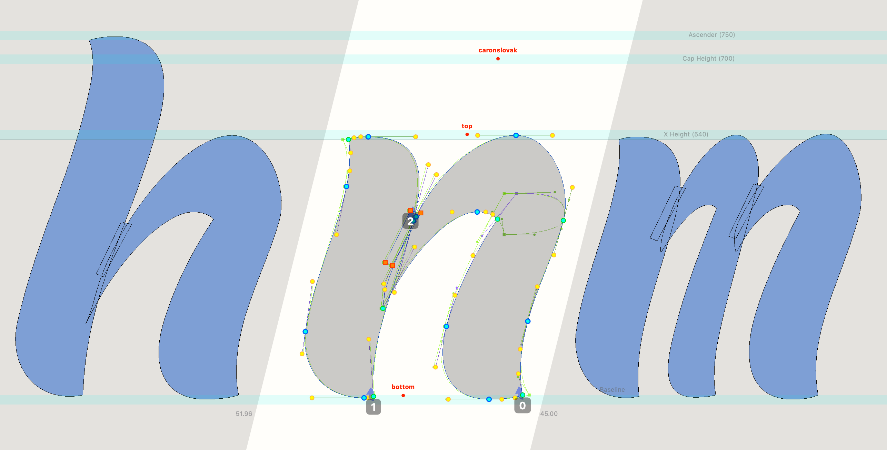
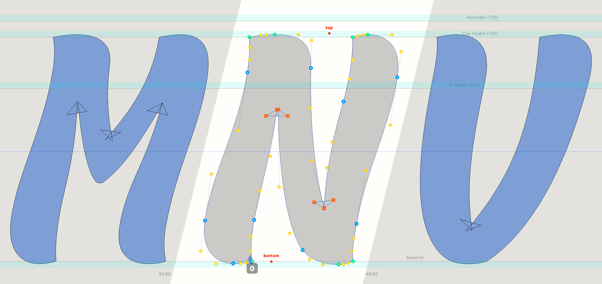
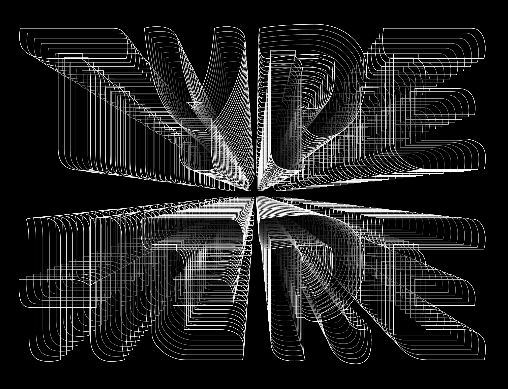
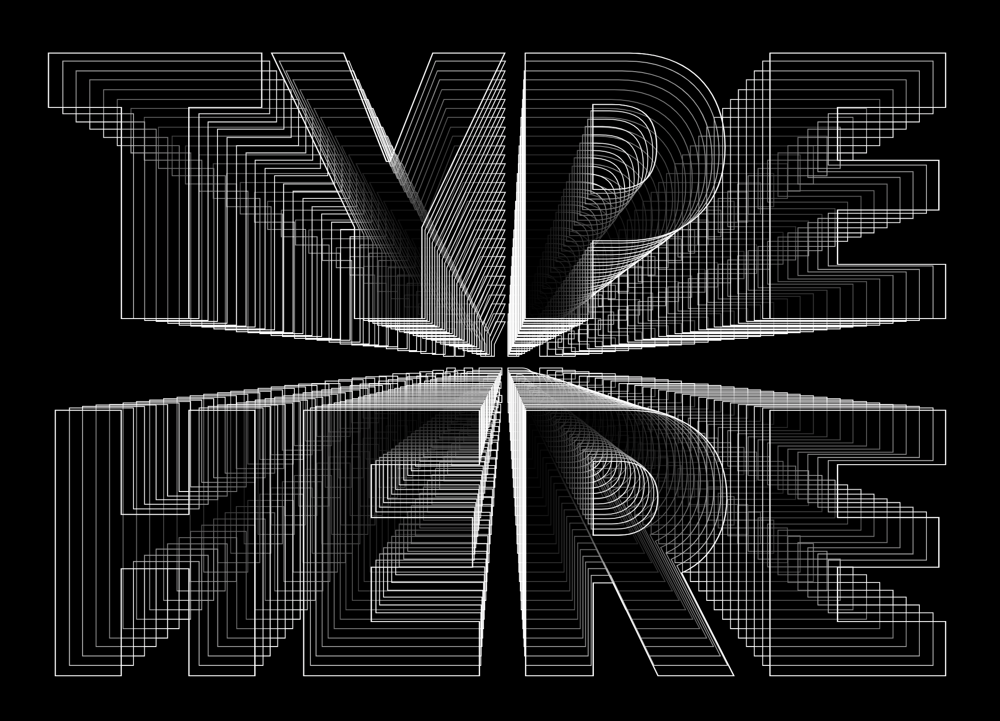
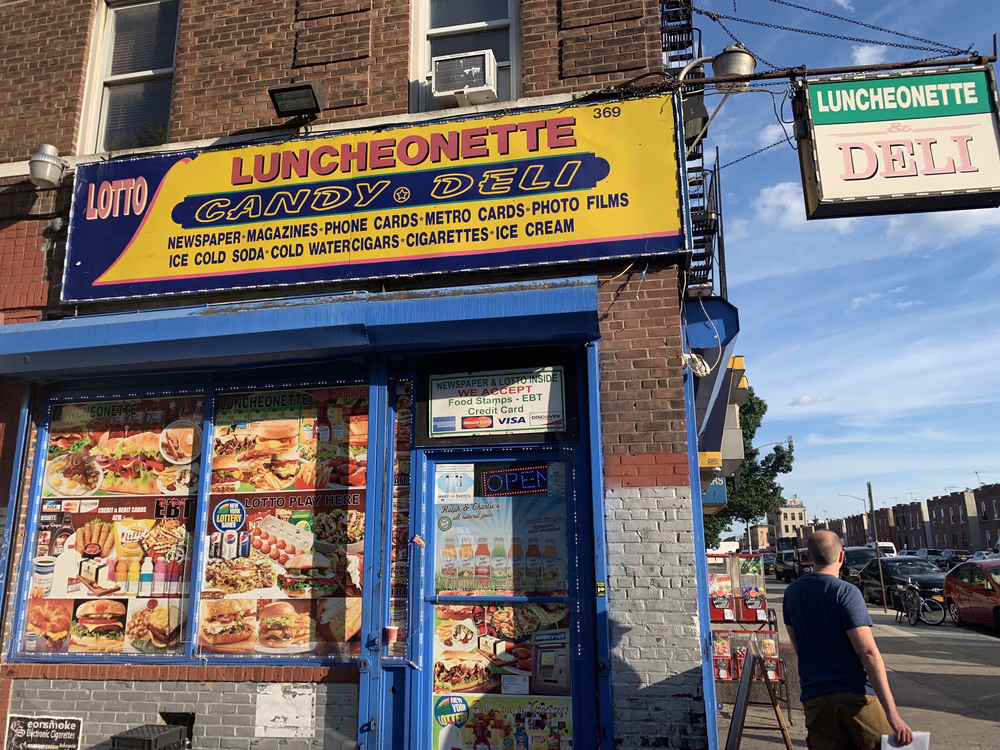

# Exploration: can overlap removal be automated?

**Problem:** it is very useful to draw font masters with overlaps, but if an end user wishes to use a font with just outlines, they see these overlaps.

Would this be possible to fix in an automated way?

## Background: why overlap drawings?

Overlapping glyph drawings makes it more efficient to copy similar contours between glyphs, as in the "shoulder" of the n/h/m:

It also makes it simpler to control drawings while working, as in the inktraps of diagonal glyphs:

## Example design problems

### "Futuristic" design

Someone might want to do some kind of *TRON*-like design, with outlined paths for letters:

This works a lot better without contour overlaps:

### "Vernacular" design

This is also a problem if someone wishes to make someone wishes to make some "vernacular" design, with letters overlapped like the *"CANDY • DELI"* in this bodega sign:

## End-user design workaround

In the short term, the best workaround for a graphic designer to use this font with outlines will be to **use static instances instead of variable fonts.** Static instances will have overlaps removed when they are generated, because they don't need to maintain compatibility between styles.

Another workaround (which would work with variable fonts) could be to outline text, then duplicate and overlap a solid version in front, in order to give the appearance of a solid outer stroke.

Potentially/probably, this is the solution that will be required for Recursive. After all, it is already the case that variable fonts are useful for some contexts, while static fonts can be useful for others.

*However,* if this problem were to be solved, how might that be done? I've had an idea and I am recording it here. This is not to say that this will necessarily be an outcome of the project, because it would add a very large chunk of scope to the project.

## Idea: a post-process to removed overlap, then make all segments into curves

The main production problem for removing overlaps is this: the built-in "remove overlaps" feature of font editors removes all points that are on a path, and not controlling angles. In a typical drawing, these would be unecessary points, and useful to remove in order to simplify a drawing. However, in Recursive, these are critical in that they allow controlled interpolation between Casual and Linear styles. Curves become straight lines, and to make this work, those straight lines need off-curve points that are set inline with their straight lines. When overlap is removed, then, compatibility is broken.

One potential solution: 
- a script could remove all overlaps, and then make *every* segment into a curve (even segments that are always straight lines)
- the script could maybe use a treshold to avoid making inktraps into curves, such as "only make a segment into a curve for segments of greater than *X* units in length)

Big caveats:
- There are oncurve points which are also removed by the "remove overlaps" feature. These would have to somehow be recorded, and re-inserted
- Contours are drawn in a way that some on-curve points move inside and outside of other contours, depending on weight or style. This overlap removal strategy would require drawing in such a way that no overlaps change where points are. This would be very hard to check for and enforce, between collaborators.

## Another option: just draw without overlaps, from the beginning

This could work, but would give up a lot of control, flexibility, and efficiency. Also, in terms of Recursive, this ship has sailed – much of it has already been drawn.

## Another option: manually remove overlaps, and take care to maintain compatibility

This may be the ultimate solution, but would have some big challenges:
- It would be difficult to maintain curve quality while doing this work
- It would require working with many masters open at a time, which currently requires a very large amount of computing power (a 2018 MacBook Pro with 2.2 GHz Intel Core i7 & 32GB RAM currently gets major lag with more than 8 masters.)
- It would be very time-consuming, yet require a fair amount of technical expertise to do well. It's not the kind of problem that could be easily outsourced or crowdsourced.

## Conclusion: consider this as a future enhancement

In the future, tools for variable fonts will be easier and faster to use. Someone may solve this problem. We will better understand the demand for this typeface, and whether the static-font workaround works for designers. 
