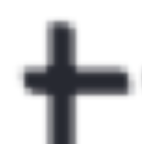
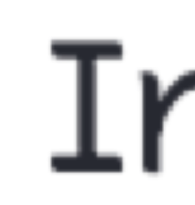
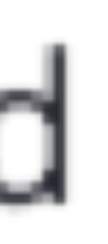
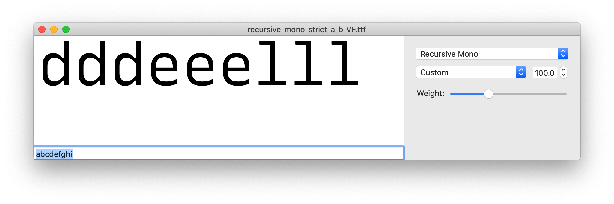
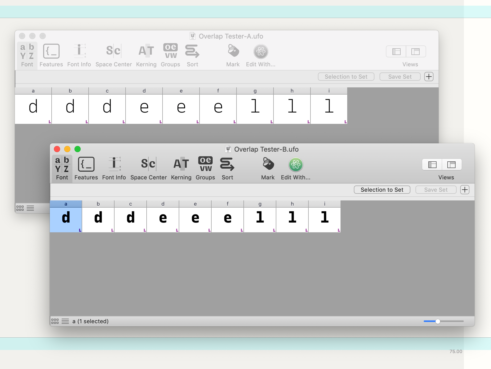
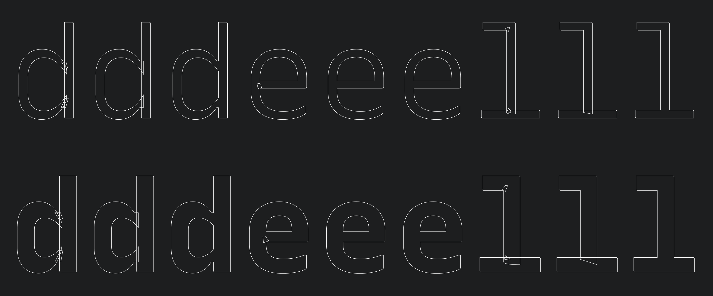

# Testing overlap rendering on medium to low-DPI screens

**Date: June 5, 2019**

## Question

Does glyph construction matter for text rendering on medium to low-DPI screens?

Clearly, prior experience in Recursive has shown that "exterior" overlaps often render poorly on low-DPI screens. Take an "o" that is made up of two halfs, overlapping but smoothly connecting on the top and bottom. Antialiasing happens on both of the overlapped contours, but if the top edge of one turns on a pixel at 50% gray at the top of both contours, these values *add up,* resulting in a terrible blobby lettershape at small scales, and less-distracting but still-noticeable bumps at larger sizes.

*Above: rendering issue with overlapping contours, as seen in Chrome browser on macOS. Arrows point out examples of the rendering issue.*

BUT, does this also effect the rendering of *"interior"* overlaps? 

Variable font can retain overlapped contours, and this is very useful to draw glyphs efficiently for interpolation. But do they face this issue in all contours? Examples of "interior" overlap are:
- The crossbar of a /t, made from a separate rectangle crossing a stem
- The are where a bowl or curve joins into a stem, on letters like /d, /e, /a, or /n.
- A corner which is not a simple acute angle, but two overlapped paths that connect in a loop, as is frequent in a letter like /M
- Areas in which "ink traps" are made by overlapping a small rectangle over the inner corner of a joint.

It appears to happen, though thankfully in a less-noticeable way. 

## Testing

I've made a very simple VF, `variable_ttf/overlap-tester-VF.ttf`. This puts contours for /d, /e, and /l into the spots for /a through /i, each in three different styles of drawing. This was then built with FontMake.

*Interestingly, either FontMake or Sketch are removing some overlap from the first "e," even though that overlap is present in the UFO.*

This is tested in `index.html` of this directory, which can be opened directly in any browser. I am looking at it in Chrome.