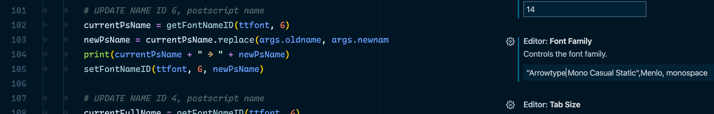
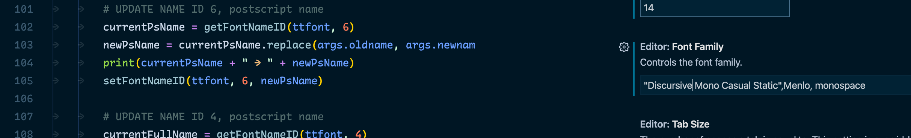
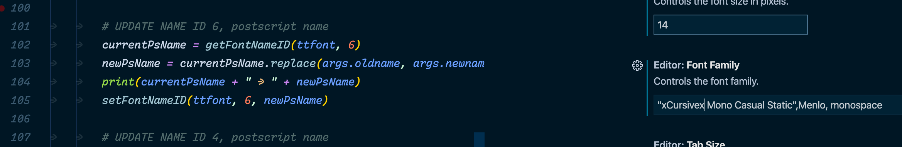

# Testing style-linking and family name bug in macOS (Catalina 10.15.3)

**Finding:** in macOS, the substring `cursive` within a font family name will cause many problems with style-linking in apps using macOS CoreText to display type.

Due to this, Recursive has several issues on macOS, as of Catalina 10.15.3:

- In TextEdit/Keynote/Sketch, changing from a Regular version of a font (e.g. Helvetica) to Recursive will go to the Italic instance. When I change back to another font, the Italic style sticks.
- In VS Code, calling the font family "Recursive Mono Casual Static" calls the Italic instance. The full PostScript name must be called to access Regular (upright) instances, but then Italics cannot be shown.

This is more fully described here:
https://github.com/arrowtype/recursive/issues/153

## Test it yourself

Using macOS, install the fonts at `docs/ribbi-style-linking-macOS/recursive_v1.037--style-linking--test-cases` to experience the following results:

`Arrowtype Mono Casual Static`
- This rename solves the issues completely, with no other change made to fonts beyond family naming in name IDs 1, 3, 3, 6, & 16.



`Discursive Mono Casual Static`
- This will result in only-upright* fonts in VS Code & Atom, and have the same style-linking issues in TextEdit that "Recursive" does



`xCursivex Mono Casual Static`
- This will result in only-Italic* fonts in VS Code & Atom, and have the same style-linking issues in TextEdit that "Recursive" does



`Rocursive`
- This is a curveball, just used to check that the issue isn't limited to only Recursive (e.g. there might be an additional variable at work, such as something else in the font metadata allowing this style-linking to be manipulated by the "cursive" substring.) However, this also demonstrates similar RIBBI style-linking issues as "Recursive."

## Test method

You can easily change the family naming of TrueType fonts with a directory using this script: `docs/ribbi-style-linking-macOS/change-family-name.py`. To use it on all fonts in a directly, use it like this:

```
python <path>/change-family-name.py -o "Old Name" -n "New Name" --inplace $(ls <folder_of_fonts>/*.otf)
```

(Note: to use this script, you will need to have FontTools installed and use Python 3.)