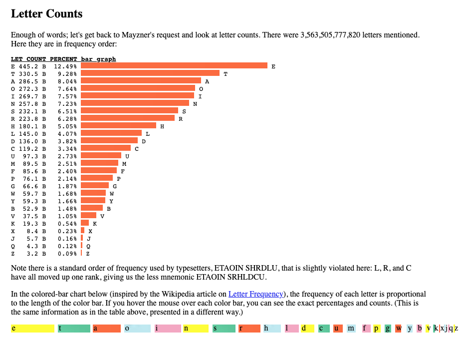

# Recursive Specimen – Inspiration & Ideation

## Stickers

Devs and designers love stickers. They plaster them onto their laptops, waterbottles, notebooks, dogs, loved ones, etc etc.

Therefore, it would be a fun thing (and likely popular) if the recursive specimen had one or multiple sticker sheets.

As I come up with ideas for this, I will add them here.

**Letraset-like alphabet sticker sheet**

What if we allowed people to write their own messages with glyphs from Recursive?

This could follow a simplified [English letter frequency](https://norvig.com/mayzner.html) to ensure that there were more copies of the most-frequent letters.

