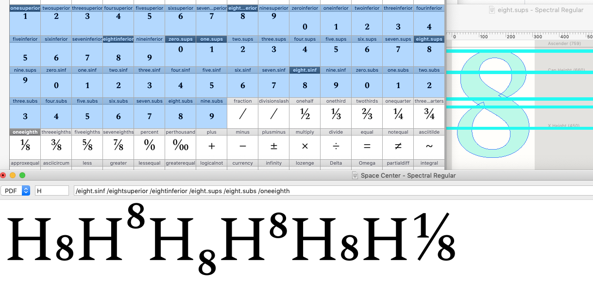
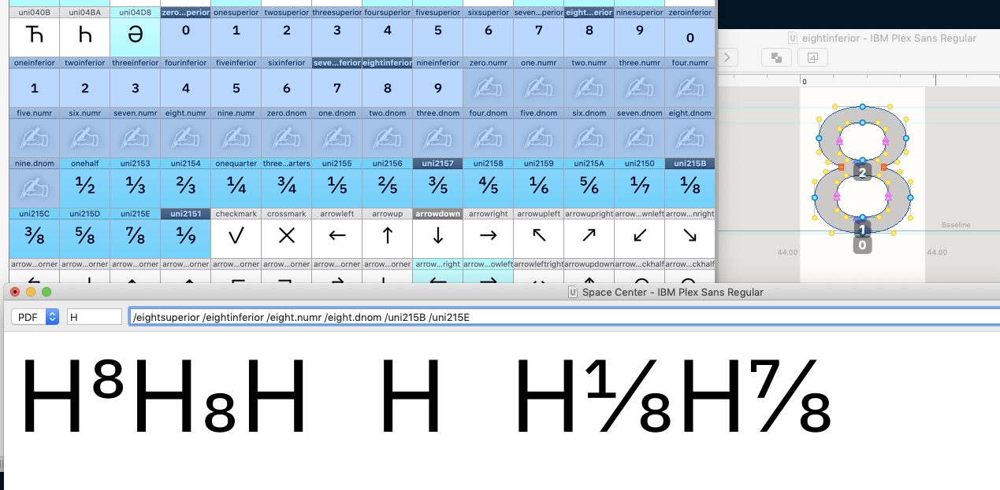

# How should Recursive implement superiors, inferiors, scientific inferiors, and fractions?

## Spectral

Spectral does the following:
- `/eight.sinf` is drawn
- `/eightsuperior`, `/eightinferior`, `/eight.sups`, and `/eight.subs` use `/eight.sinf` as a component, but position it slightly differently
- `/oneeighth` uses `/one.sups` and `/eight.subs` as a component

I wonder whether the font really needs to separate `/eightsuperior` from `/eight.sups`. Here, `*.sups` and `*.subs` are used to compose fractions, while `/*superior` and `/*infereior` are given unicodes, so they can be typed out for scientific notation.

## IBM Plex Sans

The `/*superior` and `/*inferior` glyphs are all drawn (no components), and fractions are composed of these. No separate, higher or lower “scientific” versions.

## Plan for Recursive Mono

Recursive's strategy should be closer to that of Plex, _but_ with the exceptions:
- Inferiors will be made of components, positioned appropriately.
- sups/infs will overshoot the cap height and baseline by a bit to be larger and more legible in type.
- Fractions will be composed of these "overshot" sups & infs
  - Google Fonts "GF Latin Expert" spec requires "Additional Unicode Fractions (⅓ ⅔ ⅛ ⅜ ⅝ ⅞)"

## Recursive Sans

Spacing will need to be changed.

If possible, we should include the OpenType feature code required to make arbitrary fractions. *However,* this may or may not work in a font that contains both mono & sans proportions. To be continued...