# Recursive: Casual Mono - design & development notes

## Grid?
- What font size do devs most commonly use for code? 16px? 14px? 12px? What units should a typeface be designed at to be most-optimal for that scale?
    - Atom uses 14px as the default font size 
    - What if you designed the “text” or “micro” master for 10 or 12 px, and the “display” master for something like 72 px – then, maybe people could set the exact right OpSize value for their chosen font size? E.g. if you made the OpSize value `100` be perfect for 10px, and the value `900` be perfect for 90px, would `140` then be perfect for 14px? 
        - This is probably hard to *actually* hit perfect, but it’s an interesting thing to test…
        - it appears that “out of the box,” no. Here’s an example at 10px:


        - To actually get it to work “as expected,” you must turn off aliasing
    
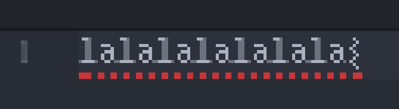

*-webkit-font-smoothing: antialiased;*


    *btw, enlarging tiny screenshots in Photoshop to show pixels is best done with “nearest neighbor”*


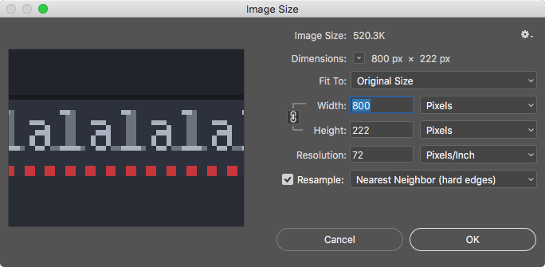


- What about at 14px?
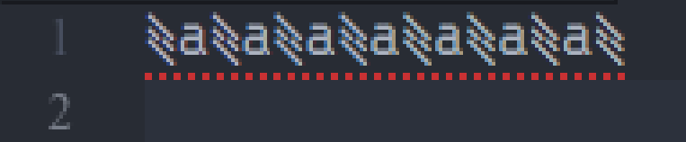

*default (aliased)*


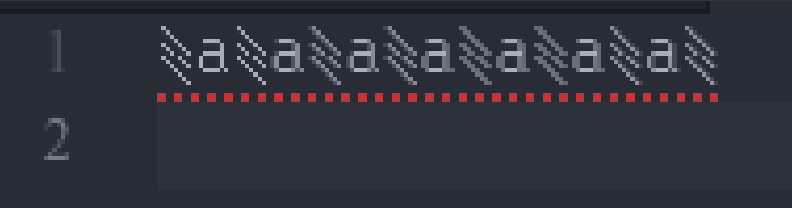

*antialiased – note that even though all of these characters are set to widths that almost divide 1000UPM evenly into 14 units (71UPM), the widths still get out of sync from left to right and result in blur*


Possible UPMs for better even division at 12px, 14px, 16px, etc

- 1344, 672, & 336 are all divisible by 12, 14, and 16 … but these will only be (somewhat) useful if antialiasing is set to “on,” which it normally isn’t, *and* even then, things would be blurred left-to-right.
- You don’t want your font to break because it’s not 1000 UPM, and you don’t want to deal with some versions that are 1000 UPM and other versions that aren’t.


**Decision: optimize micro size for 12px or 10px, even though it will be approximate, and basically don’t worry about the grid for the display size**


## Width / vertical metrics?


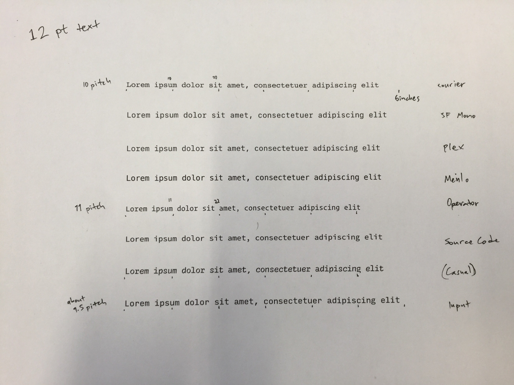


Many monospace fonts follow the lead of Courier, a “10 pitch” font which fits 10 characters-per-inch when printed at 12 point size.


| Font              | x-height |
| ----------------- | -------- |
| Fira Mono Regular | 526      |


## Overlapping strokes

Rather than drawing glyphs as closed shapes, you should try deliberately making them overlapped. This would open up all sorts of fun possibilities, from color fonts with partial opacity to showing the logic in specimens to making it faster to make stencil versions later on.


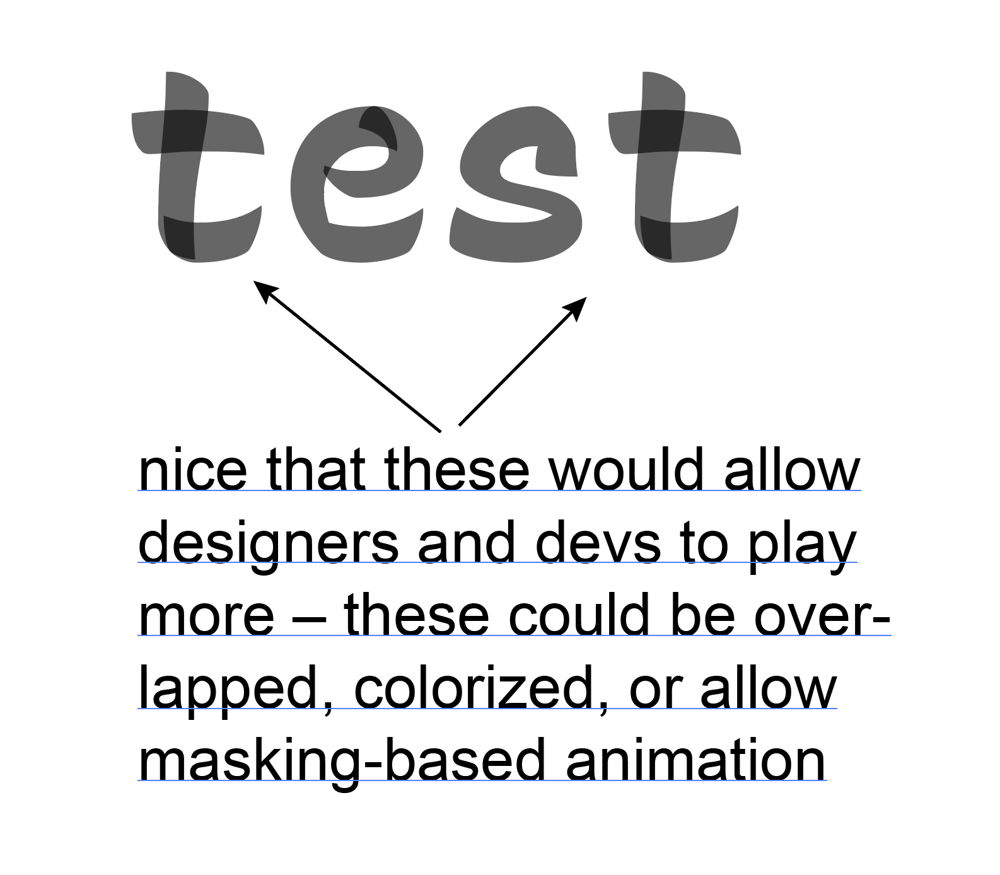


# Interpolation
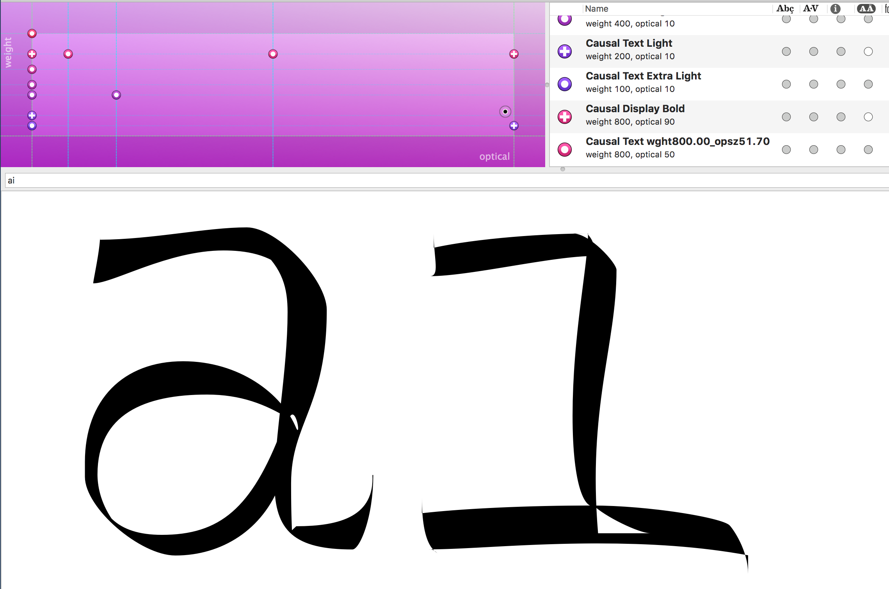

*☹️ not working yet*


Interpolation wasn’t working because I had entered the weight value of the Display Light master as 100, rather than 200 (to match the Text Light master). So, it was extrapolating, rather than interpolating. Fixing the one value fixed 90% of my interpolation issues today!


# Inktraps or no?

Pros: 

- they make a typeface “look” like it’s optimized for small sizes

Cons:

- not sure if there’s a particularly good way to fit them in, without a) making outlines which can’t be interpolated well into proper “Brush strokes,” and b) avoiding adding intermediate masters to get right of brush strokes before giving weights that can be shown as outlines nicely


# Italic Angle

Would it make sense to set the maximum italic angle to 18.43°, to match a 1:3 ratio?


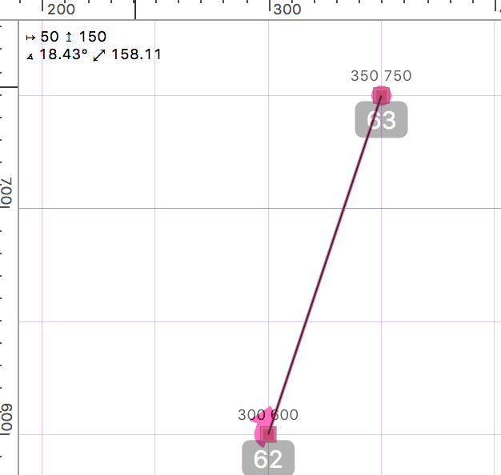


# Breaking letters into “brush strokes”
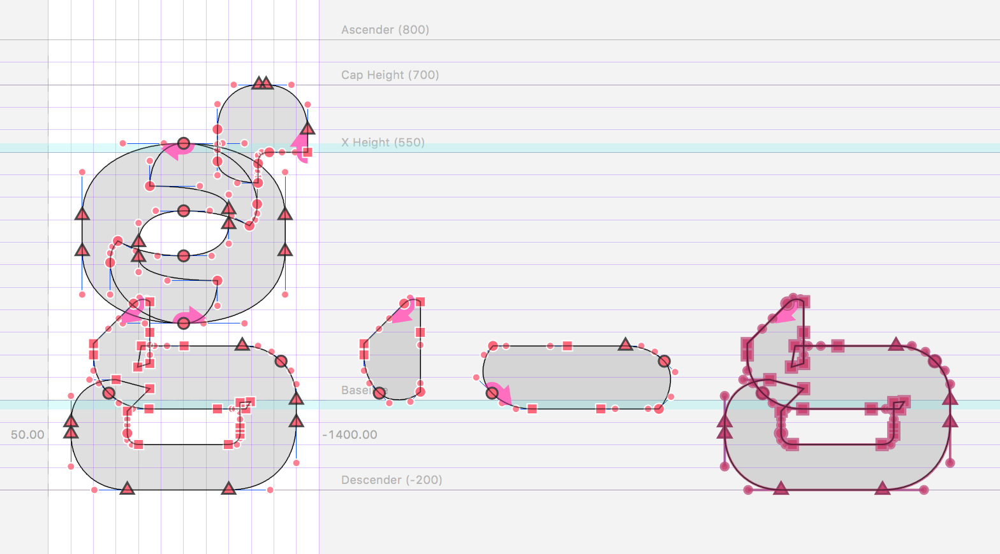


# Variable Font tests

Troubleshooting:

- `Base master not found; no master at default location?`
    - “the base master is the one which is at the default location (0, in normalized coordinates) on all the axes.” [FontMake issue on GitHub](https://github.com/googlei18n/fontmake/issues/401)
- Unicode errors
    - glyphs were inconsistent between the masters (e.g. “L” existed but was empty in a couple of them”
    - I deleted all empty glyphs, except for `space`, in all masters
- `IndexError: list index out of range`
    - this has dogged me both in FontMake and in RoboFont Batch
    - i’ve stripped the font files to just a few letters, and i can generate a variable TTF in RoboFont Batch. This works with letters `a g r s o`, but breaks on `h`
        - yup, `h` was causing a problem, because it had a different number of offcurve points in the stems, between text and display versions.
# Marketing
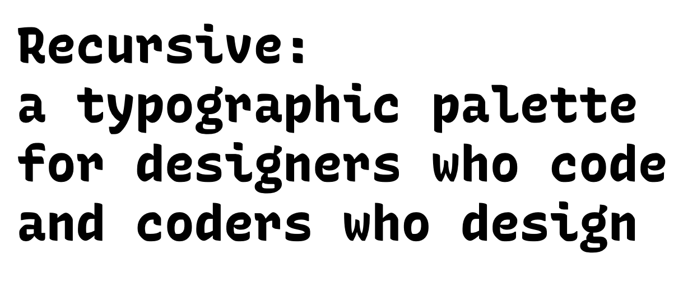


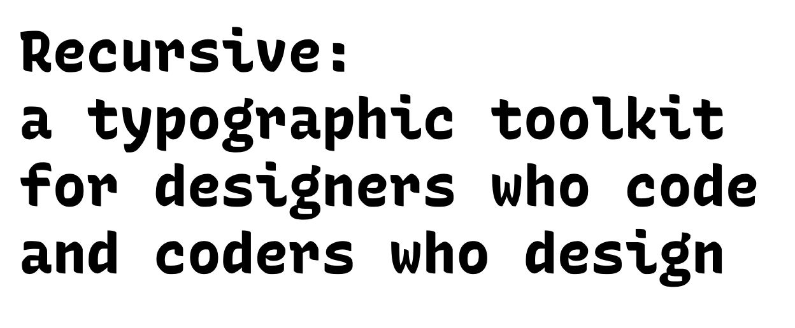


Is “palette” suggestive of as much flexibility as “toolkit”? It fits a theme of sign painting, but it may seem more commonplace – almost any font could be called a “palette.”


# Heavyweight


# 
## Why won’t it interpolate??

The heavy is interpolating just fine if I copy-paste a letter into Glyphs, but it won’t work from the UFO in Superpolator. 😕 …even if I create an entirely new Superpolator document. Why??


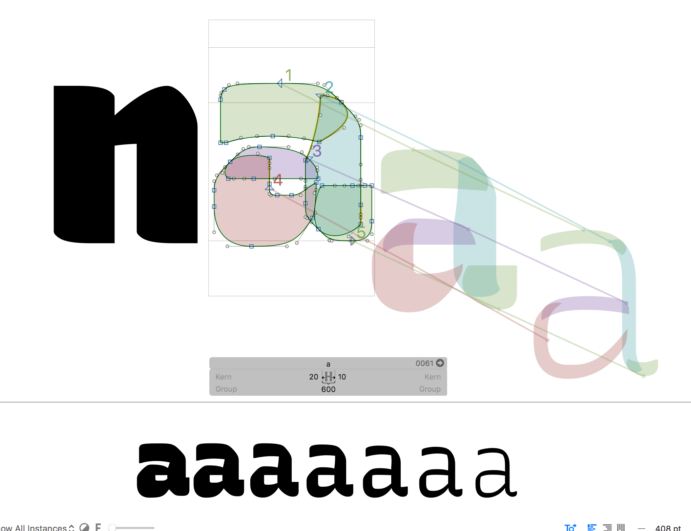


# Pleasant contstruction, plus interpolation

Not always easy … 

If I simply follow feedback and round out the “text” version of the y, I end up with a big kink. Not great:

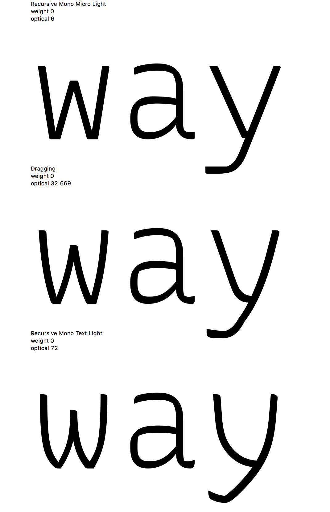


# Proportional workflow

When changes are made in width to one family (e.g. Heading Bold), use a script to copy these widths to other master(s).

Important (april 18, 2018): check script before using; verify result and don’t save (or revert) if necessary.


# Making heading style more curvy – an exploration

I’ve gotten feedback a few times that some glyphs of the “heading” style seem more organic than others. For instance, the diagonal letters (`v`, `w`, `x`, etc) are curved, but the straight letters (`n`, `m`, `a`, `b`, etc) have stems with no curves. I’ve also gotten feedback that the lowercase in the heading style doesn’t seem as warm as the uppercase, or as warm as Casual Script in general. I think this might potentially be due to the sharpness and relatively high contrast of the current letters in areas where curves join stems, like in `n` and `h`.


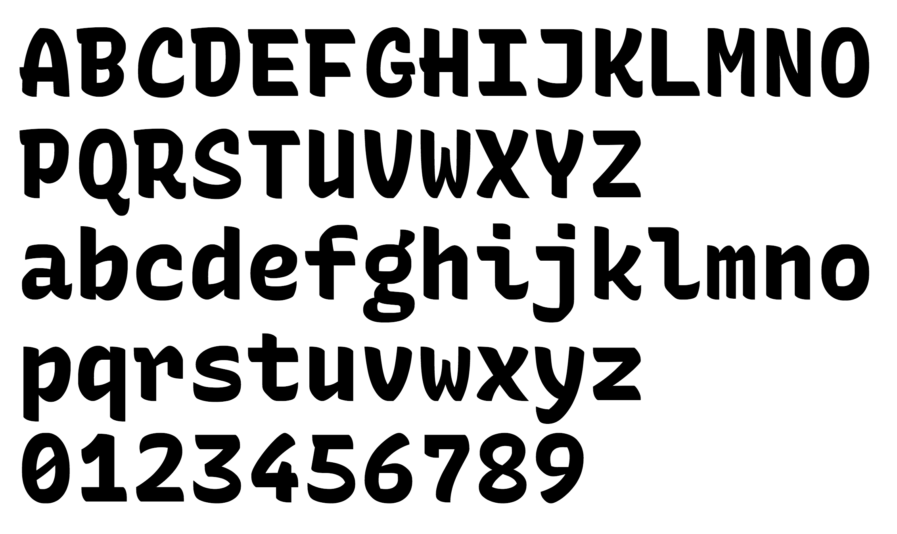

*Mono Heading Bold, as of April 25, 2018*


I’m not entirely sure whether I agree with this critique, or whether it actually matters. I’m also concerned that introducing curves to straight stems might disrupt the interpolation between my Text and Heading styles – and if so, that fixing this might require an entirely additional set of masters. However, I can’t quite dismiss the comments offhand, and I need to explore whether there is a design which might the crispness of the current heading without sacrificing the warmth and organic-ness which attracted me to casual scripts in the first place. 

I’ve tried a few directions to resolve this possible mismatch, duplicating most of the lowercase and adding suffixes like `.alt1` to be able to test different versions in the Space Center (I wrote a simple script to make this process easier and more accurate).

I am now in the process of making versions of my four masters that interpolate, so I can test this in the context of the web.

A current problem I am facing, however, is that the Robofont Space Center is now mixing the suffixes of letters, and prevent me from properly viewing changes in context. 😐 I have quit and restarted, to no avail.


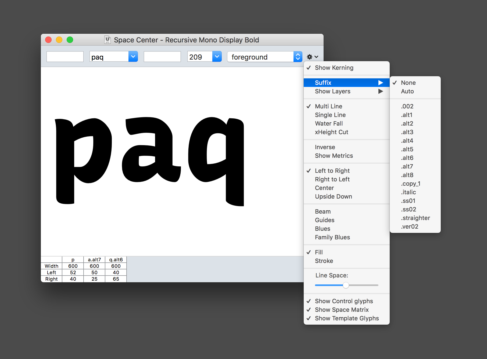


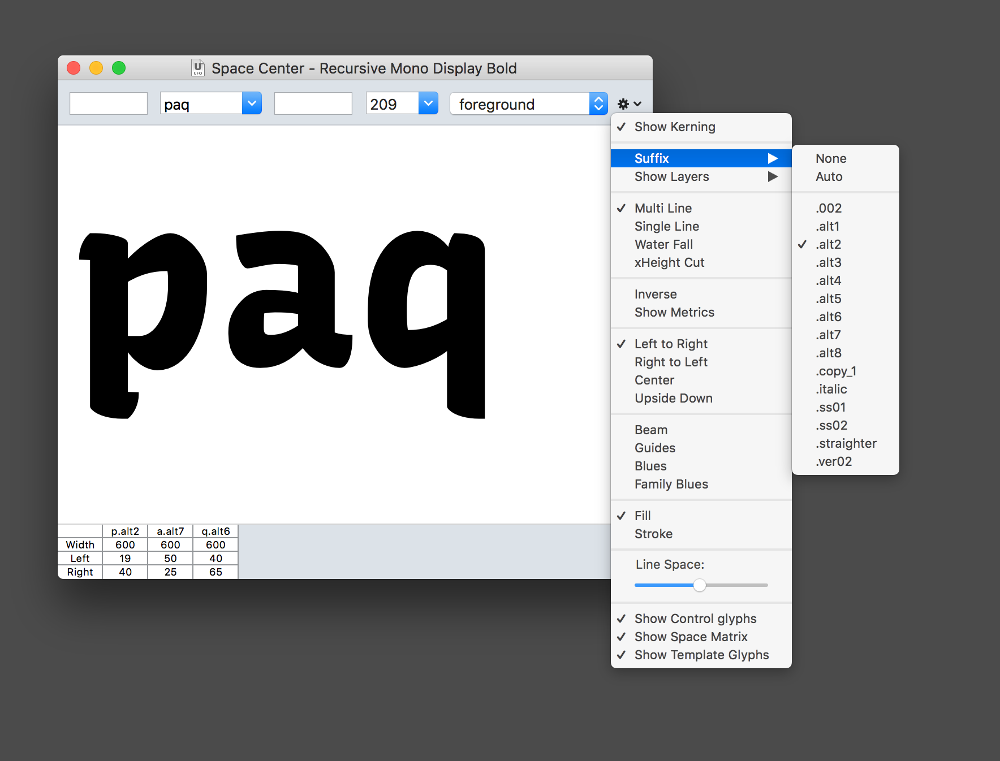


## Result of adding curviness, so far

I have experimented by creating a script to easily create new ranges of glyphs with suffixes like `.altt1`, `alt2`, etc. Through this, I found that…


- Based on the comment (from Gen) that the caps looked warmer than the lowercase, I changed my letters so that the heading style has *less* contrast than the text version. This better replicates what is done by a paintbrush, rather than the brush pen I had been using as a model of those joints. I think this makes the heading letters look more playful, and less aggressive.
- I have made most stroke endings less sharp, and introduced a bit more asymmetry into strokes
- I have reduced the totally-flat portions from the sides of the round characters almost completely
- These changes required changes to point structure, so I went through my masters to adjust these things
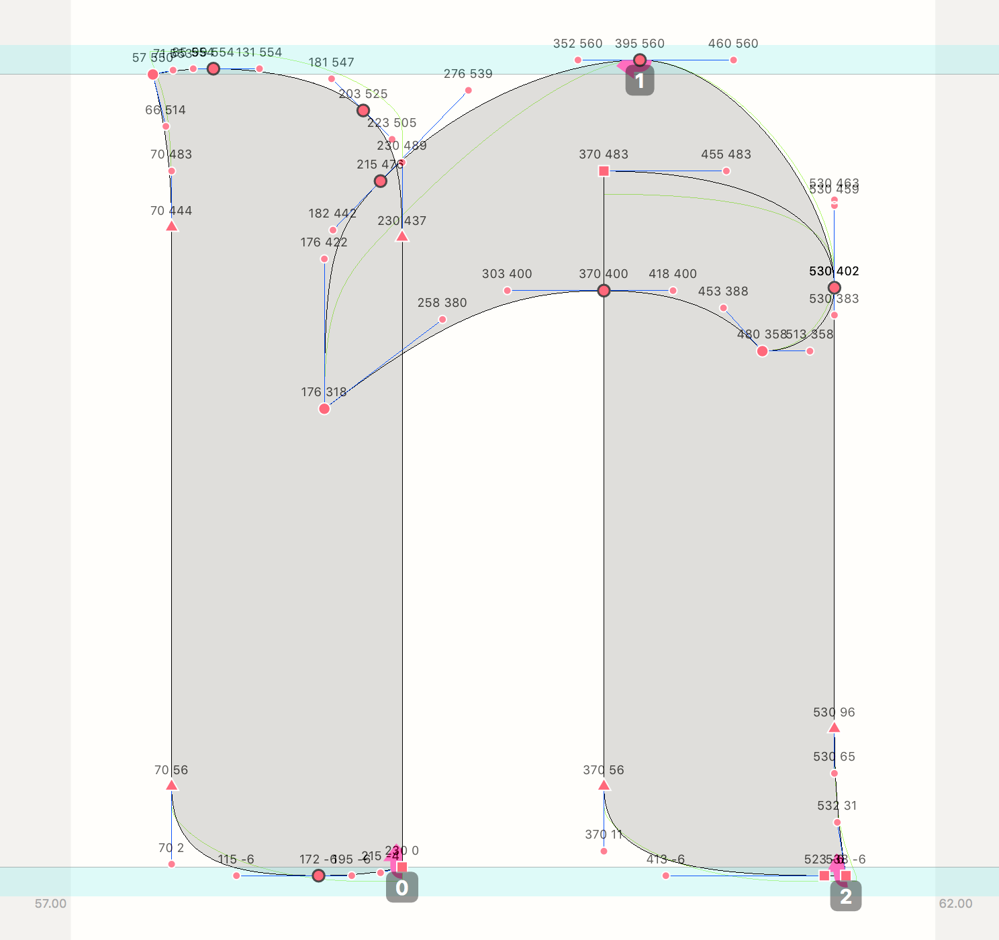


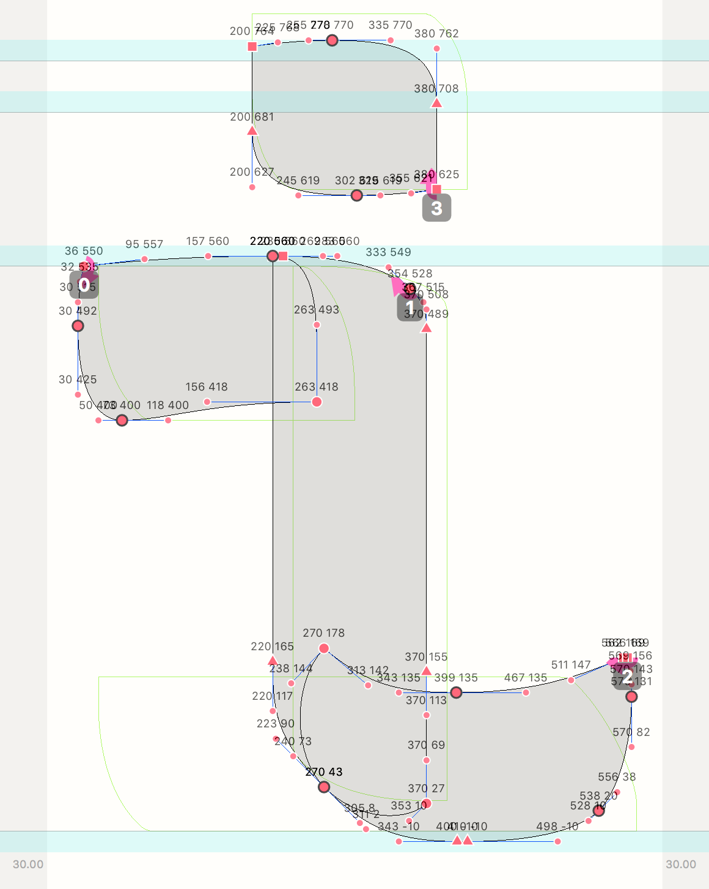


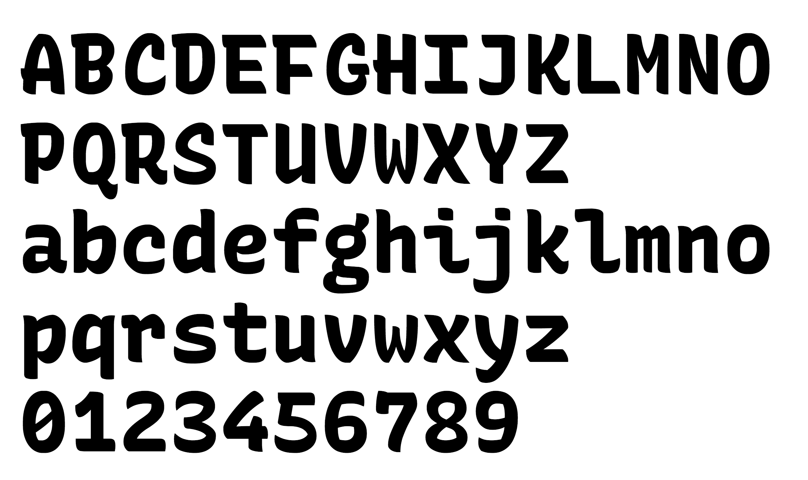

*Mono Heading Bold, as of April 30, 2018*


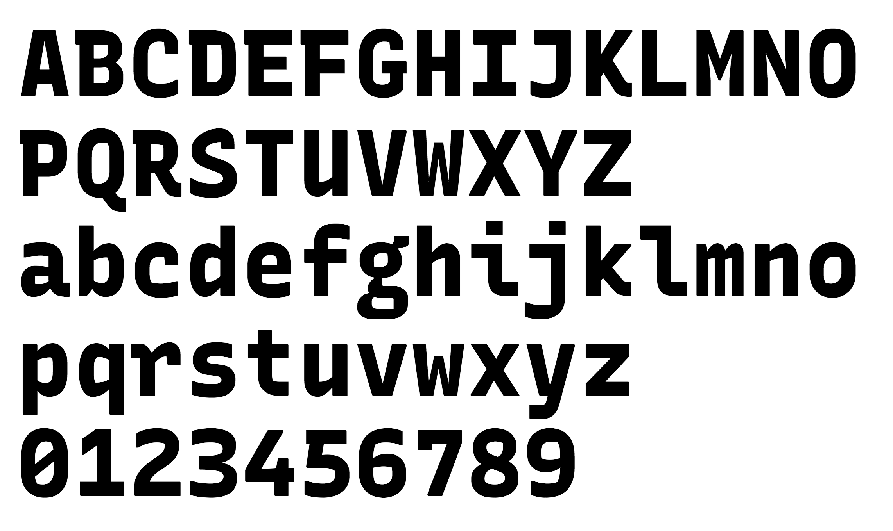

*Mono Text Bold, as of April 30, 2018*


# 
## Things to do, April 30:
[ ] Bring more of the curviness to heading light
[ ] Bring more of the curviness to caps
[ ] Test x-height, bold vs light (should they be closer together? in which direction?)
[ ] Bring more of the curviness to Sans styles
[ ] Bring proportional dimensions to more of the sans styles 
[ ] Make the vertices of diagonal characters in the Text versiosn more like the letter `y` – with a little flat bit, rather than completely sharp corners
[ ] ? open the stems next to joints in Text, similar to `r` joint? 
[x] widen `m` in text versions. make the space beside it match spaces inside it
[ ] make `F` more narrow, esp in text versions
[x] work on ss01 (more-roman glyphs, with bottom serifs, etc)
[ ] Heading Light W is too narrow


# Numerals
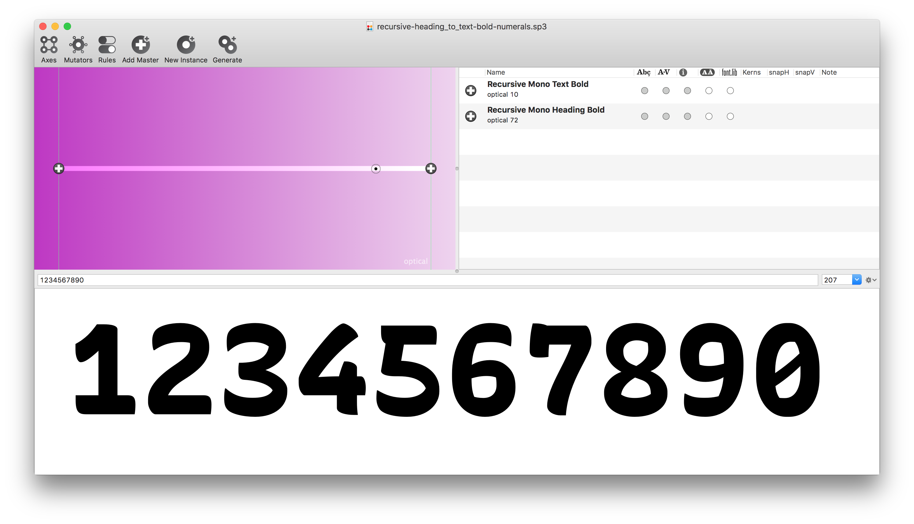


# Var fonting

The following glyphs aren’t exporting into the var font:

`~~'C', 'S'~~``,` `~~'X',~~` ```~~'a'~~``,` `~~'a.italic'~~``,` `~~'b'~~``,` `~~'f'~~``,` `~~'j'~~``,` `~~'s'~~`

…the `space` isn’t exporting either … not sure why.

But I’ve fixed that (sort of), by simply re-adding the space in the varfont prep script. The big whole with this is that it is currently hard-coded to be 600 units, rather than whatever comes from the actual UFOs.


# Things I could do, May 3–6
- ~~Make heavy caps~~
- Make heavy numerals
- ~~Paint letters to better prove out structure~~
- Make Heading Light more consistently brushy
- Improve testing website
    - more bloggy or docsy layouts
    - figure out how to build this in a way that exports to A5 booklet
    - figure out grid layout for small screens
    - start thesis site with gatsby? or vue?
- Improve var font script
    - could refactor this 
    - could add makeVar into the chain of events
    - could add a designspace generation into events
    - **could add instance-building into another python file in chain**
    - could export things directly into web tests
- Blog
    - convert notes from Just
- Work on italics
    - improve italicizer script
    - make terminal labeler script
        - include both oncurve and offcurve points
        - if it detects labels, make labels with new label
- work on proportional fonts
    - update with brushier feel
    - add heavy weight
    - add numerals
- begin writing

….UPDATE: I ended up experimenting with [Anime.js](http://animejs.com/), making a homepage animation out of an SVG.

Then, I worked on text heavy caps:


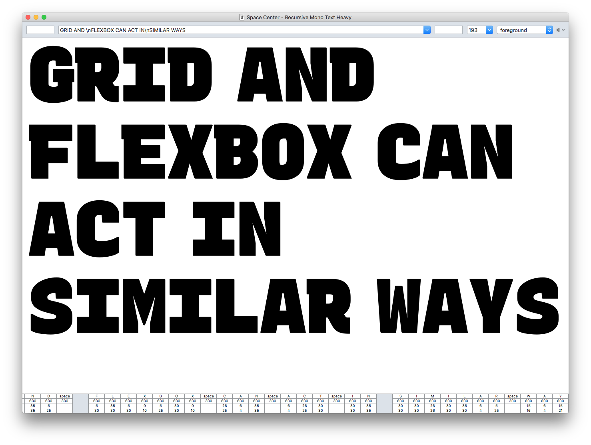


… I think it might be cool to use these, as big as possible, for nearly-full-page covers of sections in the thesis. Even just black-on-white, they look pretty awesome. They could also be fancy and animate down into a lighter weight and smaller text, on scroll.


[ ] the cap X needs to be redrawn slightly to interpolate

It’s also becoming apparent that I should create the typeface in stages:

- The widest character set coverage in Text, Light to Bold
- The next widest set in Heading, Light to Bold
- The heavy weights can be in a “beta” variable font, specifically meant for demos and display type


## Sunday, May 6

Top priority: bring Sans up to speed with mono

- fix script to copy normal-width glyphs
- copy almost-normal glyphs and adjust their width
- draw wide and narrow glyphs
- export to test on docs

Secondary priority: generate italic, testing italicizer script

- make point labeler script
    - one hotkey to label selected points – including attached offcurve points
    - have script check which labels already exist, and create similar but unique labels each time
- label terminals in bold
- fix italicizer script to unskew labeled points in groups
- think about whether you can script fix vertical stems and round parts

Secondary priority: draw basic punctuation for mono (paul will probably ask for this):

- period, comma, quotes, parentheses, curly braces, braces, ampersand, @, #, *, !, slash

Tertiary priority: draw heavy numerals


## Working to expand Sans again
- Unsuccessfully tried to improve mono-glyph copy script to prevent overwriting any non-600-unit glyphs in destination font. 
    - this shouldn’t lead to *too many* problems of overwriting, though it is troubling not to have a preventative measure
    - the problem with preventing the overwriting of non-mono glyphs is that the logic seems to allow glyphs to be cleared, but not written. Why is this??

To do:

[x] copy normal-width glyphs from mono to sans
[x] starting with Heading Bold, copy mono glyphs to propo, and re-fix their widths (to make things interpolatable and keep details matching)
[x] Fix x-height of Sans Heading Bold
[x] move on to heading heavy, expanding wide M and W from heading bold
[x] then, make heading light, text bold, text light 


# Review with Paul, Monday May 7

**there’s still not enough difference between heading and text**

- heading could be more expressive
    - (maybe you should make a version with even more flaring? maybe where vertical stems cut in a bit, like current `I`?) 
- text needs to have more internal consistency – it still looks pretty informal
    - e.g. `S` is curvy while `C` is square

**Do you really need duplexing? If it’s useful,** ***provide examples***

- are you just trying to avoid complexity in workflow?
    - (no – while this project may appear to be simple, I am trying to make something simple for end users – closer to “how a typeface *should* be” – and that is a huge challenge, making shapes that interpolate between brushy and stiff, and keeping things from reflowing on changes to weight/personality)
- heading is spaced pretty loosely right now
- if you are suggesting that duplexing is useful, you should show where, when, and why
    - menu items
    - links in text
    - designing layouts


# To fix, May 7
[ ] give heavy mono 600-unit spaces
[x] try squarer text cap `S` (it’s good!)
[x] raise sans text light `s` to new xheight
[x] center sans text light `t` (too far left / too narrow)
[ ] add basic punctuation
[x] make sans text `L` wider
[ ] make sans `A` wider
[x] extend leg of sans `R` (update mono to sans version)
[x] fix stems widths in text `A`
[x] copy fixed sans text light A to mono
[x] Make Sans Text M less displayish

next:

[x] extrapolate, then correct numerals for heavy
[x] fix lowercase heavy `x`, and keep it interpolatable by editing other weights (then copy to sans)
[x] make bottom of heading `4` more round
[x] draw and make adjustments in Sans heavy
[ ] even out n and o in sans? in mono?
[x] does heading style have too much spacing? (No – I think it just needs a more accurate name)


 ****

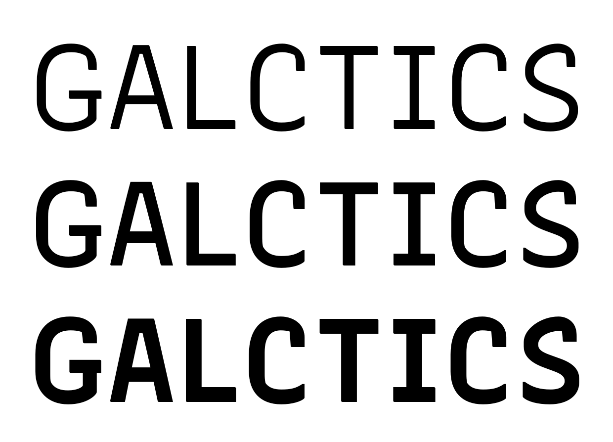

*Rounder versions of G, C, and S*


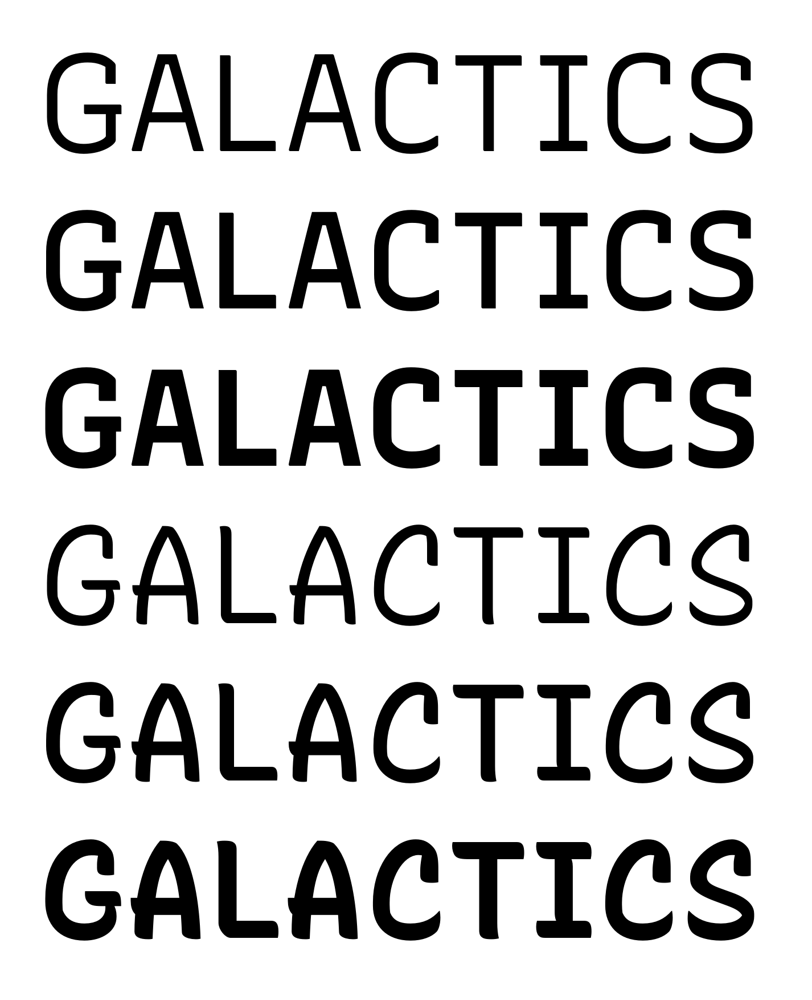

*Sharper versions of G, C, and S, to better match the overall squarish shapes of the “Text” versions*


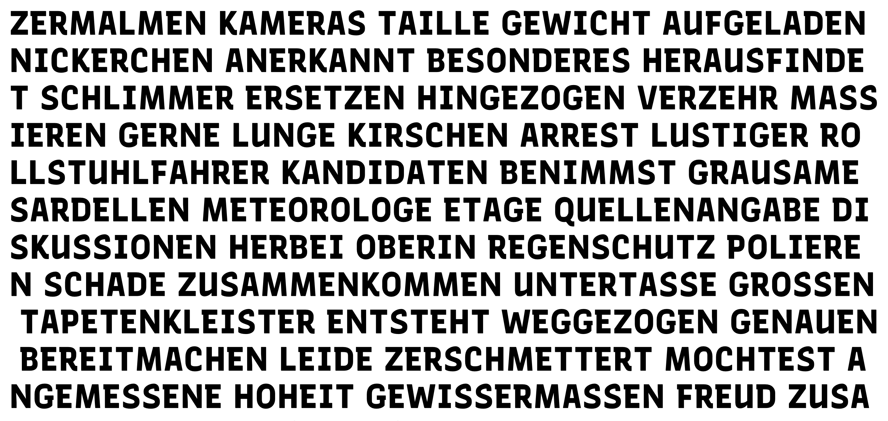

*Rounder G, C, and S*


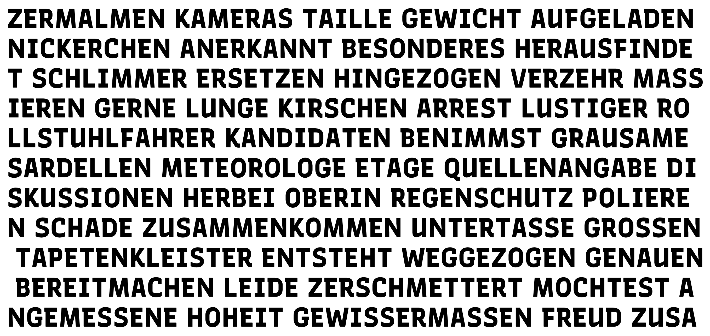

*Sharper G, C, and S*


# Should the Sans M be a different shape?


*Raised middle point*


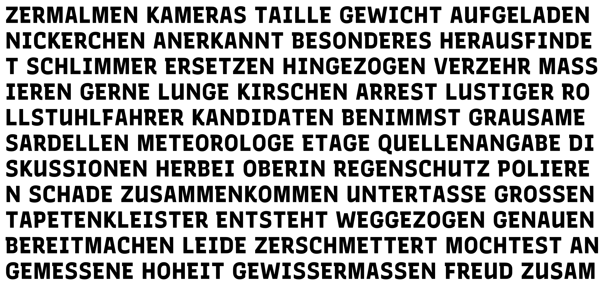

*Straight sides, midpoint to bottom*


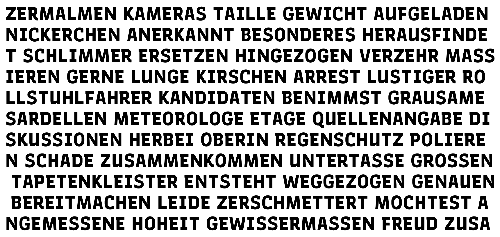

*Sloped sides*


Conclusion: the straight sides, raised midpoint feels the most a part of this font, partially because it relates the most with the mono version. The M with straight sides and a middle coming down to the baseline feels borrowed from a different font, and the version with sloped sides feels overly vintage or whimsical, somehow.


# Working on Heavy numerals

I have barely used this method yet, but I have light and bold numerals, so I will attempt to extrapolate heavy instances, generate those, copy the numerals into the heavy UFOs, and fix from there.

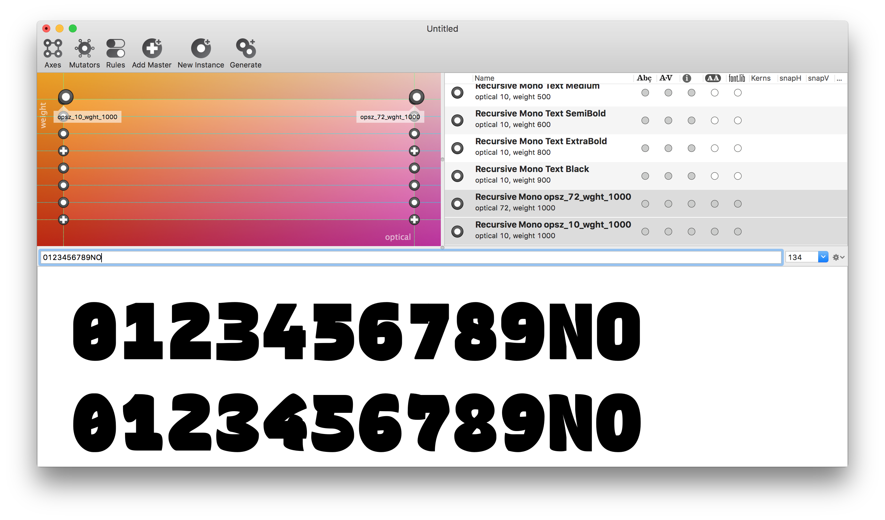


# Interpolation confusion: Mono Heading seems to be pulling toward “text” style


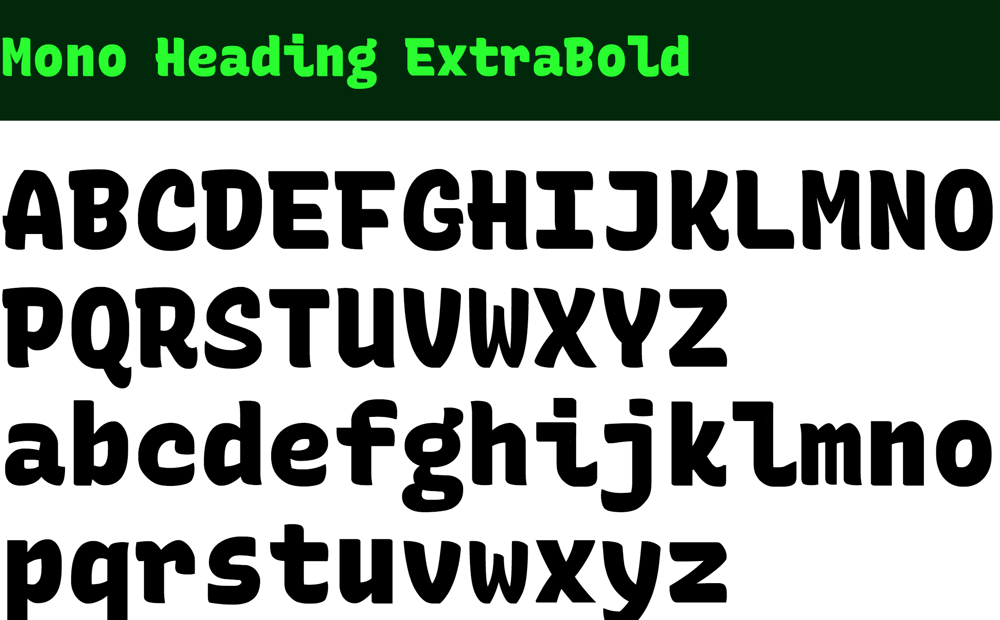


…even though the designspace seems fine in superpolator


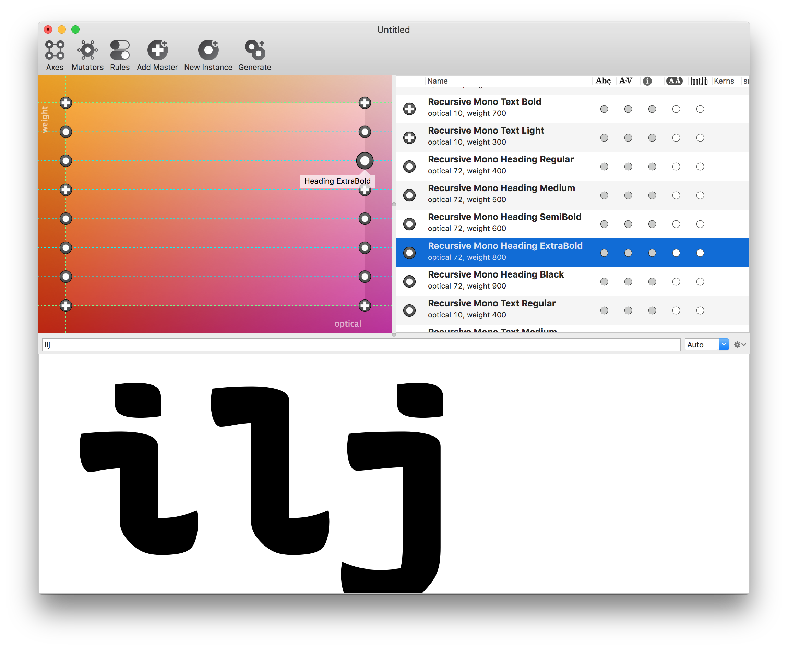


# Review with Erik, May 8

Questions

- Is there documentation for fonttools, so i could add instance exporting to the makeVar script?
    - (I want to improve my generation workflow)
- How might I better catch path errors that will trip up cu2q? (and thus fonttools makeVar )
- Is there a way to prevent RF batch from using old instances, in exporting?
- What might be some better test strings/ contexts?
- How can I handle the complexity of all these masters, especially when I make them into Italics?
- overshoot?

Answers

- try designspace extension
- don’t get too caught up in build scripting


to do

[x] read https://practicaltypography.com/are-two-spaces-better-than-one.html
[x] fix sans text heavy cap S (i think it’s done?)
[x] check x-height on light weight
[ ] text serifs too small - *do or do not* (?)
[ ] further test whitespace in m, text
[ ] find better way of proofing – make jumping, not scrolling/printing
[ ] look up “ufo processor” on github – `build <designspace path>`
[ ] top of Text cap `C` is wonky
[ ] shorten descenders on `p` and `q`, light to bold
[ ] spaces are still exporting at 500 units
[ ] try *adjust anchors* extension for diacritics
[x] make heading numerals more consistently low-waisted


[ ] ~~make twitter poll: what do you call 14px – 18px size fonts in web design? (text, body, etc?)~~ (that’s the wrong question – what I need to find are more appropriate names for levels of expression, not size)
[x] make tapered vertical stems to test


# Review with Peter Verheul, May 10

Prep:

[x] make `I` stem straight in Sans headings
[x] export fonts via fontmake, to hopefully correct export issues
[x] Put fonts into blog posts and print (?) for feedback

Questions

- Do you have any general opinions on spacing?
- Do you have any general opinions on overshoot?


## Feedback / To-dos

Make fewer pages, with more mixing (I suspect you should still print key weight alphabets to mark corrections on)

- caps with lowercase
- roman with italic
- mixed weights

Corrections, Global

[x] `s` feels short in medium heading, but tall in medium text (definitely tall in text)
[x] lift spine of `S` in text light – spine of text `s` feels low when in running text
[x] top and bottom of heading `o` feels overly heavy
[x] `z` is too heavy, overall – make thinner horizontals and thicker diagonal
[x] `z` feels a little out of place (maybe add a top-left serif? try another form?)
[x] `k` top diagonal too heavy, bottom diagonal too light (esp in heading)
[x] heading `8` becomes too heavy: top and bottom can be slightly reduced
[x] upstroke of `1` could be higher – currently, it makes the number appear shorter than others (but maybe this is good, to enhance legibility?)
[x] heading `6` also too heavy 
[x] stem incisions? yes. `A` incision can be more pronounced
[x] overshoot on `A` bar short be closer to serif in P, D, B, etc
[x] bar of `A` is too heavy, and makes a black spot in text (lightened; check in context)
[x] make middle of heavy `2` thinner to match style of others
[x] try lower-mid points of 6 and 9 (it’s nice!)
[x] spine of `5` feels low and downwardly-sloped in UI
[x] spine of heading `5` too light
[x] bring serif top of text `7` down
[x] bring serif of text `5` outwards
[x] top of text `G` feels left-leaning (and `S` in heavy)
[x] add contrast to text bold (verticals: 150; horizontals: 142)
[ ] ? add contrast to text light? probably…
[x] tail of heavy head `Q` is too small → make it intense
[x] give bigger incision to heading heavy `P`
[x] top of heading cap bowl chars (`B, R, D, P`) have an awkward curve … it might need to be more pronounced to work when viewed in large sizes
[x] in Text Regular, midbar of `G` is too low
[x] cap heading `S` is too light (recheck)
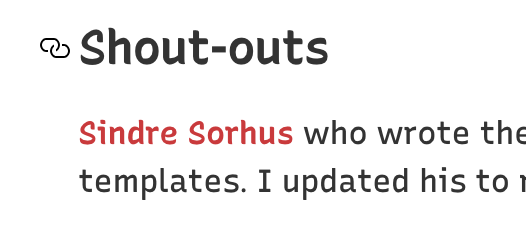


[x] heading heavy `g` looks low 
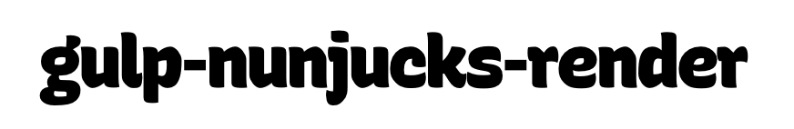


[x] heading light `i` and `j` tittles are a bit too low


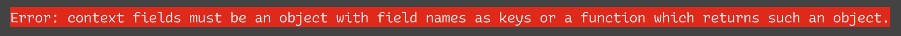


Corrections, Mono

[x] regular cap `W` has strokes that are too light – may need an intermediate master
[x] Correct top curve of heavy heading `B, D, P, R`

Corrections, Sans

[x] move stem incisions into Sans
[x] move in smoother top curves
[x] move in corrected `Q` tails
[x] move in corrected `S` and `s`
[x] move in corrected numerals
[x] move in corrected heading `A`s 
[x] move in corrected text `G` midbar
[x] move in corrected bowls on text `b,d,q,p`
[x] move in contrast for text bold
[x] top of heavy `r` is too light
[x] Sans `r` has too much space on the right
[x] lowercase `c` may not need top serif – it feels out of place (especially in sans? or maybe mono `r` doesn’t need a serif, either?)
[ ] sans `e` appears wide – should be closer to `c` width
[x] sans `w` is too wide for its low middle point. raise this, or make it more narrow
[ ] create mono-ish `i, l, r, f`


## Bigger question: should the “text” version be normal contrast?
- this should probably be test in context….
- Yes, the Text Bold looks better with it
[ ] Should the text light also be? how much contrast?

If the bold looks right with horizontals of about 142 to verticals of about 150, maybe the text light should have horiztonals of about 47 to its 50 unit verticals (to keep the same proportion, of a 5.3% difference). But maybe this is overly mathematical, and actually should be tested in context rather than guessed at.


## How will I approach multiplexed kerning?
- maybe using Ground Control plugin and a script to add kerning feature code to all fonts at once


## Character set:

Writing about this here: [+Character Set](https://paper.dropbox.com/doc/Character-Set-3wBSiigXGThOu3DUhnJ4F) 


## Naming

Thinking about this at [+Style Naming](https://paper.dropbox.com/doc/Style-Naming-MVqbQfBUYBHWQURheMqog) 

## Review with Paul van der Laan, May 14

Questions:

- What might be a better description of heading vs text? Heading still works for smallish sizes, in shorter lengths
- Is it counter-productive to be designing in light, bold, and heavy? That is, should I be making light, regular, and heavy? 

Corrections:

[x] bring serif of heading heavy `Z` down a bit to make it darker
[x] mono heading regular `C` looks too wide
[ ] mono `f` bar is too high at the x-height
[ ] spines of heading `2` bold and heavy are too wide at bottom
[x] make sans `w` less wide
[x] sans `f` has too much space on right
[ ] create mono-ish `i, l, r, f` in sans
[ ] make mono text `c` sharper
[x] remove curve from crotch of heading cap `R`
[ ] ear of text `g` is weak
[ ] make leg of heavy text `R` sharper / more present
[ ] incise stem of heading `1`

To-dos

[x] punctuation!


    . , : ; " ' ‘ ’ “ ” ` # ( ) { } [ ] ! ? @ * - _ / | \ < > $ &

Tests

[ ] Make layout(s) with mixed type styles

Normal-contrast `s`? Nope.

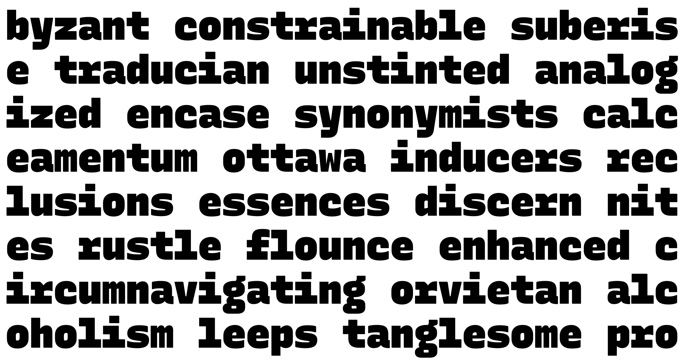


Review with Gen:

[x] more closely match `e` and `a` – in counter space, and in sqareness (done but could be re-evaluated)
[ ] test whether to smooth other inner corners of text
[ ] match where inner corners are
[x] `y` heading bottom looks crooked – simplify this
[x] you may not need the hook in heading `R Q K k` (keeping on UC, not on lc)
[ ] text sans `m` and `w` can match widths better

To fix:
`~~'asterisk', 'at',~~` `'bracketleft', 'exclam', 'less', 'parenleft'`

Things I’ve noticed to correct:

[ ] text `a` has a belly that is too low 
[x] `=` and `>` are misaligned, so they make a bad arrow
[ ] backtick / `grave` isn’t backticky enough (should be smaller, i think … check this)
[ ] heavy sans `G` needs longer crossbar
[ ] sans uppercase `U` should be wider
[ ] sans uppercase `W` middle looks like it’s leaning rightwards
[ ] sans heading `l` is too rounded on bottom left – looks like its leaning left
[x] move back to outwards-curved heading `< >` , but make taller for good arrows
[ ] move sans `*` upwards and make smaller


## Peter Verheul, May 16, 2018
[ ] total weight of `R` more than `S`
[ ] make optical corrections more related in `G` with `1` and `W`
[ ] top of `5` becomes heavy
[ ] `7` could use more slant
[ ] bottom serif of `f` can be a bit lighter
[ ] caps need a bit more spacing in heading heavy – letters are combining
[ ] `g` is too square
## Review with Paul Barnes and Erik van Blokland, May 17

To prep:

[x] create spacing tests: `HHH OOO` etc
[x] move `$` down
[x] add better `$`
[x] fix text `n` `u` `m` `h` curves
[x] move fixes to sans
[x] move punc to sans and adjust spacing
[x] re-export with updates
[ ] create advanced spacing test: `AAA ABA ACA ADA` etc, `BAB BBB BCB BDB` etc
[ ] try spacing test without word spaces
[ ] if time permits, make `& | + £`


## Punctuation spacing in Sans
- ~~copy mono punctuation~~
- determine average sidebearings in core fonts (n & o)
    - or why not all glyphs across fonts?
- set sidebearings of text bold to this average sidebearing
- round each to nearest 50 units
- copy spacing to other sans fonts punctuation

(lololol, I was getting unexpected results printing from scripts like `CurrentFont()["w"].leftMargin`, and it was the result of using Recursive Mono in the RF script window, which doesn’t use fallback fonts … and so was missing decimals.

Follow up:

[x] fix interpolation issue in `7` in heavy text weights
[ ] add curves to diagonals in `#`?
[ ] go back and do corrections above


## Big question: should the brushy style be visually casual at body copy size?

Currently, some characters are clearly informal when used at text size, while others look like they could have simply come from any mono font. 

The `</>`, `s`, `S`, `N`, `e`, `v` , `w`, and numerals are all pretty noticeably casual. However, the `i`, `l`, and `p d b q` look relatively normal. 

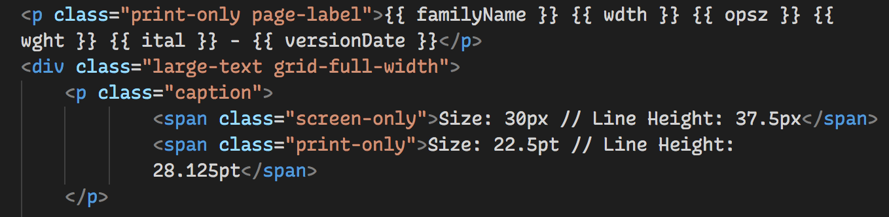


What might it take to make them stand out as clearly different?

Does adding a “wedge” shaped bottom serif change text at 16px?


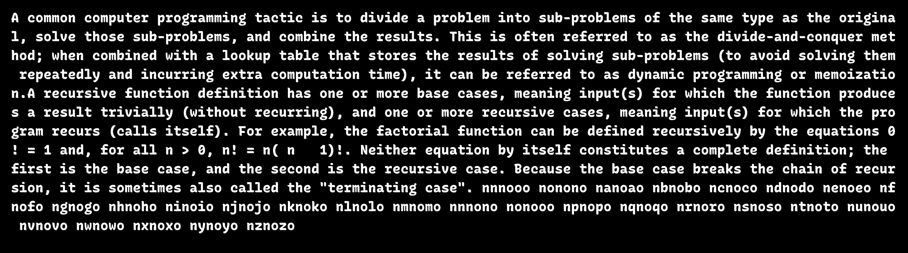


Does it need more extreme wedges, and maybe also need a weird form of `g`? (but how well would a weird `g` interpolate into a formal style?)

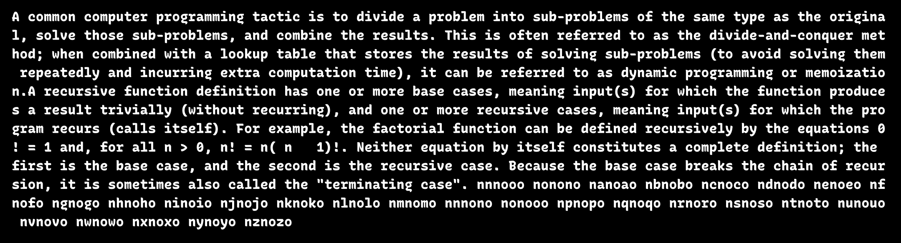


Working answer: I don’t want the heading to be too extreme, but rather typographic with personality. Not “clownlike” but “typographic.” 

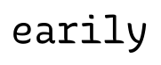


## Medium question: should it be a `business casual` axis, rather than an `optical size` axis?

It would call to the casual script inspiration, it would be a dad-joke callout to “business casual” dress of enterprise devs, and it would be a shoutout to business script, from the IBM selectric. 


## Medium question: should the texty version have more “ink traps”?

In a way, these better relate the existing `A V v` shapes, but I have decided against it for two reasons:

1. the shapes don’t appear to really aid reading *that much*
2. the shapes are very unatural for a brush to make (I’m still basing this on brush strokes, even though I have rationalized it a lot)
3. the interpolations from casual to rational would be extremely fragile, and very open to kinking


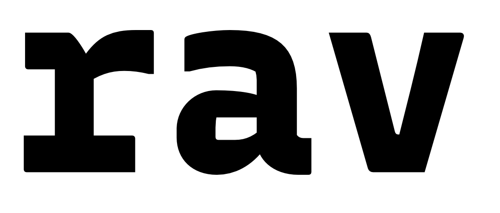

*Without ink traps*

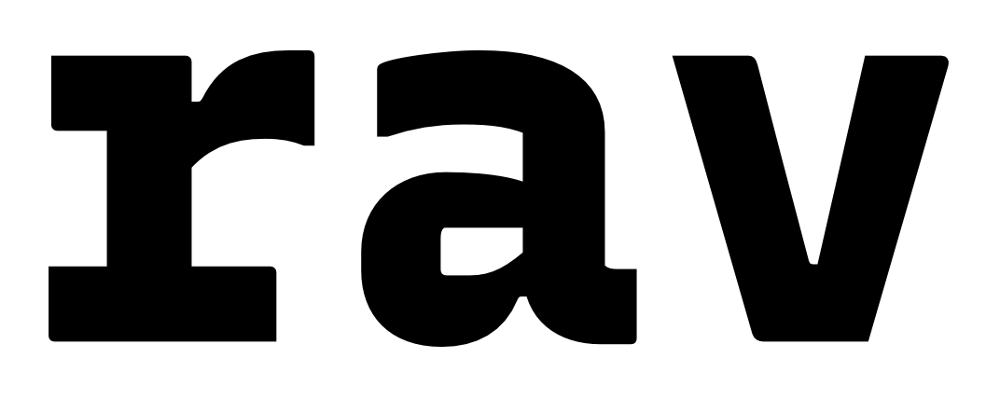

*With ink traps*


*Without ink traps*


*With ink traps*


## Should the `a` have no tail, to better balance with e?


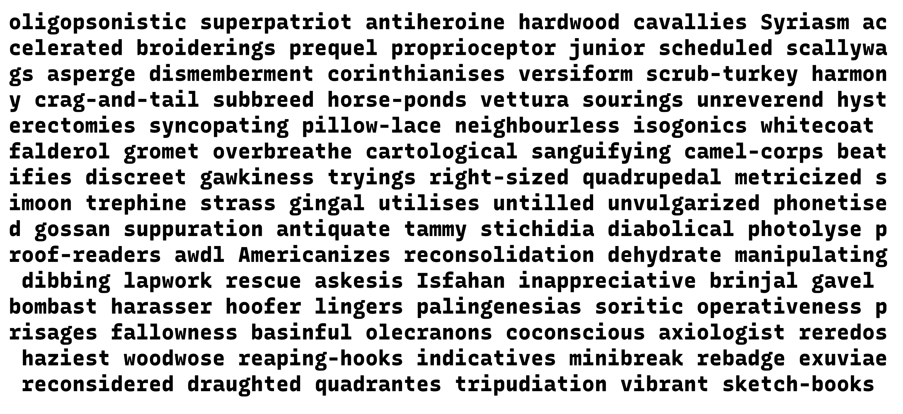


… after viewing: probably not, because it pulls too fall away from a hand-painted feel. It is a tough thing in that it makes more sense in the Text version than the heading, but this can’t have both in the default and still interpolate. However, it seems ripe for `ss01`, along with the low-eared `g` and the non-serifed `c`. This also means that in the Sans type, it probably *should* be the default. More on this soon.


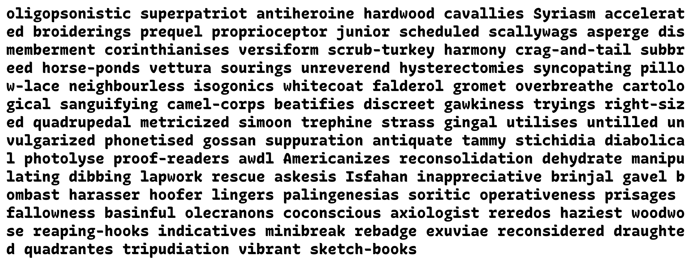


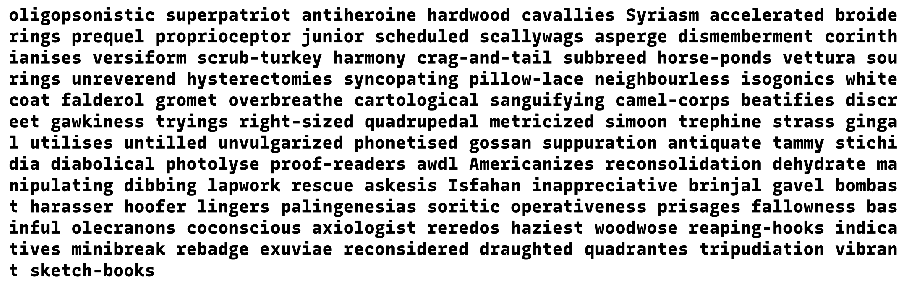


## Stroke Joins at 0° & 90° only, or also 45°?

I am building my letters out of multiple, overlapping strokes. This is partly to maintain a connection to sign painting, partly to make pieces more flexible and reusable in building new characters and weights, and partly to allow a future extension into a color font, where strokes have partial transparency and different colors. 

Strokes are connected at 45° points to appear more natural when strokes have some transparency.  Keeping these joins at 45° allows a connection to sign writing, while still allowing for relatively simple interpolation across weights. However, these joins introduce a challenge: they break curves into two, separate paths, making them inconvenient to control and quite hard to make properly smooth. 

Should I keep 45° joins, as I currently already have in quite a few of my glyphs? Or, should I rebuild strokes to refine the curvature slightly, optimizing for regular fonts above color fonts? I was fairly split on this question, particularly because I don’t want to redo work. However, beginning to modify glyphs into Italic versions has made it quite clear that points at 45° are significantly hard to correct. Therefore, I believe it will ultimately be fastest and best to rebuild these strokes for 0° and 90° connections, and proceed from there.


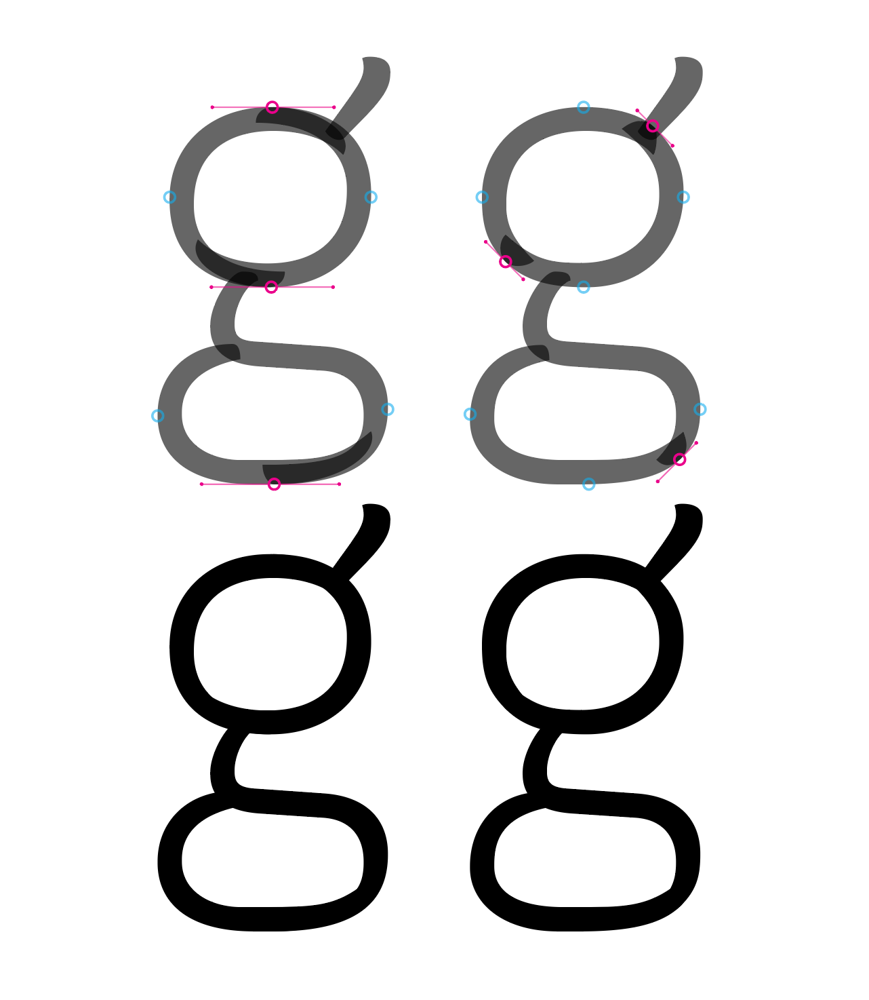


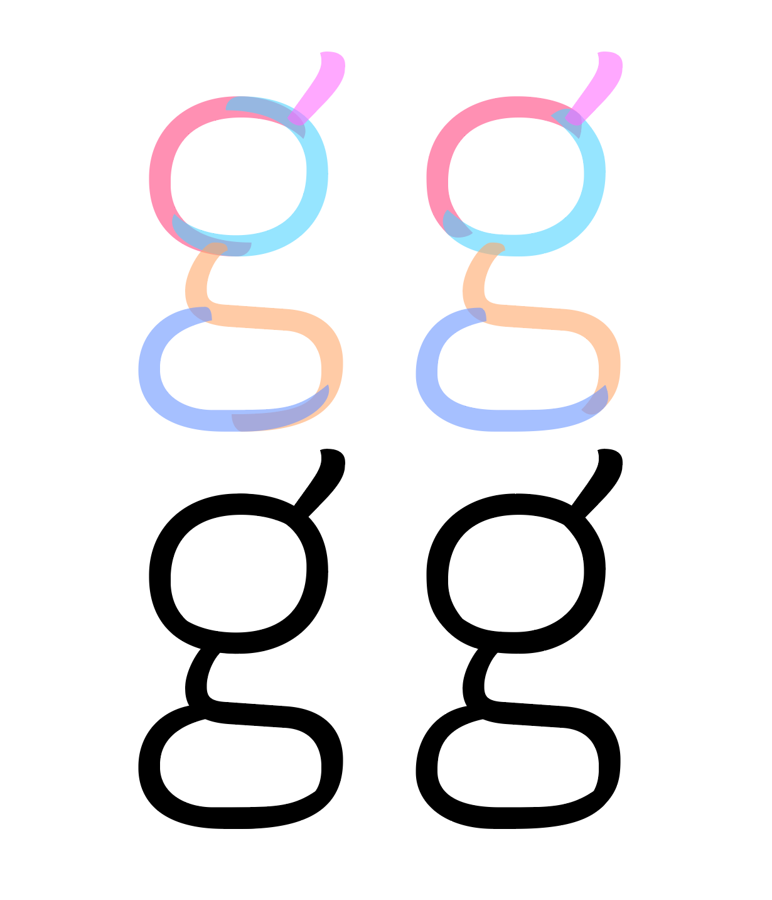

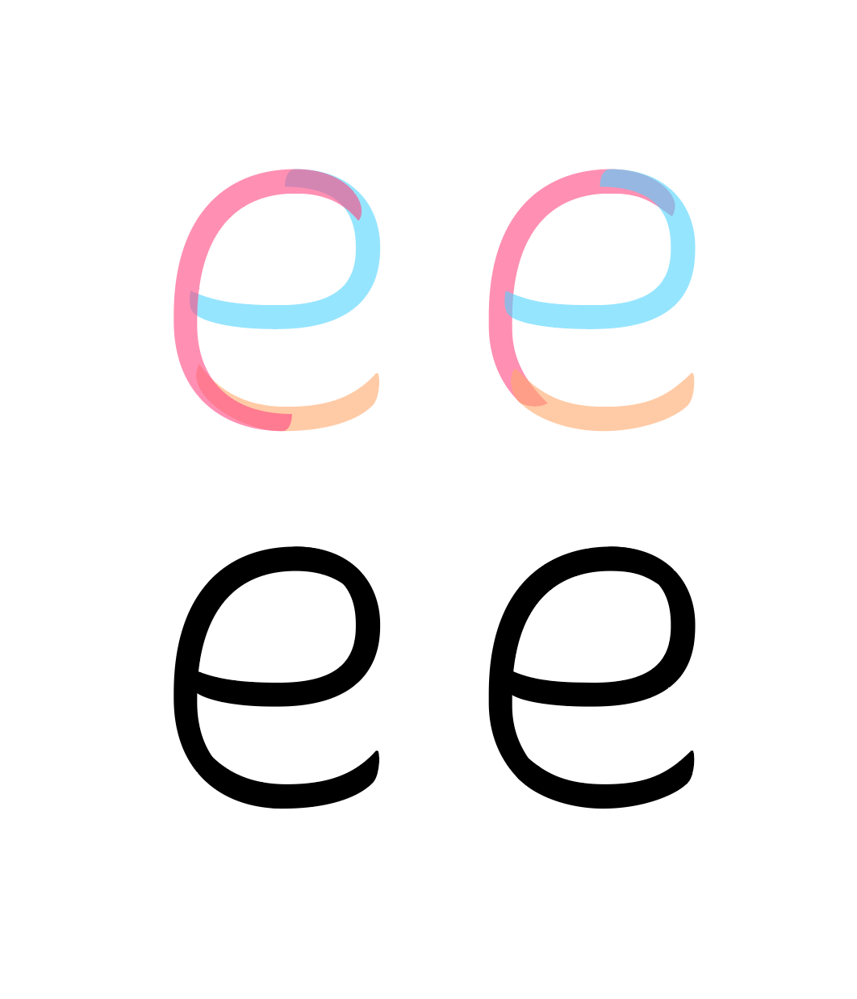


## 

Saturday, May 19
Priorities

[x] explore browser extension further (limit to 2 hours)
[x] fix navigation in tester site (maybe make the better tester instead of messing with the current thing?)
[ ] add `ellipses` and `plus`
[ ] try to make a build pipeline so tests can happen faster
[x] lighten regular by ~20
[x] pull wedge serif changes through mono styles to test
[ ] get punctuation working in sans
[x] remove hooks from lowercase `k, x`
[ ] make `ss01` version of text `c` that has no serif
[x] make heading `e` less curly/backsloped
[x] run
[ ] write for petr


## Sunday, May 20
[x] edit Namrata’s catalog text
[x] write your own catalog text
[x] add `|` to mono
[x] write and layout Peter’s mini-thesis
[x] get punctuation working in sans
[x] test interpolation in hookless `x, k`
[x] move in hookless `x, k`
[x] add toggle button to extension, and maybe more controls
[ ] put together python build pipeline: varprep, select masters and designspace file, opt for ttf or var to apply fontTools scripts, then output messages or fonts
[ ] change letters to 90-degree connections?
[x] email update to Paul Barnes


## Test word for italics
    hamburgerfontsiv
    
    newfishtacoburg


**Angle?**
In a quick test, the default sloping of italics in google chrome is about 14–15°: ||||||*||||||*
… you could check this more closely if it seems relevant.


## Casual and Gothic

I’ve been struggling to figure out naming for my styles. I’m making a rather experimental variation axis, and it’s difficult to talk about (or even really *think* *about*) my typeface without putting words to this axis. I’ve called it an “optical size” axis, but that’s not accurate. Optical sizes are variations of a typeface meant to make it appear the *same* at different sizes. My hard-to-name axis, on the other hand, is meant to allow the typeface to look and feel quite *different*, across sizes. 

It’s meant to offer a very fun, energetic feeling for short-form text, and a more calm, rational voice for longer-form text. I have started thinking about it as an “expression” axis, which is closer to what I want to communicate. Even so, what should I call each end of that axis? Simply assigning numbers or “high” and “low” doesn’t work well, because instances must be named in a recognizable way. 

I was naming the styles “heading” and “text,” as a twist of the common labels “Display” and “Text,” but the expressive end works find at text sizes, so long as it’s not set at too long of a length. For instance, it looks great in the terminal or in small navigational elements. Beyond that, I just need a good way to talk about the sizes.

Brushy and Constructed? I don’t really think laypeople know the latter term. Also, it’s not very catchy and “brushy” just doesn’t sound very official.

Informal and formal? Again, these are labels I don’t expect most developers (or even designers) to know – I don’t think any of my classmates knew these terms before this year.

Chill and Solid? Better … but calling a style “chill” feels just a bit too trendy or flippant to me. I want my typeface to be of-the-moment, but I don’t want it to seem careless.

Finally, I came to the names *Casual* and *Gothic.* I like these names for several reasons:

- These names are somewhat specialized and may not making immediate sense to laypeople, but there are established, well-known typefaces that use these names, so if people don’t know the terms, at least Google searches will turn up related ideas.
- I am basing the project on Casual script, so that naming seems obvious. I am pulling the less-brushy versions towards type like Verdana and Menlo, but it also has influence from another common model of signwriting: “Gothic,” as defined from sources like the Speedball Manual of Writing.


## Serif-less caps?
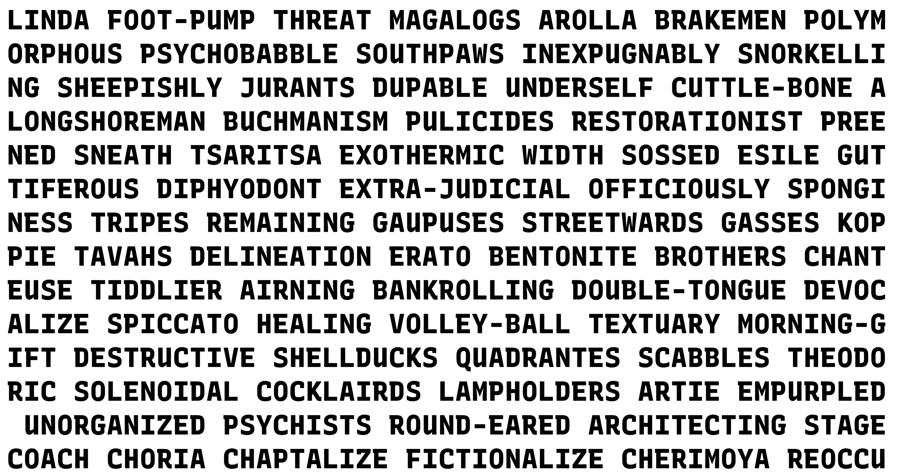


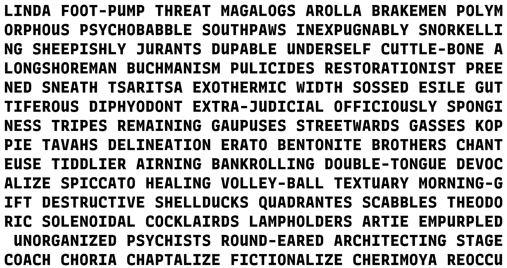


## More casual `n m u h`?


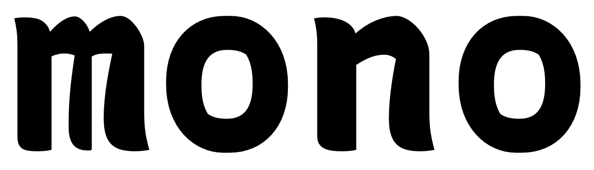


## Italic angle
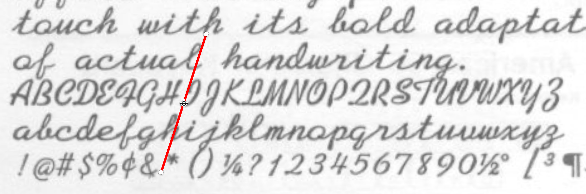

*Business Casual is 18°*


## Naming: Casual and Gothic rather than Heading and Text
## More casual /more extreme joints?

Something I’ve heard from early on in this project is that the casual style doesn’t quite seem to have enough inner consistency, and that there is not much separation between the casual and gothic versions.

Specifically, people have pointed to the curvy diagonals of casual, mixed with relatively normal letters shapes in the `n`. This is especially apparent when I am transitioning or animating between Casual and Gothic – some letters change very prominently, while others barely shift. 

I’m am experimenting with a variation on the “joints” of letters `n u h p q b d r m`, in order to make them appear a bit closer to handwriting or scripts. However, I am quite uncertain with whether this works, because it introduces a lot more density into the letters.


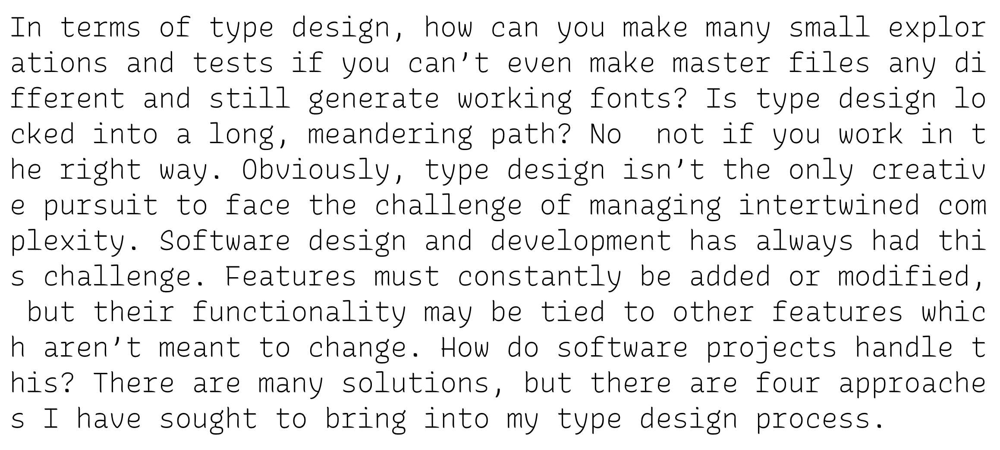


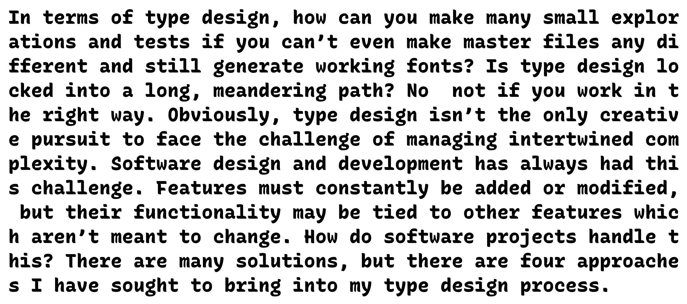


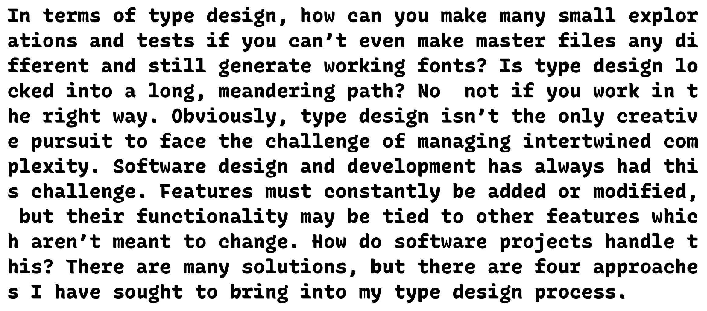


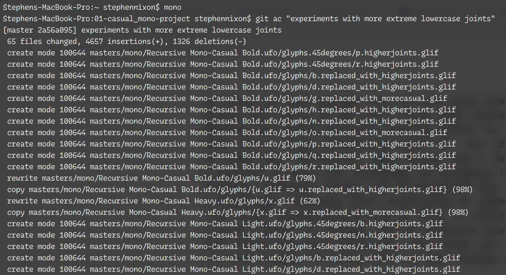

*in use*


Seeing these images together, I think the more-extreme joints are working fairly well in the bold, but become too distracting in the light and regular – they create spots which are too dense for easy reading. Were this not a mono, I might be able to get away with it, but because it is a mono, making these joins more extreme makes those letters suddenly appear more compressed than usual, next to letters like `e` and `c`.


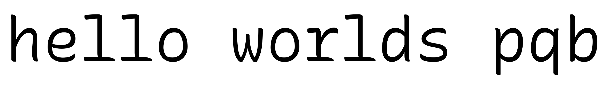


## Dealing with weights

In the end, I want my “700” to roughly match the bold of typical web fonts (helvetica, SF, Roboto, etc), and my “400” to roughly match the regulars.

It’s getting in the way that I’ve labeled my masters as “light, bold, heavy,” because they don’t really match the instances I want to output. It also yields the weird result that “edit that next master” switches between masters in the order of bold-heavy-light, due to alphabetical sorting. This isn’t ideal.

Instead, I’ll try labeling them as “A, B, C” (for light, bold, heavy), and generating all instances as interpolations.


## Drawing the `asciicircum`  & `asciitilde`

By looking at other monospace fonts, I notice that these characters are much larger than their related diacritic marks, though usually with a similar overall visual style.

The `asciicircum` usually closely matches the `<` and `>`, as well, though it’s usually smaller.

The `asciitilde` lines up with much of the punctuation, in order to be useful in code (the place I normall see it is the command line).


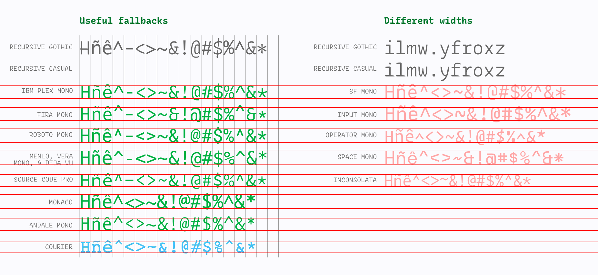


As a starting point, I’ll start the `asciicircum`  with the `<` symbol, rotated and raised to the ascender height, then scale it to about 85. I’ll then re-thicken the strokes to match the font weight.


## Thinning horizontals of Gothic Light

The horizontals of Gothic Light are still about 50 units in thickness, when they need to be a little less to allow for optically-monowidth strokes. The bold strokes appear to me to be optically correct at around 142 units, so with that same rate of adjustment, I could go to 94.66% thickness, or about 47 units. However, because the regular font weight is still somewhat more thick than it should be, I will try 46 units. 

Of course, one concern is that the boldness of the gothic and casual may not match quite perfectly if only the gothic has modified stroke widths. To account for this, I will probably balance things in interpolation (my light master is lighter than around a “300” weight tends to be, so I have a bit of flexibility), or potentially take a second pass to correct it.


## Re-starting the italic

Instead of making a clever set of scripts to auto-italicize, I will start by more-manually italicizing a set of test letters. In this process, I hope to figure out:

- whether I need to change connections from 45° to 90° to make the process reasonable
- whether an 18° italic slant can generate good instances of less extreme italics
- whether / how much I can change letter shapes between upright and slanted italic – for instance, whether I can make flat serifs in humanist `i l j` into sloped serifs


## Tues, May 29
- bring in corrections to sans, make others
- make sans italic lowercase
- test one character as a stylistic set, to test assumption you can use this with var font to make things interpolate or substitute as needed (but is this actually needed for thursday?)
- start ~~presentation~~ handout


## Add unicodes from glyph names 

I somehow lost the unicode values for a glyphs that were copied between UFOs, but the names were still in place. This script uses the names to re-add the unicodes. It seems to be working correctly for my problem.

    from fontTools import agl
    
    f = CurrentFont()
    
    ### use the below to use the current font
    for g in f:
        if g.unicode == None or g.unicodes == []:
            
            print(g.name)
            
            if g.name in agl.AGL2UV:
                uni = agl.AGL2UV[g.name]
            
                print(g.name, "|", uni, "|", hex(uni))
        
                print(g.unicodes)
        
                g.unicode = hex(uni)
        
                print(g.unicodes)


## Catching interpolation issues

1 point missing: 

- a contour is missing a tangent point/segment in a curve

2 points missing: a segment is missing two offcurve points (should be a “curve”)

3 points missing: 

- a contour is missing a curve point
- a contour is missing one tangent point into a curve


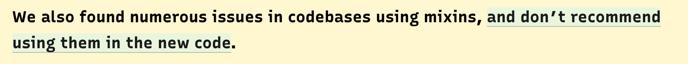

*apostrophe with too much spacing (or maybe this needs some kerning?)*


## Is “Gothic” an incorrect name?

Paul objects to the name “gothic.” Some people seem to be confused about calling the casual style a “sans”

Is there a better name?

Block? But maybe this gives the wrong mental image of what the typeface is … I don’t want people to think that the blockiness is the primary feature, as it’s really *not*.

Normal? Maybe … I don’t know if the name clash with CSS `font-weight` and `font-style` is a problem… 

DIN? Or something close to this?

Rational

When does a “gothic” stop being a gothic?

This will definitely be an important area to write about in the process book/site:

- a brief history of signpainting: casual and gothic
- a brief history of humanist sans type
- an explanation of naming, whichever direction i go

There may be something worth bringing in from scribing devices once used for engineering (and this blog post generally has great facts worth citing):
https://www.typotheque.com/articles/from_lettering_guides_to_cnc_plotters


Maybe “Strict”? *Recursive Mono Strict & Recursive Mono Casual.*


## In which order should names be arranged? Proportion or Genre first?

Might this family be more clear to people if it were named with genre-first, e.g. `Recursive Casual Mono Regular Italic`? Or possibly leaving out the “sans” it could be `Recursive Casual Regular Italic`…

This might make the family more simple to understand as being “two separate typefaces” that are related, similar to type families which include both Sans and a Serif members.

However, I see a problem with this approach: the proportional aspect is pretty much the only non-compatible part of the typeface, *not* the genre. That is, a designer can freely mix any style within Recursive Mono, without worrying about layout changes. They can experiment with titles / nav / code snippets in Casual or Gothic. They main consideration isn’t the *styling*, it’s the rhythm and purpose of proportion. Once that is decided, the designer can do what they want to fine-tune the experience.


## Should the gothic have no “kinks” inside counters?

As of May 31, the gothic style has subtle kinks in counters, indicating where “brush strokes” have overlapped to create the letterform.


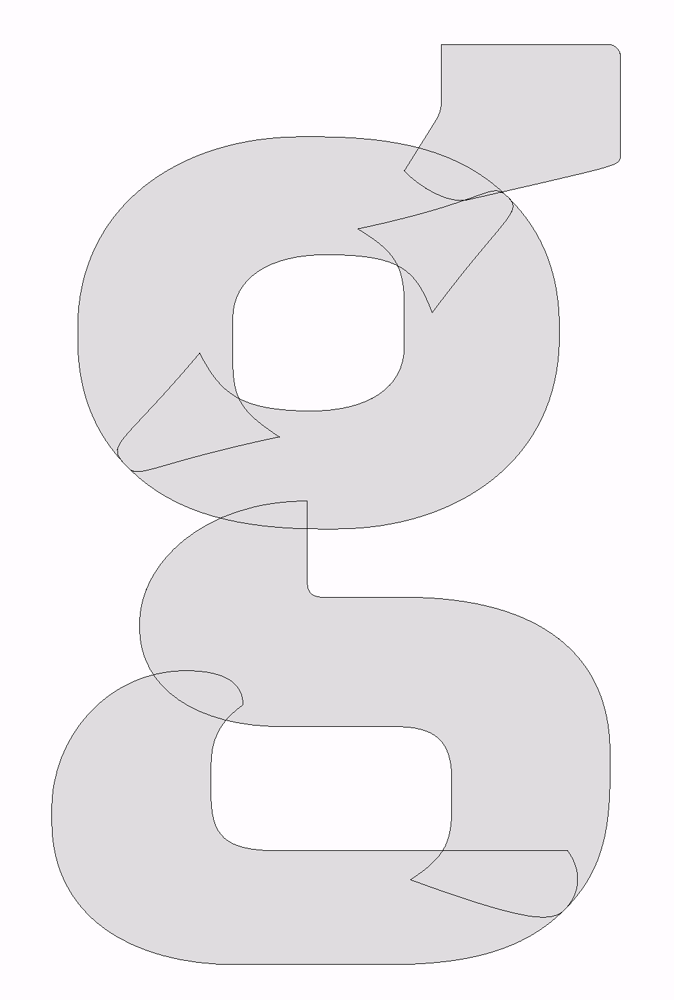

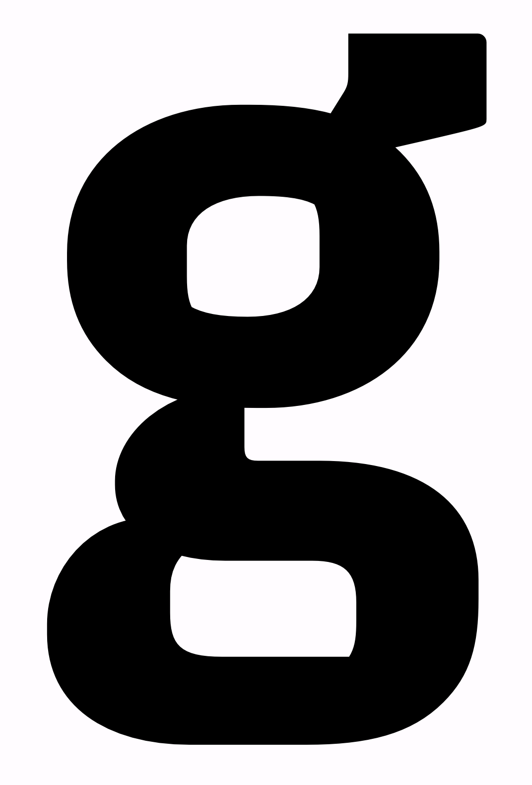


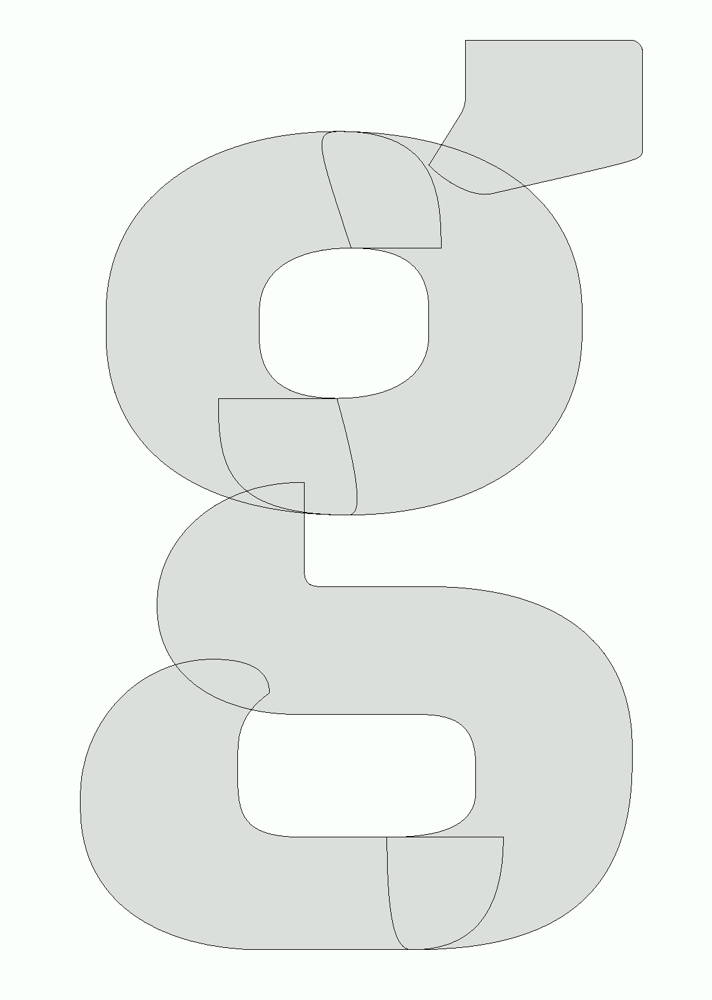

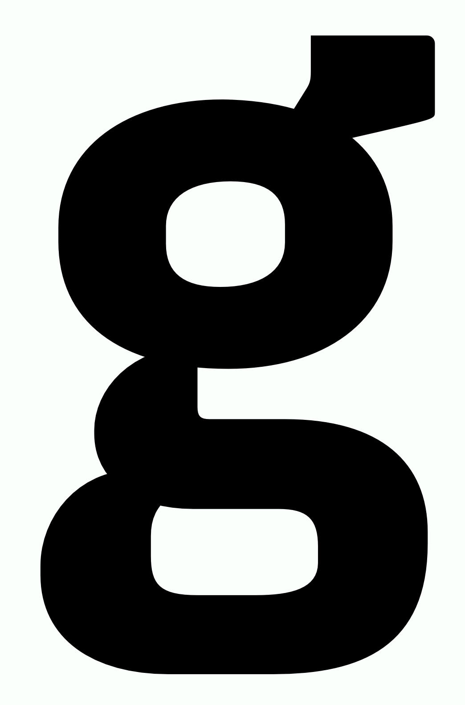


Testing: I can remove kinks in the master `B`, then interpolate with the casual.

Early results … It is a very small change, overall, especially seen at a distance. A couple of noticeable differences it does make: 

- it removes the impression that letterforms have a “reverse” contrast
- it maybe puts the typeface more into a different “genre,” if this is something I’m really pursuing. It takes it away from something brush-oriented. Is this a good or bad thing? That is really hard to know … this change might also suggest making other changes, such as removing serifs from uppercase, etc.
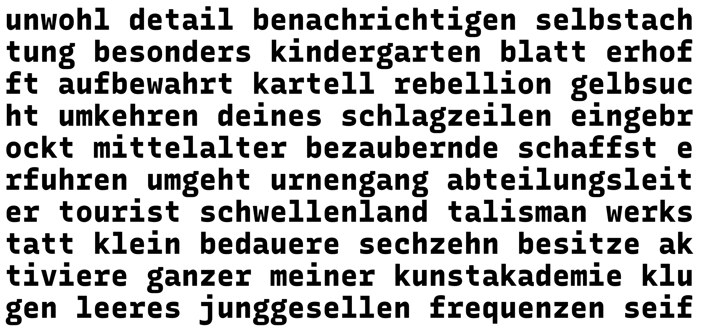

*small “kinks” in counters, showing brush stroke “overlaps”*


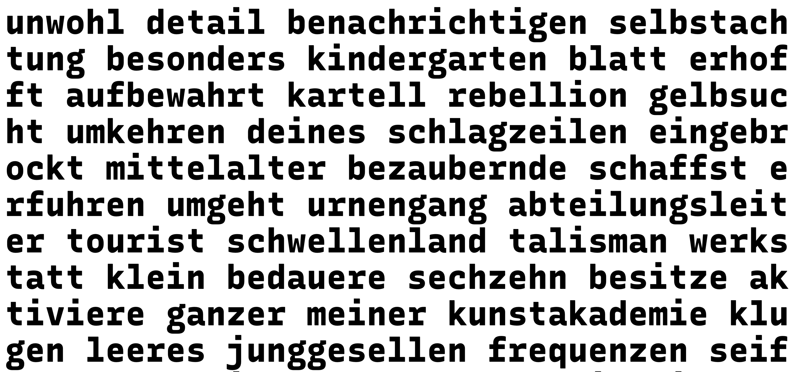

*kinks changed into smooth curves*


The one thought I *have* had when looking at text onscreen is that it sometimes appears to have “white spots” in the strokes … Removing the inside notches might solve this problem. It may be worth it for that reason, alone. 

**Action: test a no-kink version in text, especially via the chrome extension.**


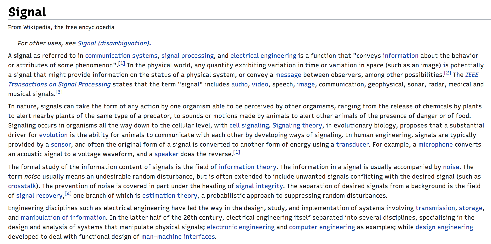

*with counter cuts*


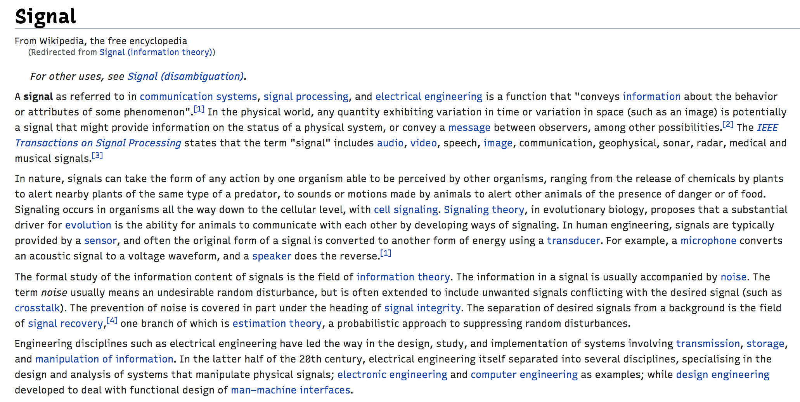

*with smooth counters*


**Process of eliminating kinks**

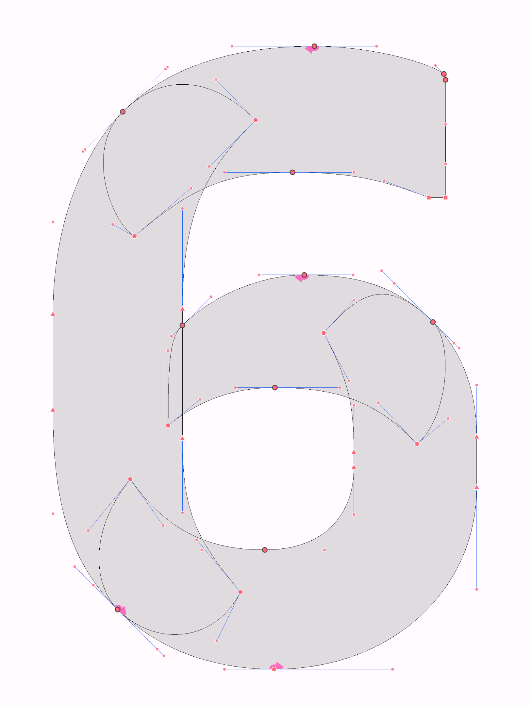

*Strokes overlapping at 45-degree points*


*Strokes moved to 0 and 90-degree points*


This process is me asserting a hierarchy of goals for the typeface: I care more about this working as an unobtrusive text face than about it being something for display. The 45-degree overlaps look slightly better as overall “compositions,” for instance, if I eventually output this as a color font. However, they don’t allow for curves to be as controlled, and they result in quite informal letters when made solid.

## More balance in `n u h p d`?

Now that I’ve made the “arm” side of `h u n` letters more expressive, the “stem” side feels overly stiff and overly bold. I want a way to lend a bit more curve to these stems, without losing the computery soul of the letters.


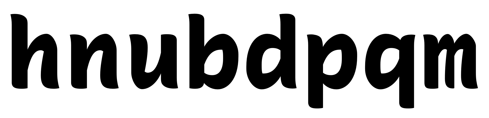

*As-is on May 31*


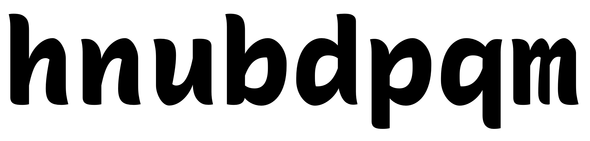

*Experiment, June 4*


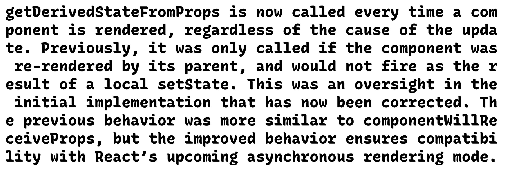

*As-is on May 31*


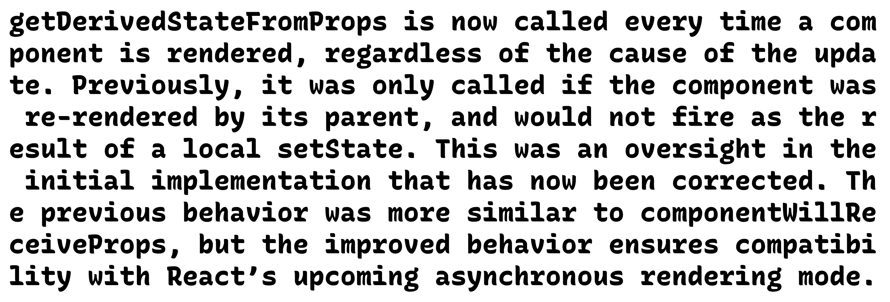

*Experiment, June 4*


## Corrections, post-Greenlight presentation
[x] *make z lighter (especially in bold, as noticed by mona and peter)*
[x] should the sans `0` have no stroke? It does, perhaps, disrupt running text.
[x] remove serif from lowercase mono `c`
[ ] differentiate `8` and `B` (add whitespace to the cuts of each)
[ ] balance left and right side of `n`, `u`, `h` in casual (currently, the left stem is straight, and feels much heavier
[ ] balance top and bottom of the right side of Gothic `G` (currently, top curves in less that bottom portion, making it feel imbalanced)
[x] change `ampersand` back to simpler version
[ ] caps should probably get a bit of extra weight

Sans

[ ] gothic sans `w` is quite heavy, e.g. in the word lawful
[ ] lighten gothic `z`

Italic

[x] *give italic* `*a*` *a tail, probably, for improved legibility and scripty-ness*
[ ] move new `a.italic` into italics and correct
[ ] unskew stroke ends?
[ ] italic `f` seems to be too far to the left … it has a lot of space on the right side. Maybe only the stem needs to move?

*What is an italic like? Is the only way to know, to write with it? Possibly so… Well, if so, that is what I shall do, post-haste. I really do enjoy these italic alternate characters, and I should probably swap in more. Updating the diagonal characters could really have a big impact. Is the angle right? Too steep? Maybe too steep…*


## Sunday, Jun 3
[x] test gothic regular with smooth strokes
    [x] make even strokes in gothic B lowercase
    [x] make even strokes in gothic A; fixing 45-degree connections in `e f t  g`
    [x] fix 45-degree connections in casual
    [ ] move fixes to sans and try it there
    [ ] try in browser extension
[x] replace serifed `c` in mono
[ ] test casual italic with un-skewed / un-rotated stroke endings
[ ] try exporting an italic at 11 degrees (14 feels overly steep for web text)
[ ] move proper punctuation spacing into heavy sans styles
[x] should dollar sign have smaller bars? (in rational, yes)


## Generating WOFF2 Files

You can take the UFOs in the makeVar “instances” folder, open these in RoboFont Batch, then generate WOFF2 from here. It seems to avoid interpolation issues, because the interpolation is already done.


## Troubleshooting var font generation, June 5

[+Questions for Just, Jun 5, 2018](https://paper.dropbox.com/doc/Questions-for-Just-Jun-5-2018-NfThbIURrfI1XtNJnmlJP) 


## Thursday, June 7 (Critique with Erik)

[+Questions for Erik, Jun 7](https://paper.dropbox.com/doc/Questions-for-Erik-Jun-7-3IUlMUabG6VuyNIDfi0Eg) 

Critique:

[x] make bar of sterling match Euro bars (and probably yen, dollar, bitcoin)
[ ] maybe make better curl on sterling
[ ] right side of germandlbs is too light – close up whitespace
[ ] use AVAR map to get map values for CSS
[ ] **Try UFO Processor**

Designspace spec at https://github.com/fonttools/fonttools/tree/master/Doc/source/designspaceLib


## Friday, June 8

Working on unkinking numerals, section symbol, and diacritics 

[ ] should straight quotes be bigger, to match commas?


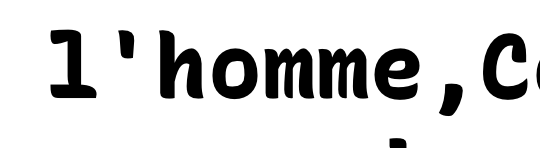


[ ] ~~Mono~~ `~~t~~` ~~needs to be a bit wider … maybe the left side could extend a bit more~~ actually, no. When it’s at text size, it’s clear that the right and left sides of `t` are pretty well-balanced as they are now
    
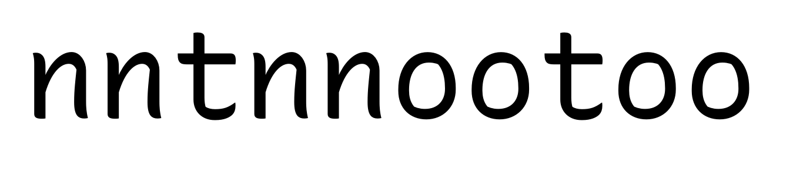

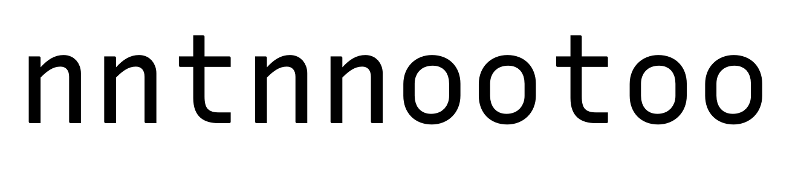

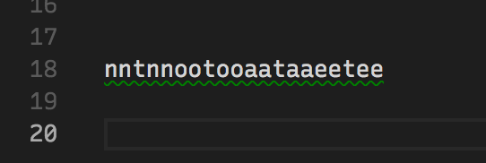


Typically, the circumflex would be closely related to two acute/grave marks, but in this style (in the caps, in the image below), that ends up look too much like a mustache…

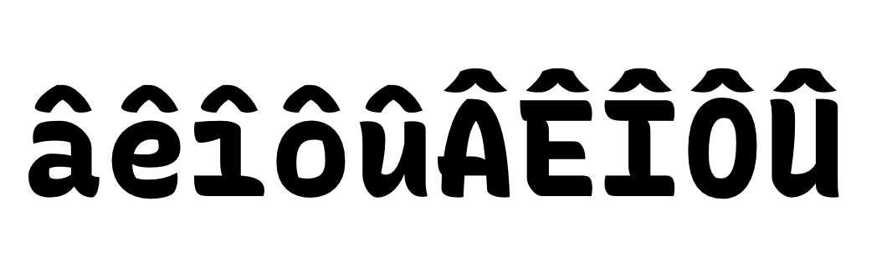


## Composing complex characters

Example: `eth`

- Starting with `o`, `parenright`, and the slash from `lslash` (which originated as the hyphen, and was given a little wiggle in the middle to compensate for the optical illusion of diagonal crossbars that appear disconnected when they’re simply straight lines)
- the “brush stroke” approach is useful here: i combine the top of the parenthesis with the right side of the `o`, and then set it against the left side
- the left side of the `o` can be compressed down a bit to give extra room for the slash, similar to how the bar of the `f` moves down to make extra space
- the slash can be skewed a bit to be less steep, and fit in with the letter
- Make corrections: 
    - align points so they overlap well, 
    - adjust thicknesses to be consistent (for instance, the slash got thicker when skewed) 
    - move curves to feel smooth and graceful
    - move top towards the center of the letter, to feel more balanced overall
    - through this, I try to keep angles and/or ratios consistent between masters, to avoid unwanted kinks … this will likely be harder when the italic versions are factored in


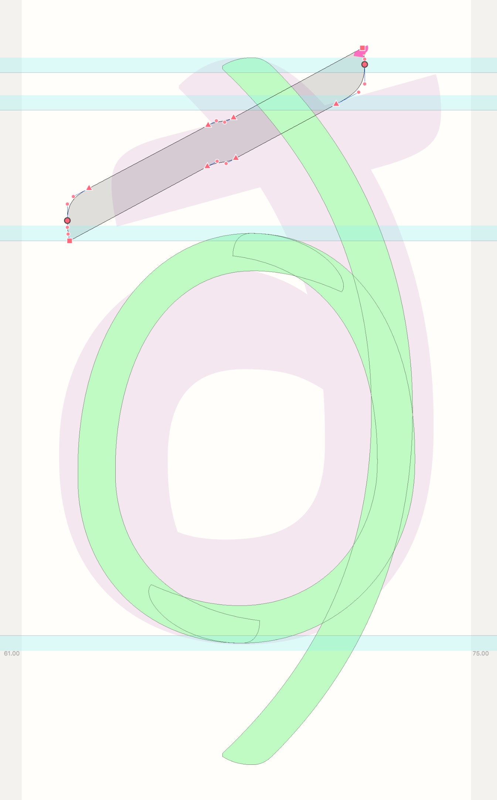


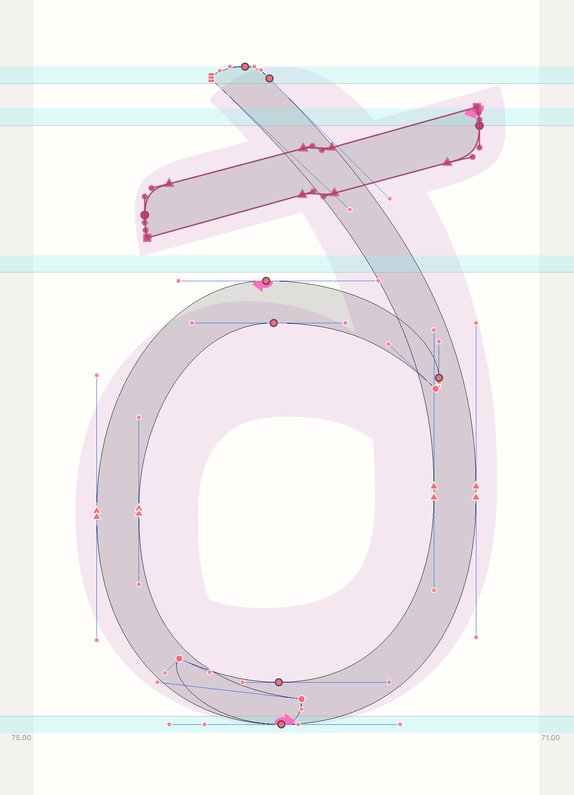


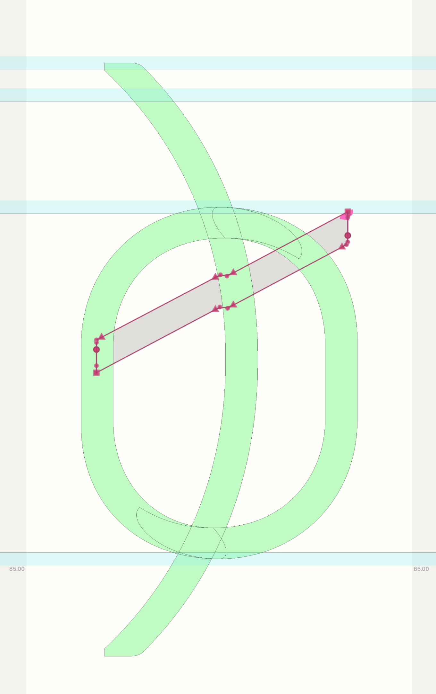

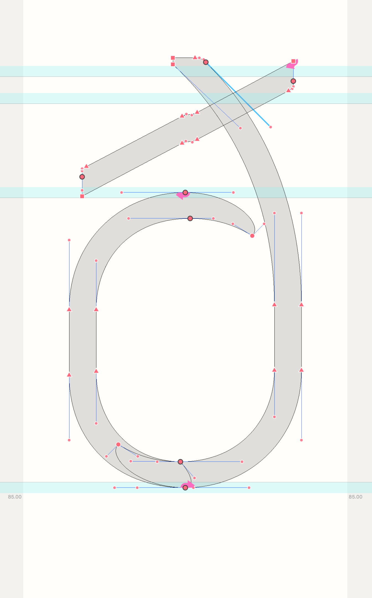

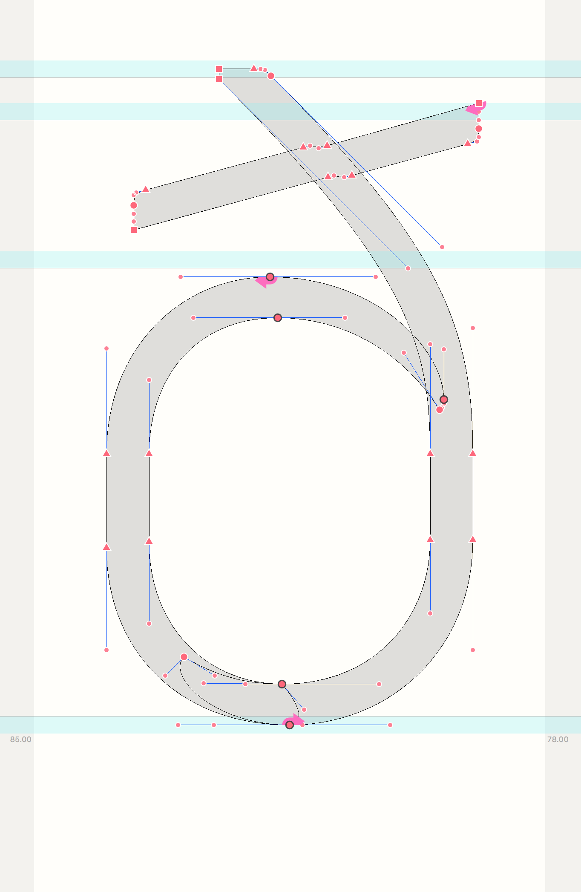


Example: capital German double S


- start with adding components from `F`, `R`, and `germandbls`
- Decompose `F` and `germandbls`
- delete left stem and top of `germandbls`
- match `F` stem position to that of `R`
- Nudge the top right area into a connection
- if points get added/deleted to make this work, be sure to do that in all masters


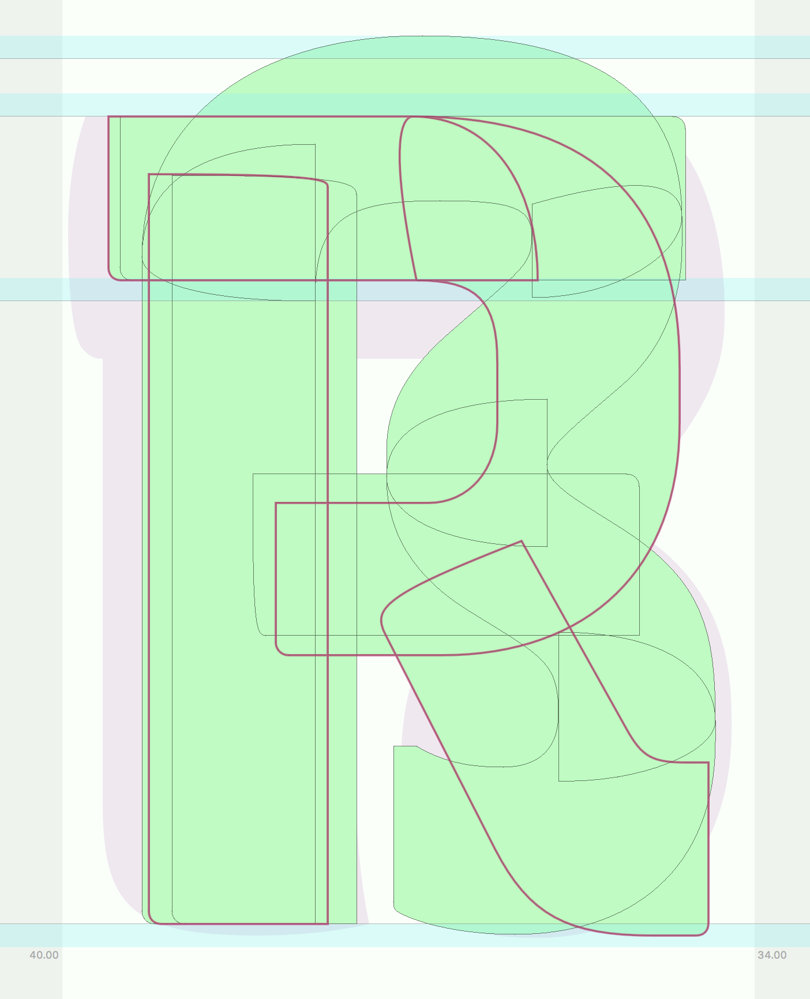

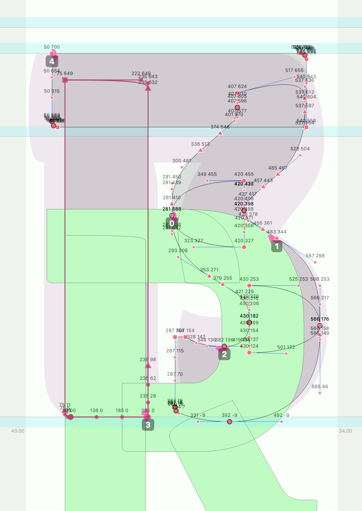

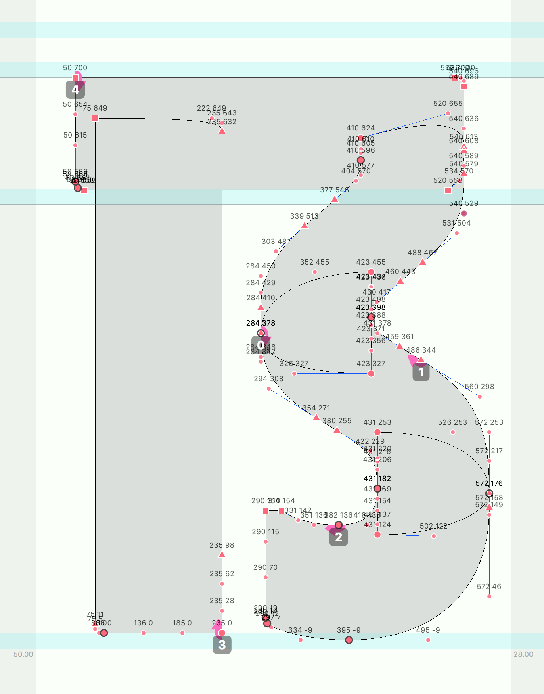


## June 11, Critique with Paul

[+Questions for Paul, June 11](https://paper.dropbox.com/doc/Questions-for-Paul-June-11-dDnh3AuaKgQjgsX8vliDT) 


## Is the i dot too small?

Maybe a little … 


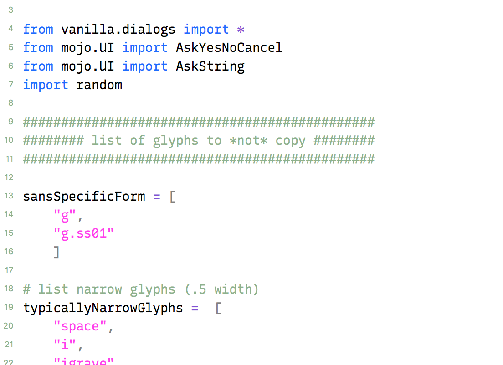


## June 12, critique with Erik

Corrections: 

[x] fix `tcaron` (clashing)
[x] fix `Lcaron` (move caron to match cap height)
[x] simplify `cedilla` – maybe remove the connection
[x] move down the mark in  `gcommaaccent`
[x] match thicknesses of accents (acute is much thicker than others)
[ ] Don’t have diacritics that you don’t need… (probably delete `0312.case`)
[ ] Move anchor of `L` to top of stem
[ ] round out `eth` in casual B
[ ] shorten bars in heavy weights
[ ] `z` is still a bit heavy
[ ] extend left side of `t` by a bit (probably make even with left of `i`


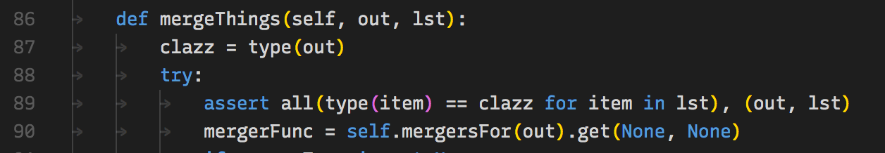


## Possible var prep need: making anchors the same in every glyph (or at least checking it)

…Actually, that doesn’t seem to be the problem. The problem is so far escaping me… I’ve written more about it here:

[+Troubleshooting var font merge error](https://paper.dropbox.com/doc/Troubleshooting-var-font-merge-error-Kc9i0IBMiW4OMfG7x3cNx) 


## The importance of using a font while creating it

You catch more errors that may have otherwise gone undetected.

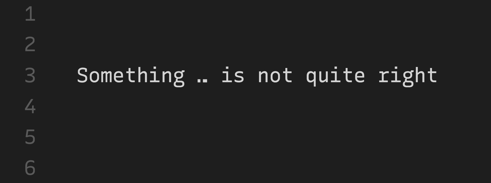


## Poster and presentation considerations

Color will be very useful as a tool to reinforce just how much range this typeface has. When just in black or gray, the different type changes don’t feel as impressive.


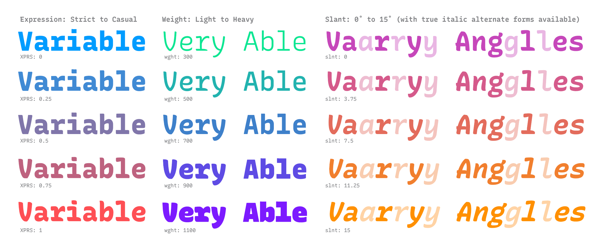


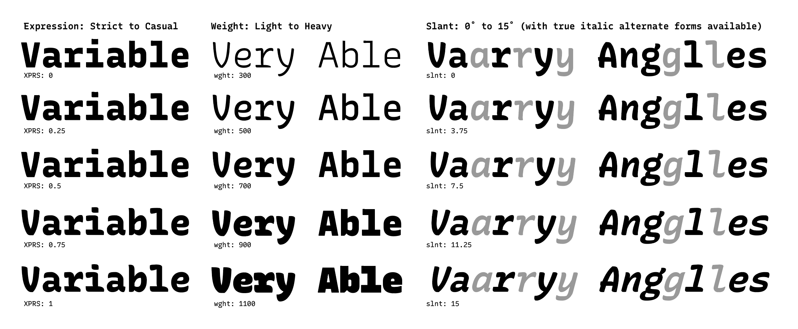


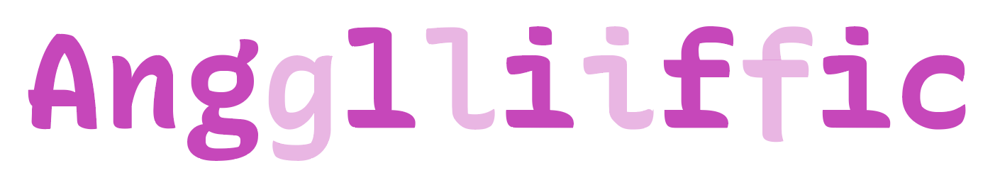


[ ] check thickness, italic `f` vs `i`
[ ] figure out what some curves are shitty


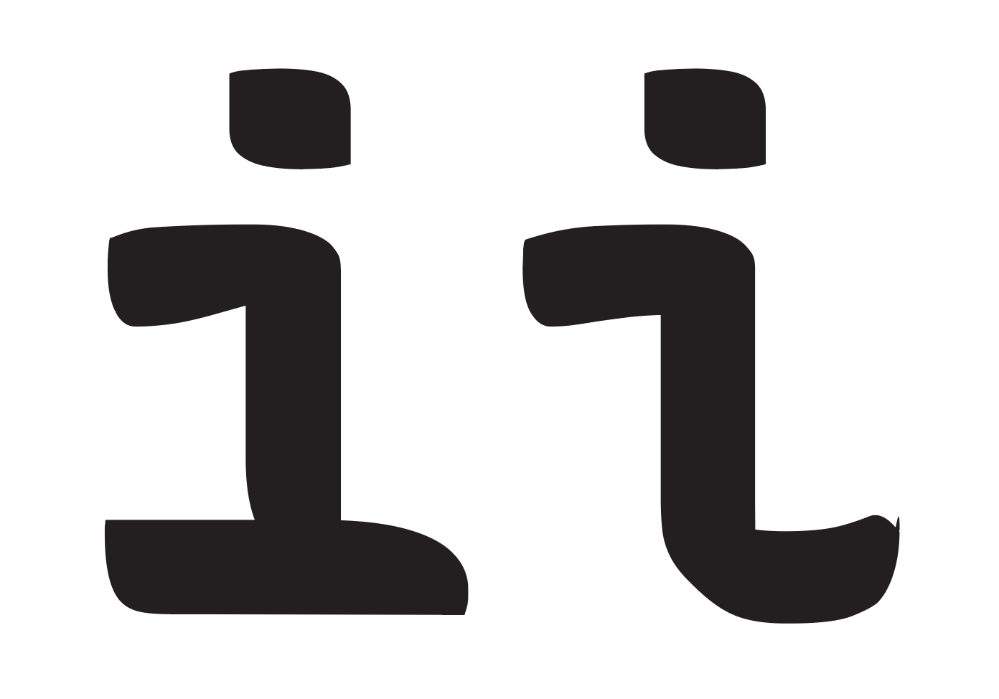


## Diacritics for italics
[ ] add diacritics for “true italic” letterforms


## Sharing miniscripts
https://gist.github.com/thundernixon/7b6383262f5e167c69481e5f636abb48


[https://gist.github.com/thundernixon/7b6383262f5e167c69481e5f636abb48](https://gist.github.com/thundernixon/7b6383262f5e167c69481e5f636abb48)


## Moving diacritics into Sans

Basic copying: run script, make `dotlessi` and `dotlessj`, copy over `brokenbar` and `centeredperiod`, run `insert-anchors.py`, then rebuild diacritics

[x] casual A
[x] casual B
[x] casual C
[x] Gothic A
[x] Gothic B
[x] Gothic C

Then

[x] recopy to bring in improved `ij`
[x] add `brokenbar` and `centeredperiod` to not-copy part of script
[x] Go through Casual caps and make them interpolate again

Nex, for each Sans master:

[x] fix anchor placement (esp. ogonek)
[x] fix kinks in `zero`
[ ] check ogonek placement in mono caps
[x] check ogonek in sans heavy (rebuild diacritics)
[x] draw `AE`
[x] draw `ae`
[x] draw `OE`
[x] draw `oe`
[x] build danish diacritics
[x] fix `eng` and `Eng` and `Nhookleft`
[x] fix `Lslash` and `lslash`
[x] fix `Oslash`
[x] fix `Hbar` and `tbar`
[x] fix `ldot`
[x] fix `tcaron`
[ ] decompose and copy `cent`
[ ] run diacritic-checking script to ensure compatibilility
[ ] add `zeroslash` (find proper name) to sans
[ ] make left and right arrows that are components of `up`, then add left/right arrows to not-copy portion of script
[ ] make `gcommaaccent` use a bigger accent *OR* make other comma accents smaller…

Glyph copier questions

- Should the glyph copy script also prevent copies of diacritics? 
- Should it have a way (or a specific other version) to copy only specific characters? 
- Is it preventing accidental copies? (e.g. letters which have been changed, but aren’t yet in the “do not copy” lists?
    - I’ve added a part of the script that checks glyph width before clearing or copying glyphs. However, this has made it painfully slow, and scary to watch, because you just see glyphs disappearing, about once a second.
    - Instead, you should just have a script that adds these non-600-width glyphs to the “do not copy” list at the beginning of the script
        - that works better
    - but I now need to add a way to copy diacritics, without making them a different width
        - probably: `if g.width != 600 or g.width != 0`

What diacritics might need sans-specific forms?

- macron (at least for `i`)
- tilde(at least for `i`)


## Move `i` and `j` to component forms?

I’m a little nervous to do so, but I probably should…


## Get names of sans base glyphs that have anchors for accents

super mini script

    baseGlyphs = ['D','E','F','G','H','I','J','L','M','N','O','Q','U','V','W','X','f','g','i','j','l','m','r','s','t','w']
    
    f= CurrentFont()
    
    for glyphName in baseGlyphs:
        if len(f[glyphName].anchors) > 0:
            print(glyphName)

To do: figure out why script is not working to copy 600 width chars

- it was a logic mistake: I used an `or` where I should have used an `and`


To do: figure out why glyph copy script is. not copying some components… (e.g. `B` and `bitcoin`)

- huh. I think it was just a problem with the earlier version.


## Ligatures for `r` in sans? 

It might be nice to have ligatures for `r` in sans, for `ri`, `rt`, and `rf` … however, these would also need to exist in mono to make things work as a variable font, so I don’t think it’s worth it, for now.


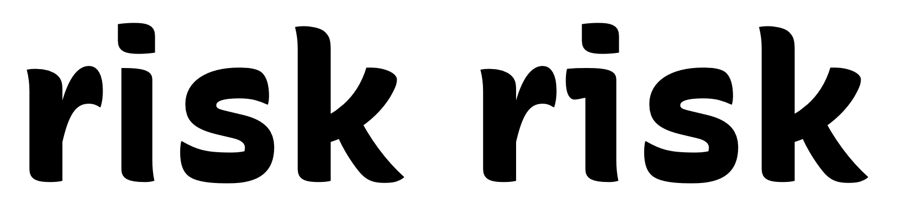


## `ij` ligatures? 

This should probably exclude the serif in the `j`, to prevent things from clashing in the heavy weight.


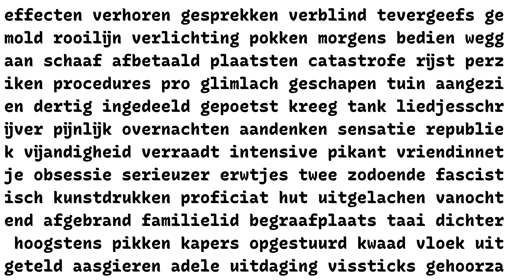


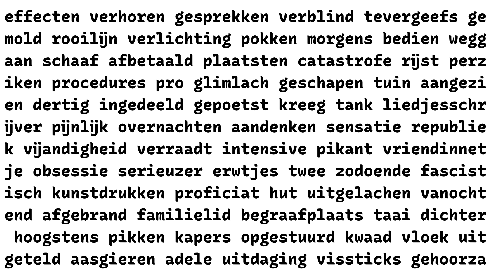


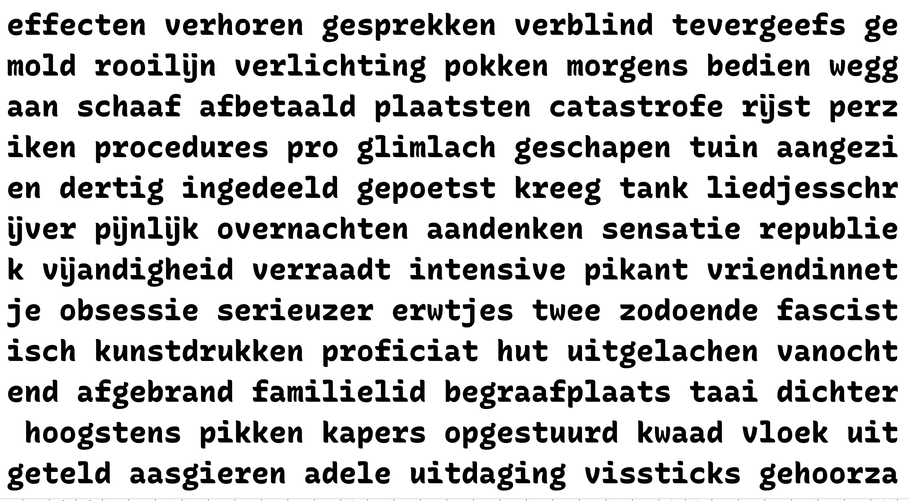


Done! in mono. 


## Rendering issues 😕 – will need to separately label “Recursive Var” and the normal, overlap-removed instances

(though you should also try to remove overlap in varfont)

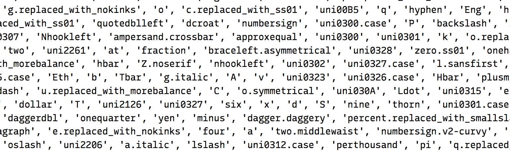


## Fix `c` – it’s vertically assymetrical


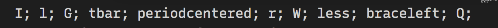


[x] done
## Would be very useful: a smaller version of the glyph-copier script to move single characters for the whole family (e.g. to fix interpolation issues, etc)


## Changing accent glyphnames to friendly names

I was working with accents with their production names, like `uni0300` for the combining acute. However, that was fairly cumbersome, and I didn’t want to be constantly fighting against that as I work between more masters, as I add in the italics.

So, I wrote a simple python script that uses a dictionary to map the `uniXXXX` names to friendly names, and then would go through open fonts and swap out the names. This also required me to update my glyphConstruction recipe and rebuild glyphs, and then re-run my “add unicode” script,” also with its dictionary updated to include the friendly names. What I *should* have probably done is to figure out how to use https://github.com/LettError/glyphNameFormatter, but it is very unclear to me how to use that, so for now, my simpler solution seems to work. In the future, I will figure out how to use the better method. 

Actually … there are problems. Most of the combining accents work just fine, as expected. However, a few, such as `dotaccentcomb` and `caroncomb` just … won’t work. 😕 

Oh! I had renamed the accent glyphs themselves, but that doesn’t automatically rename the references to components. So, what I really needed to do was to extend my glyph renaming script to include components. As a big benefit, doing so should rename the accent components without me having to worry about rebuilding components. Fingers crossed… And yes! It’s working just fine.

One funny mistake I made in this process: I attached a glyph sort to my unicode-naming script. But, instead of making this run on every font (6 times), I made it run on every glyph in every font (6 * about 460 times). That wasn’t a very performant script.


## Fixes to make for specimen
[x] counter of bold `R` is wonky
[ ] `registered` mark has poor legibility in a text editor
[x] strict mono heavy `f` still has a kink
[x] balance tilde a bit more … it’s currently sloping down to the right
[ ] make separate `ogonek` for `e` and `o`s
[ ] `currency` symbol is interpolating wrong in. casual
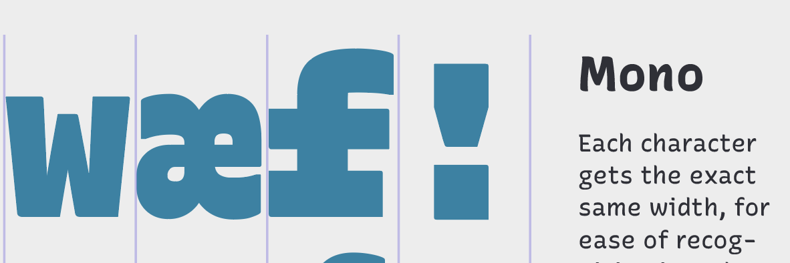


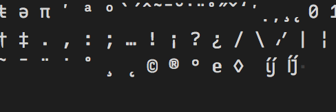


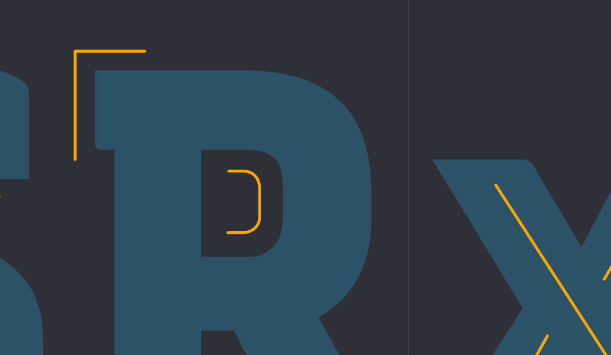


## Continued…

Due to lag, I will continue my notes here:
[+Recursive: Casual Mono - design & development notes, part 2](https://paper.dropbox.com/doc/Recursive-Casual-Mono-design-development-notes-part-2-PVx9AgIWQ6wZAcMhPhQFv) 

