# Recursive: Casual Mono - design & development notes, part 2

*Continued from* [*Part 1*](https://paper.dropbox.com/doc/Recursive-Casual-Mono-design-development-notes-quIvYVS8hXu2hOEykANMh#:uid=428572261368795188684566&h2=Italic-binge%2C-part-2)*, which was getting laggy from so much content* 

## Italic binge, part 2

*More notes in* [+Recursive Italic: approach and process](https://paper.dropbox.com/doc/Recursive-Italic-approach-and-process-WXlD89RPNOzrA4wTjwi5e) **

Big question: do i try to script the unskewing/rotation of the casual styles, or do I just bash away at the typical skew? Do I try to script the italic prep, or would that take longer than just doing it?

Test:

- see if you can quickly make a script to easily apply labels to selected points. This should:
    - apply to curves *and* their attached offcurve points (aka handles)
    - Be able to apply multiple labels to points. For example, if I want to make a horizontal stroke thinner, i can apply labels to the insides. If I want to make the terminal of that stroke also be able to rotate or skew, i should be able to apply those labels separately
    - this could either work as several separate mini-scripts, or one extension. Maybe i’ll split the difference and write some of the logic in one file, but have separate scripts to trigger the different labels…

Decision: I won’t do a generated “rotalic” casual, because:

- In looking through the challenges I faced with my first attempt at a skewer & unskewer script, there are still large obstacles to overcome in making it work with the different edge cases in different letters: different terminal counts, styles, and shapes
- In a quick test of a interpolating between a “rotalic” casual and normalize gothic  `H`, there are extremely-visible kinks at the tops and bottoms of strokes.
- there are likely unknown unknowns in this path, and I don’t have time for those potential disruptions right now

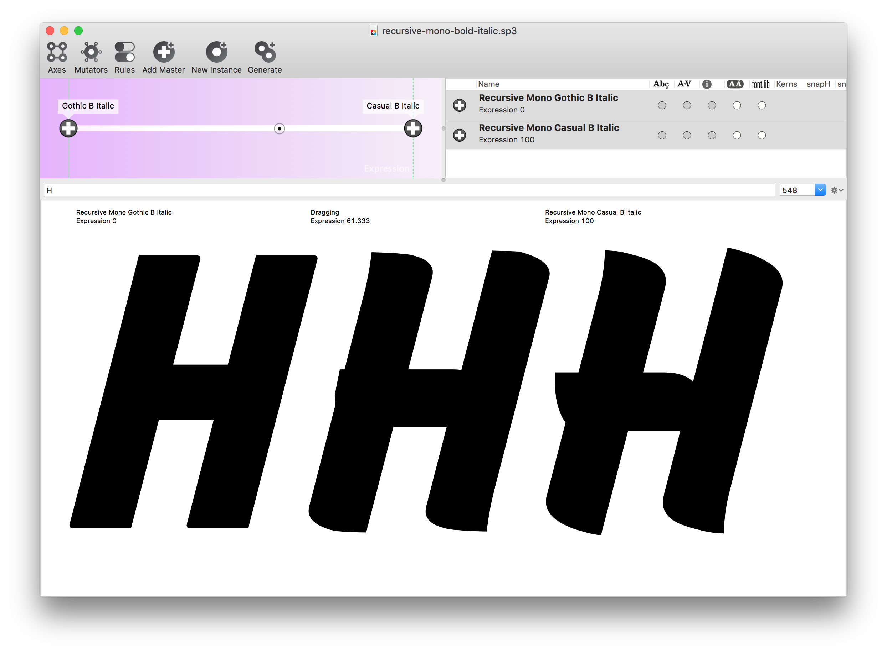

*The harsh kinks introduced by rotalics would be very difficult to avoid, based on the amount of change and angle of the associated beziers*

Letters that require reworking for interpolation:

- c
- e
- f
- f.italic
- i.italic
- l.italic
- g
- o (but this is easy)
- (all all of the gothic round shapes)

Goal:

1. Have corrected italics for A–Z, a-z, and 0–9, `& ? @` in four core weights. 
2. Have corrected accent mark placement
3. (hopefully) Have correct acccent marks
4. (probably not) have corrected german & danish letters
5. (probably not) have correct punctuation / symbols

Plan:

[x] correct upright italics to have only 0 and 90 degree connections in mono and sans
[x] generate interpolated UFOs at 14.04 degrees, then work from those (Done in sans and mono; superpolator adds missing glyphs, so I may want to delete these again so i’m back to just lowercase in the “gradually sloped” UFOs)
[x] delete all non-lowercase glyphs from interpolated 14 degree masters
[x] re prep and skew  the letters with updated connections, plus `a` with tail
[x] gauge whether it will be faster to make existing gothic italic letters without kinks, or simply re-correct them
[ ] add more taper to casual `n b h u m`
[x] take a pass through the lowercase to check for rounding errors … there will likely be little kinks, especially on the tangent points on the sides
[x] skew and correct uppercase
[ ] move anchors into place
[ ] duplicate corrected italics into full fonts that are math skewed
[ ] duplicate extrabold italic masters and make them “heavy italic”, for testing
[ ] send through export flow
[ ] find a way to copy but skew anchor points
[ ] update slanted script to handle components (not double-slant them)

## To export family with italics in the core range, plus a heavy upright, just copy all Bold italic letters into a “heavy” italic master. 

There may ultimately be a better technical way to do this without adding redundant data, but this will be a way to make things work for the grad presentation

## Fixes needed in upright:
[ ] change connection spot of `L` and `E`
[ ] 

## Fixes needed in italics
[ ] Will need to come back to refine corners in gothic caps, to fix kinks from rounding issues

Non-compatible glyphs to fix
~~~~
- ~~f.italic~~
- ~~T~~
- (anchors are inconsistent)
- (remember to name and sort)

To export, I’m just removing it.

Error in makeVar script:

    AssertionError: (('ringcomb', ('ringcomb', 'ringcomb', 'ringacute.case', 'ringcomb', 'ringcomb', 'ringacute.case', 'ringcomb', 'ringcomb', 'ringacute.case', 'ringcomb', 'ringcomb', 'ringacute.case')), 'str', '[0]', 'list', '.glyphs', 'Coverage', '.MarkCoverage', 'MarkBasePos', '[0]', 'Lookup', '[4]', 'list', '.Lookup', 'LookupList', '.LookupList', 'GPOS', '.table', 'table_G_P_O_S_')

This is probably due to inconsistent anchors, and running my anchor check script shows that there are inconsistencies. For now, I’ll just remove all of these:

    for font in AllFonts():
        for g in font:
            g.clearAnchors()

## Try the contextual substitution

It works! Just sent a GitHub issue as an email, so it took me a few minutes to figure out how to make a python script importing the right thing, but it was quite easy once it happened.

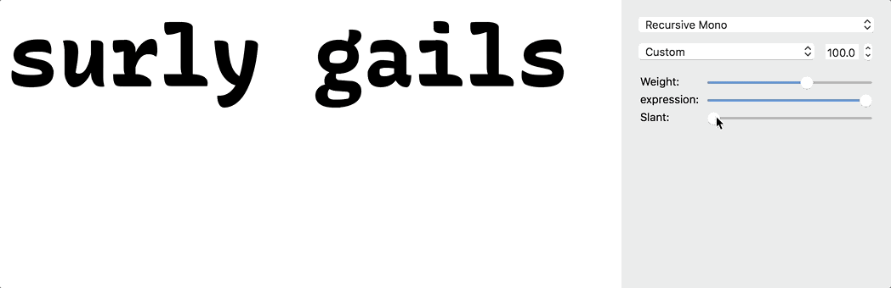

# When code is just a simple interface

I wanted to get the names of glyphs with anchors in my corrected-italic fonts, in order to quickly make a set to edit. That was as simple as:

    for g in CurrentFont():
        if len(g.anchors) > 0:
            print(g.name)

Little things like this are so satisfying. 

## June 19
[x] First, unkink the sans gothic italics
[ ] look through sans italics to check that mono italics actually did copy in … some of them seem to be missing (?)
[ ] generate variable fonts; be wary of getting too caught in this
[ ] work on UI mockups
[ ] incorporate mockups into specimen & poster
[ ] start writing process book - 

Weirdly, the sans italics i fixes manually yesterday are here, but some of the glyphs i copied in from the mono seem to have disappeared. why??

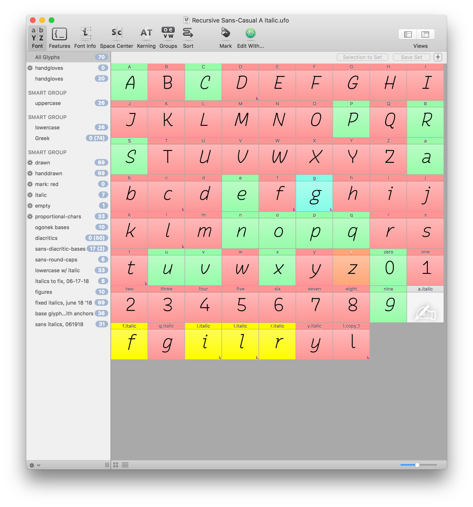

## Italics to fix in Gothic B

🚨When I interpolated to get to 14 degrees in the gothic, it somehow interpolated with the heavy weights, as well … yielding letters with are significantly too thick. 😐 

I’m correcting those now.

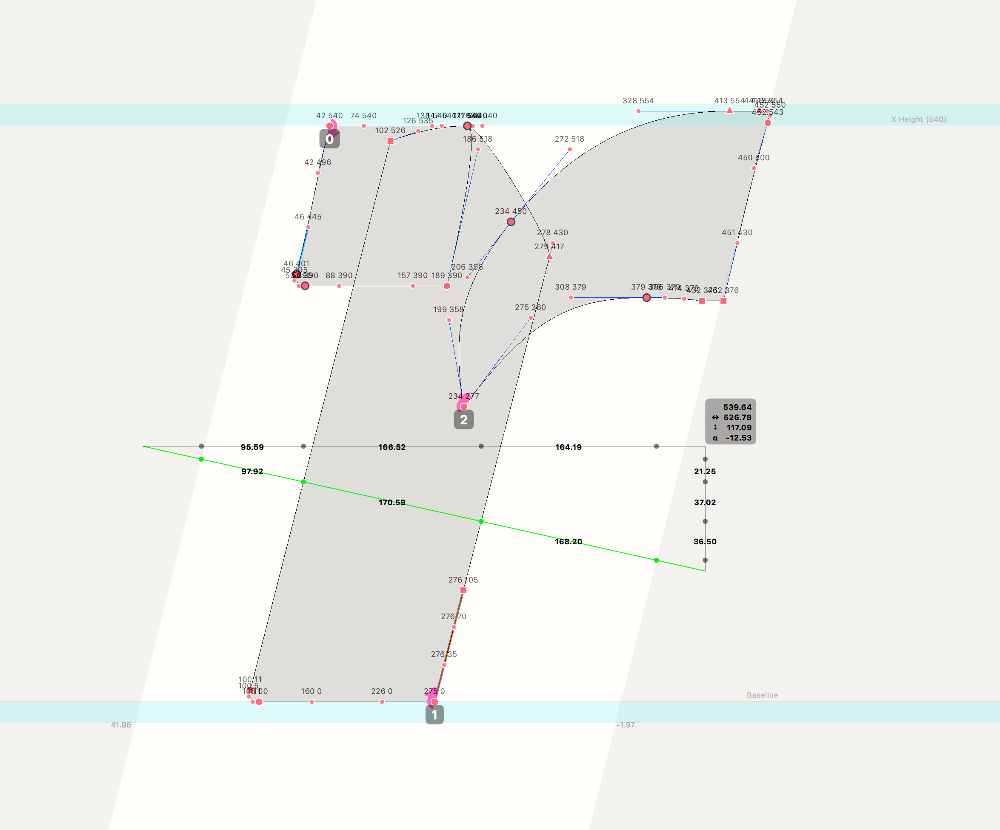

(Fix in mono first, then move into sans)
~~d~~
~~b~~
~~a~~
~~zero~~
~~m~~
~~n~~
~~j~~
~~o~~
~~p~~
~~q~~
~~u~~
~~g.italic~~
~~y.italic~~

y.italic is messed up. the top right faces different ways, between UFOs.

It should be pointy on the top left. But I’ve copied the `g.italic` over to it, so it’s pointy on the top right. I need to fix this in:

- mono casual a & italic
- mono casual b & italic
- mono gothic a & italic
- mono gothic b & italic
- (copy over to sans)

## Issues interpolating into a new master location

When I interpolated to get the 14 degree master from the 18-degree master, I expect it to work fairly seamlessly. I was wrong on a couple of fronts.

[ ] make a script to check monospace for consistent char widths!

# Testing

# Problems:

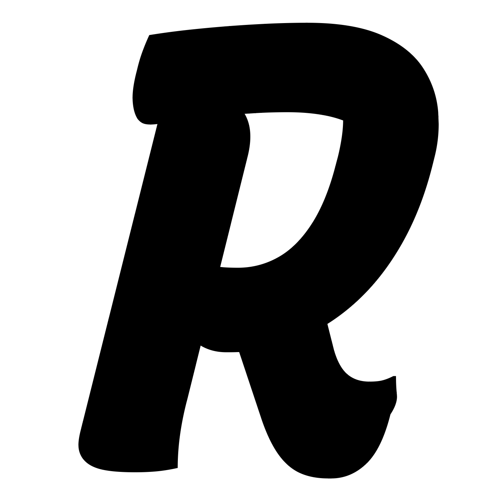

*Casual ExtraBold R*

## Better exporting method

fontMake seems to mess up the outlines a bit, and more critically, doesn’t include designspace rules in exported instances. 

So, I’ve realized (and successfully tested) that it works better to load a designspace file into superpolator, make sure there is the italic rule, then generate UFO instances. These UFO instances, then, can be put through RoboFont batch, and output to OTF files that appear to be accurate to what I want. The italic rules are inserted by Superpolator, and the outline issues that I’ve seen in the past from fontMake don’t seem to be here.

This uses two scripts to work how I want:

- `add-feature-code-to-selected-fonts.py`
- `sort-all-selected-fonts.py`

Hopefully, setting the style mapping in these UFOs will also enable proper linking of styles, without making me go into TTX. …… follow up: It doesn’t 😕

Also, I’m slightly biased towards the idea that this generates OTF curves, rather than inserting a bunch of extra points.

Though, now I’m running into an error from Batch: `RuntimeError: dictionary changed size during iteration`. I don’t have time right now, so I’ll just focus on updating the sans and writing the fucking book, already.

## A (hopefully) better approach to italic substitution, to work across variable font and static instances

I’ve made both “true italic” characters with `.italic` suffixes, plus “roman” characters with `.roman` suffixes. I will add these to all fonts, then use this opentype feature code to make them possible to activate with stylistic sets:

    @defaultletters = [a            f            g            i            l            r            y       ];
    @slopedroman    = [a.roman      f.roman      g.roman      i.roman      l.roman      r.roman      y.roman];
    @trueitalics    = [a.italic     f.italic     g.italic     i.italic     l.italic     r.italic     y.italic];
    
    feature ss01 {
        featureNames {
                    name 3 1 0x0409 "italic a, f, g, i, l, r, y"; # Win / Unicode / English US
                    name 1 0 0 "italic a, f, g, i, l, r, y"; #   Mac / Roman / English
            };
        sub @defaultletters by @trueitalics;
    } ss01;
    
    feature ss02 {
        featureNames {
                    name 3 1 0x0409 "roman a, f, g, i, l, r, y"; # Win / Unicode / English US
                    name 1 0 0 "roman a, f, g, i, l, r, y"; #   Mac / Roman / English
            };
        sub @defaultletters by @slopedroman;
    } ss02;

Copying stylistic set feature naming syntax from plex: https://github.com/IBM/plex/blob/master/IBM-Plex-Mono/sources/masters/IBM%20Plex%20Mono-Bold.ufo/features.fea

## Exporting the Sans again, Mon, Jun 25

As I’m writing my process book and laying it out with InDesign, I want to be using the proper versions of my sans – right now, I’m using old versions, and that worries me. Most critically, the current versions don’t have italics in them, which means it’s negatively effecting my design options.

Mono

[x] make `.roman` versions of chars with italic alts
[x] add to opentype fea code
[x] copy to slant folder
[x] slant
[x] copy in corrected italics
[x] copy sloped roman chars to the `.roman` glyphs
[x] make sure gothic B has .roman glyphs
[x] sort out whether gradual sloped forms were overwritten (fix with git checkout and commit)

Something I learned: `git checkout file-path` is a destructive command, if the prior changes haven’t been committed.

fix:

- ~~f.italic~~
- ~~j~~
- ~~i.italic~~
- ~~g.roman~~
- ~~l.italic~~
- ~~r.italic~~
- ~~a.italic~~
- ~~y.italic~~
- ~~g.italic~~

Sans

[x] copy in any mono updates to expand charset
[ ] ~~respace superiors (fuck it, not needed right now)~~
[x] copy in ogonek (already done)
[x] move ogonek anchor and rebuild those chars
[x] add `.roman` chars
[x] copy fonts to italics
[x] slant them
[x] copy in corrected italics
[ ] varfont prep
[ ] make varfont
[ ] fix errors if they exist
[ ] open designspace doc in superpolator
[ ] generate instances
[ ] use robofont batch to generate otf files

Does copying the files `groups.lib` and `kerning.lib` from UFO to UFO really copy the kerning? A quick test in Space Center seemed to indicate so. I’ll see whether the changes last into OTFs and InDesign.

Hmmm…. I’m now getting the fontMake error:

    AssertionError: ((5, [5, 5, 5, 4, 4, 4, 5, 5, 5, 4, 4, 4]), 'int', '.BaseCount', 'BaseArray', '.BaseArray', 'MarkBasePos', '[0]', 'Lookup', '[2]', 'list', '.Lookup', 'LookupList', '.LookupList', 'GPOS', '.table', 'table_G_P_O_S_')

…but it may be because, chekcing things, the `n` has different anchors, `caronslovak` and `apostrophe`

Using this is helpful to see it:

    for f in AllFonts():
        print(f.info.styleName)
        print(f["n"].anchors, "\n")
        

…but now I’m seeing that, somehow, not all the charset copied in from the mono to the sans? For instance, sans casual A is missing the recently-extended characters. 😕 

Fuckkkkk this is hellish:

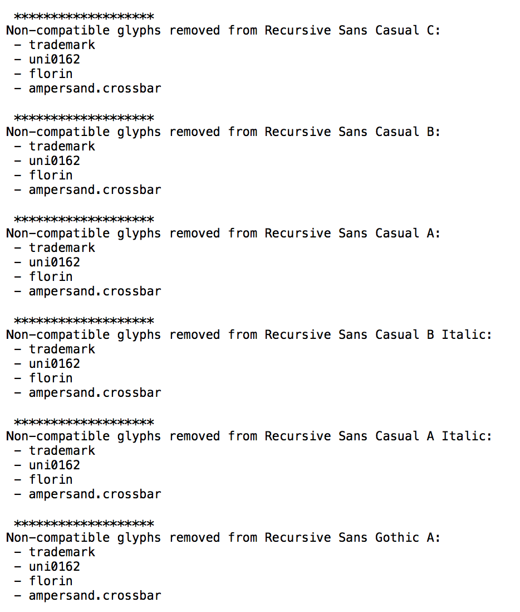

I may have to accept an incomplete character set, in favor of completing my book.

- ~~trademark~~
- uni0162
- florin
- ampersand.crossbar
- cent (added to copier script … it should have already been added.)

Hmm … most of these may be failing because they weren’t copied properly from Mono to Sans Casual B. *But I swear I did.* This is one of the many instances where it’s hard to tell whether I’m simply being dumb, or RoboFont is somehow not saving things as I expect.

After trying to address the issues in those characters, they still aren’t compatible. For now, I’ll leave them behind. They’re drawn in the mono, and I will hardly be using them in the graduation materials. If I do, I can override them with the mono version, and it won’t change the design.

## Do after printing the process book(?)
[ ] make `.roman` glyphs with components, then activate these with opentype feature code

## Compatibility challenge: hidden duplicate components:

The `g.roman` failed in my varFontPrep script, and I wasn’t understanding why. I made a much simpler compatibility check script:

    cf=CurrentFont()
    
    glyphToCheck= "g.roman"
    
    for f in AllFonts():
        print(f.info.styleName)
        print(cf[glyphToCheck].isCompatible(f[glyphToCheck]))
        

This helped me realize that I had somehow added the g component to italics, twice:

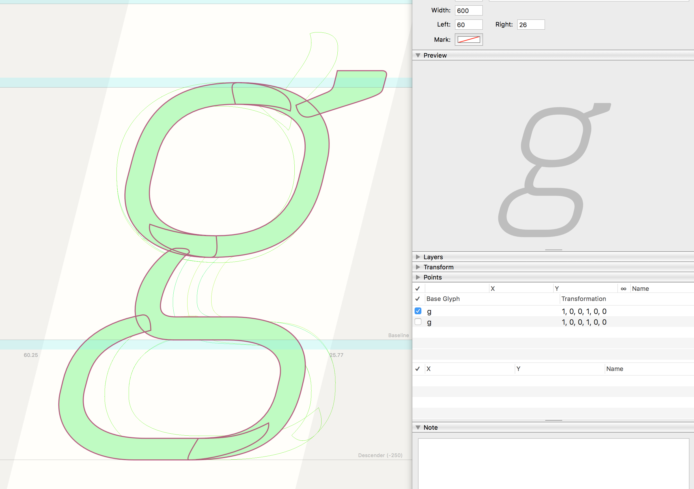

## Getting past export errors in fontmake/fonttools
    fontTools.feaLib.error.FeatureLibError: <features>:72:9: Glyph dotaccentcomb cannot be in both @MC_top and @MC_dot

## Issues found in latest font versions (June 26, 18)

Mono

[ ] check curly brace horizontal alignment
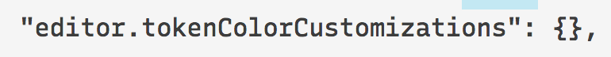

[ ] O counter isn’t symmetrical

[ ] strict uppercase `U` is too heavy on the bottom right

[ ] simplify point structure of `a` (bottom of counter doesn’t need two points)
[x] heavy double quotes have different start points (in sans, too)

**Sans**

[ ] `f` is different width between masters: set all italics to 400
[ ] quotes in Sans Casual Bold have interpolation issue (probably diff start points)
[ ] square brackets are wider than they should be
[ ] stylistic sets still aren’t working in sans 😐 
[ ] Curly braces are out of horizontal alignment

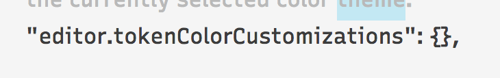

[ ] descenders should get shorter in the heavy weight, to allow for tighter line spacing

[ ] cap casual `W` is too light in bold weight
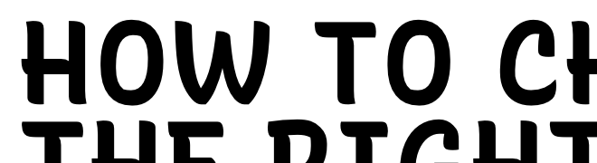

[ ] make the slashed `0` available in sans

[ ] make widths standard (and make a script to better catch these along the way?)
    [ ] imacron {347, 348, 350}
    [ ] icircumflex {347, 348, 350}
    [ ] dotlessj {340, 350}
    [ ] ibreve {347, 348, 350}
    [ ] grave {600, 350}
    [ ] igrave {347, 348, 350}
    [ ] greater {600, 550}
    [ ] bracketleft {400, 600}
    [ ] five {600, 598}
    [ ] iacute {347, 348, 350}
    [ ] uni02BC {600, 0}
    [ ] guillemotleft {600, 601}
    [ ] bracketright {400, 600}
    [ ] dotlessi {347, 348, 350}
    [ ] itilde {347, 348, 350}
    [ ] exclamdown {400, 350}
    [ ] idieresis {347, 348, 350}
    [ ] guillemotright {600, 601}
    [ ] jcircumflex {340, 350}
    [ ] fl {600, 750}
    [ ] 

[ ] either find a way to prevent rendering issues at stroke overlaps, or remove these
[ ] italic `f` and `l` clash

[ ] fix semicolon spacing 
[ ] `9` and `6` seem overly sharp where bowl turns in – `5` feels better

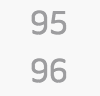

[ ] make arrows bigger – arrows in SF Mono and Zeitung visually fit much better with their fonts
[ ] Fix XPRN axis of light 8 – it currently has a path break around 0.5 XPRN

[ ] make serif bigger on `7`
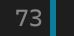

[ ] (probably) remove serif on `Z` – it looks too much like a `2`
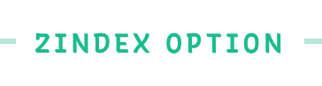

[ ] try to make “italic” an axis, rather than a stylistic set (a la DJR Roslindale)

[ ] ! Simplify point structure to make the `XPRN=0.5` (middle values) more attractive — these are currently in the `/n.simpler`  and `/e.simpler` glyphs of `Recursive Mono-Casual B.ufo`
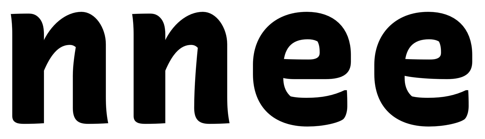

*The first /n has an ugly straight segment on the inside, whereas the second makes it a smooth, shallow curve. Likewise for the middle bar of the first vs second /e.*

[ ] casual `e` would (probably) be more readable if its crossbar were raised just a bit
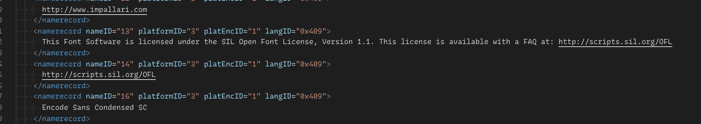

[ ] widen bottom of casual /g – it currently seems a little too tucked in on right
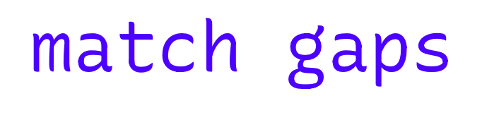

[ ] dollar sign bars are a bit short, in code – would feel better, longer
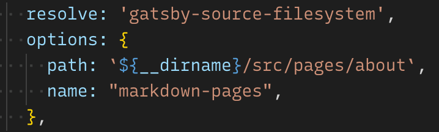

[ ] strict /r gets ugly top on slant

[ ] slanted casual extrabold /e is misaligned at bottom left (bottom contour goes outside its bounds)
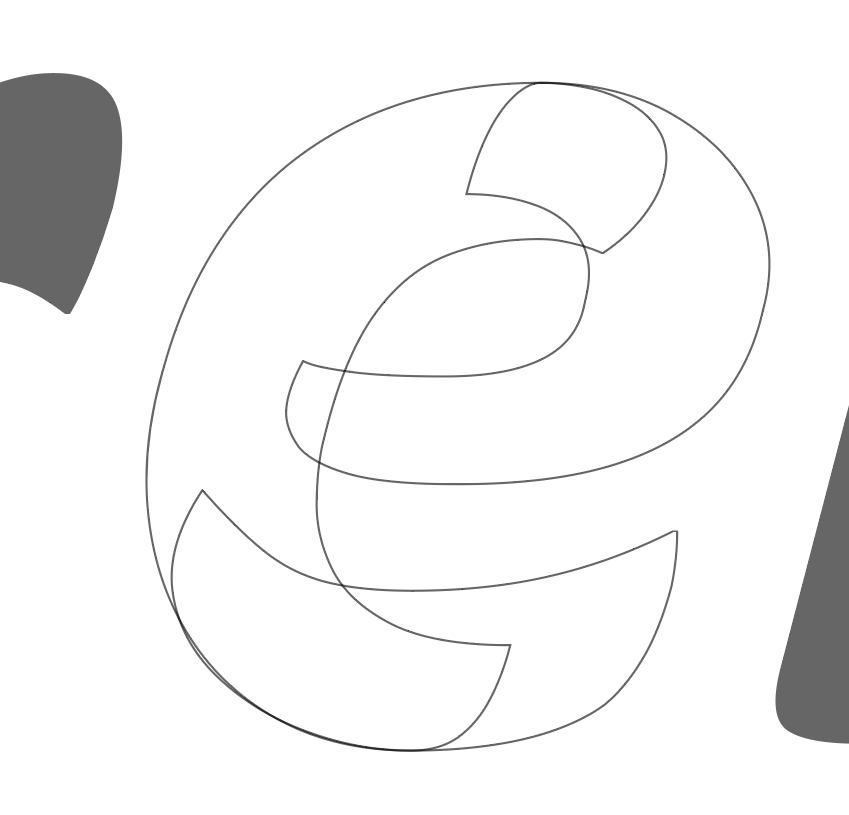

[ ] `/copyright` symbol is too light (?)
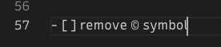

