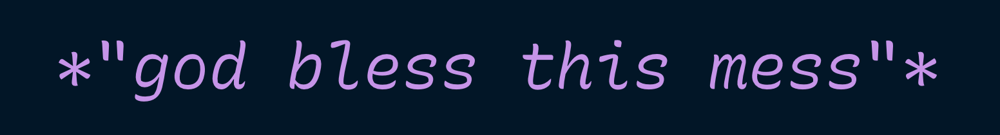

# Recursive Mono Betas for Code

This is a directory of quickly-changing betas of the Recursive Mono font project.

I am using these fonts in my primary editor, VS Code, as a way to quickly test & iterate on design decisions and build techniques as I go.

As a result of a quickly-moving design project, things are currently fairly messy here (and in this repo at large).



## Using the betas

1. Download or clone this repo.
   
2. Add the betas to your computer's fonts folder.
   
3. Edit the preferences to point to one of the following font names. These names correspond relatively closely to the filenames themselves, in case you only wish to install specific fonts.

  - **`IterativeBetaV010`** (this number will change, so be sure to double-check the filename you have)
    - This is where recent work has happened on more-cursive italics
    - It is best viewed with a code theme that supports italics. `Night Owl` is a fun option in VS Code and Sublime Text.
    - The italic here is limited and in-progress, so many characters will appear in their upright forms.

  - **`RecurMono-Regular`**
    - This is a fuller version of the "Strict" end of the expression axis. It has some of the quirks of the Casual, but it's less curvy and has overall proportions which are more traditional to highly-legible humanist-sans monospace fonts. I personally find it nicer for complex code, because it's a lot less expressive than the "Casual" end of the expression axis. This makes it easier for me to focus.
    - The italic here is a heavy 14.04° slant, which is more than usual. Moving forward, I intend to reduce this to 9.45° or 11.31° (these values are based on the slopes derived from following a pixel grid).
    - **Overall, this is the most complete version of Recursive Mono. So, if you come across anything that seems messed up in here, I'd love to hear about it! Please add issues to the repo or email me with questions / comments.**

  - **`Iterative SemiCasual`**
    - This is a quick experiment: what does it feel like to code with the instance in between Casual and Strict? Overall, I'm pleasantly surprised! It's fun, but not distracting.
    - It doesn't have contour overlaps removed, which makes it render less well at small sizes or on low DPI screens.

  - **`Iterative C`**
    - Another experiment, pairing the Strict Regular with the Casual Italic. This works best in syntax color themes that mostly reserve italics for comments and very few key words.

If your editor allows for a "font stack," where missing glyphs will fallback to glyphs from fonts in the stack (VS Code does this), I suggest the following: start with the family you wish to try, follow it with `'RecurMono-Regular'`, and follow that with `IBM Plex Mono`. This support will all characters with reasonable, compatible monospace glyphs, even if they are not yet in the top fonts of the stack.

```
'IterativeBetaV009','RecurMono-Regular','IBM Plex Mono', monospace
```

