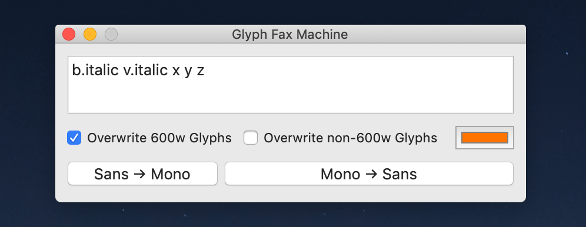

# Glyph Copier

## Usage

This script is mainly meant for use in Recursive, to copy glyphs from Mono to Sans or (occassionally) Sans to Mono.

To use it:

0. Make a git commit to backup your current work. No guarantees that this script will do exactly what you expect it to!
1. Select glyphs you'd like to copy, then copy their names to your clipboard with *`option`+`command`+`c`*
2. Run the script in RoboFont
3. Paste in the glyph names you wish to copy
4. Select your options: 
   1. `Overwrite 600w Glyphs` will replace glyphs in the destination font if they are 600 units wide
   2. `Overwrite non-600w Glyphs` will overwrite glyphs in the destination font if they are *not* 600 units wide
   3. Trying to copy glyphs that already exist and are not included in an "overwrite" option will create them in the destination font with the suffix `.copy` added
   4. If you want, you can change the mark color for copied glyphs. The default is orange.
5. Check the fonts, save if desired.
